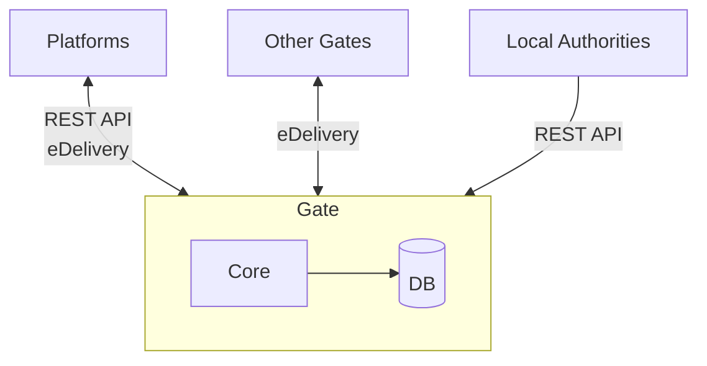
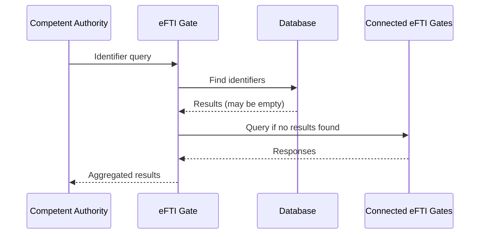
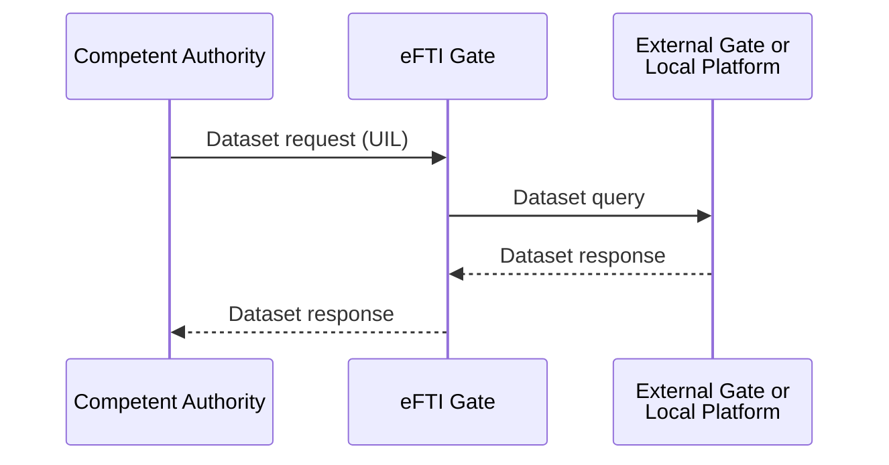
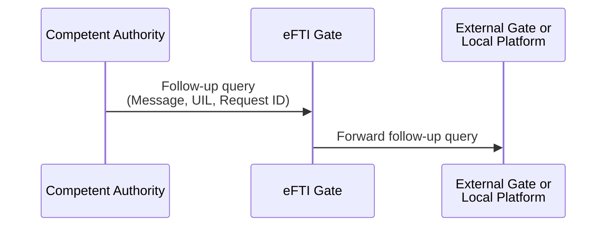

# Architecture details

## Goals
The main goal of this eFTI gate PoC was to create the most performant and lightweight eFTI gate possible while retaining full protocol compatibility.
The need for this came from the lack of performance of the [reference implementation](https://github.com/EFTI4EU/reference-implementation).

Another goal was to reduce the system's complexity in order to make it more performant as well as more maintainable.

## Design principles
For this PoC eFTI gate we had 4 main design principles:
* **Simplicity** – Fewer moving parts mean easier deployment, monitoring, and maintenance.
* **Performance** – Optimized handling of eDelivery, XML, and cryptographic operations to reduce latency.
* **Transparency** – Codebase is concise and easy to audit, understand, and modify.
* **Minimal Persistence** – Only essential identifiers are stored, ensuring lightweight operation and minimal data footprint.

## Implementation
### The tech stack we are using:
* [Kotlin](https://kotlinlang.org/) / [Klite](https://github.com/keksworks/klite) on JVM using [Java](https://www.java.com/en/) built-in HTTP server
* Admin and authority UI using [Svelte](https://svelte.dev/)
* [PostgreSQL](https://www.postgresql.org/) database
* [Docker](https://www.docker.com/) images for easy deployment

### Project structure (Modules)
* `gate/` — eFTI Gate application
* `demo-platform/` — Demo eFTI Platform that can publish datasets
* `edelivery/` — fast eDelivery implementation
* `ui/` — Admin UI
* `e2e-tests/` — End-to-end tests via Browser and UI

(Source-code directories sit at the repo root, alongside `docs/`. They are not materialised in docs-only sparse-checkout views.)

### In order to achieve all previously mentioned goals we have done the following:
#### 1. Custom eDelivery implementation

A new custom implementation of the eDelivery protocol specifically for gate-to-gate communication.
Unlike the reference implementation, it:
* Eliminates dependency on external services like [Harmony](https://github.com/nordic-institute/harmony-access-point) or [Domibus](https://github.com/cefedelivery/domibus).
* Implements cryptography and XML canonicalization internally with significantly improved performance.
* Simplifies configuration and deployment by removing the need for additional middleware or message brokers.

#### 2. Single Lightweight Database
The system uses one small [PostgreSQL](https://www.postgresql.org/) database solely to store identifiers posted by platforms.
No message payloads or exchanged data are persisted, ensuring:
* Faster processing
* Lower storage and compliance overhead
* Easier horizontal scaling

The database also stores registered gates, platforms and authorities.

#### 3. Simplified Architecture
The entire PoC is built around a minimal component model:
* No external application servers or heavyweight frameworks.
* Clean and modular codebase that is easy to reason about and adapt.
* Streamlined interfaces for integration with platforms and authorities.

#### 4. Simplified data flows:

**Identifier query**

**Dataset query**

**Follow-up message**

The Gate can be horizontally scaled by increasing the number of instances. PostgreSQL can be replicated for high availability if needed.
