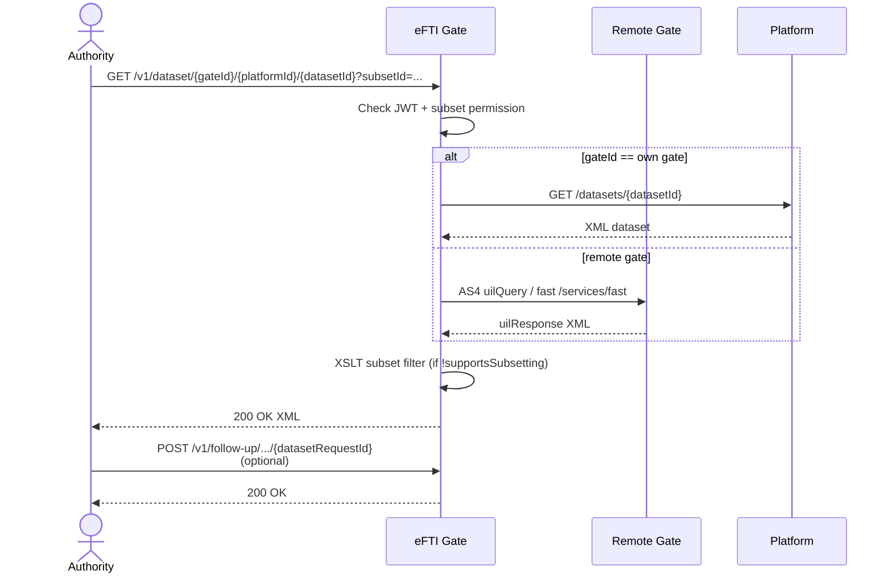

# Architecture: Dataset Retrieval and Follow-up

## Changes

- _Initial state. Change tracking begins at v1.0.0._

> Sub-architecture for the Dataset Retrieval and Follow-up surface. For overarching rules see [theme README](README.md). AC are in [`../../cfr/core-functionality/dataset_retrieval_and_follow_up.md`](../../cfr/core-functionality/dataset_retrieval_and_follow_up.md).

## Dataset retrieval at a glance

## Rationale

The gate routes by UIL (`gateId`/`platformId`/`datasetId`) and enforces the subset-permission contract; the dataset body itself is the platform's responsibility. The gate-vs-platform subsetting split (platform may advertise `supportsSubsetting`) keeps the gate stateless about dataset content while still guaranteeing the authority cannot exceed their permitted subsets. Streaming XML processing is non-negotiable: a DOM parser would OOM on a real freight dataset.

