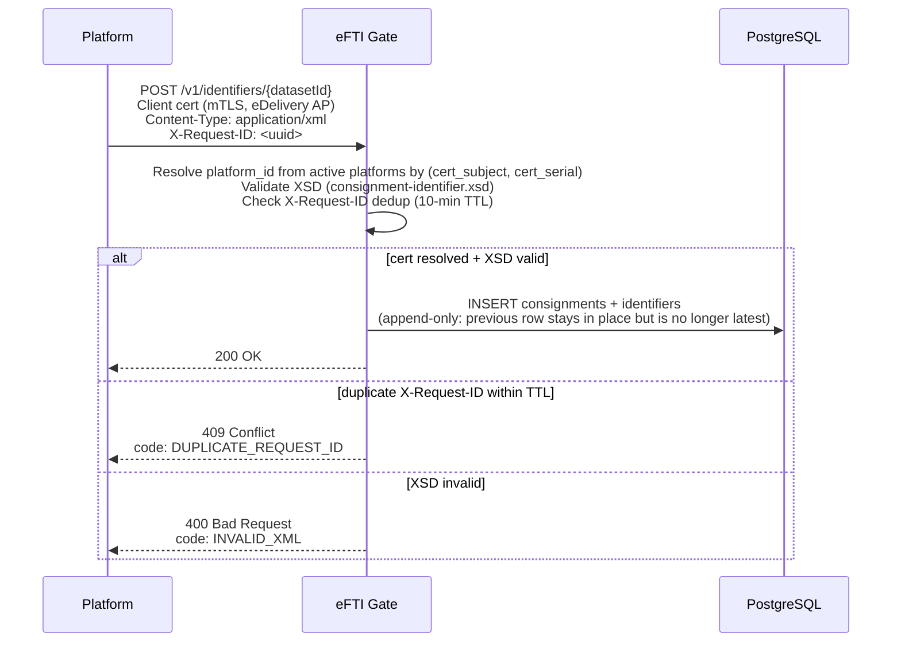

# Architecture: Identifier Management (Platform API)

## Changes

- _Initial state. Change tracking begins at v1.0.0._

> Sub-architecture for the Identifier Management (Platform API) surface. For overarching rules see [theme README](README.md). AC are in [`../../cfr/core-functionality/identifier_management.md`](../../cfr/core-functionality/identifier_management.md).

## Registration flow at a glance

## Rationale

The gate is a registry, not a store of dataset content. The platform owns the dataset; the gate keeps the identifiers + the minimal denormalised search columns. Append-only INSERTs preserve every state transition without UPDATEs, which is critical for the EU Reg 2024/1942 audit trail and the GDPR Art. 30 record of processing.

