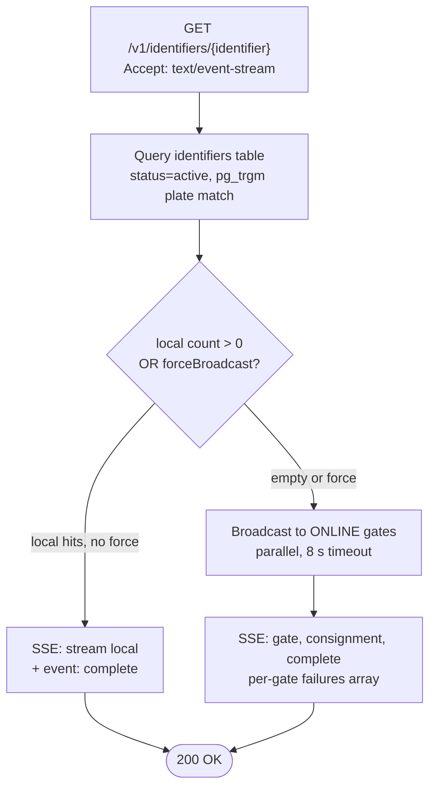

# Architecture: Identifier Search (Authority API)

## Changes

- _Initial state. Change tracking begins at v1.0.0._

> Sub-architecture for the Identifier Search (Authority API) surface. For overarching rules see [theme README](README.md). AC are in [`../../cfr/core-functionality/identifier_search.md`](../../cfr/core-functionality/identifier_search.md).

## Search decision at a glance

## Rationale

The gate is the **registry**, not the dataset store. Authority search hits the local registry first; only on a local miss does it broadcast to peer gates — to avoid leaking the search across the EU when the answer is local, and to avoid unnecessary cross-border load. The denormalised search columns and no-JOIN hot path keep the local query under the 50 ms SLO at scale.

