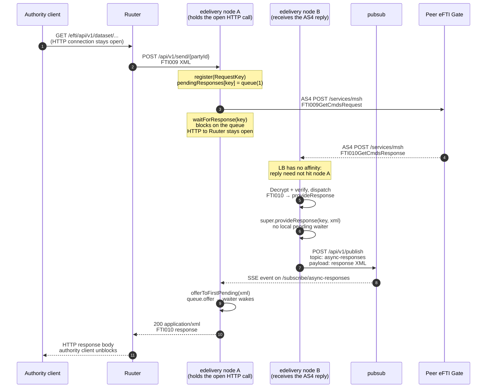

# Architecture: eDelivery multi-node response correlation

## Changes

- _Initial state. Change tracking begins at v1.0.0._

> Covers the request/response correlation path through the `edelivery` service and
> why `pubsub` is required when `edelivery` is scaled to more than one node.
> AS4 envelope handling is in [integrations/edelivery_as4.md](integrations/edelivery_as4.md);
> internal Kotlin service boundaries are in
> [integrations/internal-kotlin-services.md](integrations/internal-kotlin-services.md).

## The problem

An authority REST call is **synchronous**: the client keeps one HTTP connection open
and waits for the business answer. The AS4 hop that carries that call to a peer
gate is **asynchronous at the protocol level**: the outbound request and the
inbound reply are two separate HTTP connections, and there is no requirement that
they land on the same process.

That mismatch is fine on a single `edelivery` instance. It breaks as soon as
`edelivery` is scaled:

1. Load balancers for the gate use least-connections and **no sticky sessions**
   (`docs/specs/non-functional.md` §3, §3.1). Inbound AS4 `POST /services/msh`
   from a peer gate is not bound to the node that started the outbound request.
2. Pending correlation state lives in process memory
   (`SingleNodeAsyncResponseProvider.pendingResponses`). A response that lands on
   another replica finds no matching waiter and is discarded.
3. The original authority call would then block until the eDelivery timeout and
   return `504`, even though the peer answered correctly.

`pubsub` exists to bridge that gap: it notifies every `edelivery` node of an
incoming AS4 response so the one still holding the authority HTTP connection can
complete it.

## Why pubsub (and not something else)

| Option | Why not / why yes |
|---|---|
| Sticky sessions at the LB | Not allowed — the authority JWT is stateless and the topology contract forbids affinity. AS4 inbound is also peer-initiated, so we cannot pin it to our outbound choice. |
| Shared correlation table + poll | Latency and write load for every response; poll interval would push the authority p95. Also fights the append-only DB rules for transient data. |
| PostgreSQL `LISTEN`/`NOTIFY` | **Not available in this implementation.** All DB traffic must go through ReSql, and ReSql has no notification channel — services never talk to PostgreSQL directly. A `NOTIFY`-based handoff would require a side door that the architecture forbids. |
| Direct node-to-node HTTP | Requires service discovery of peer `edelivery` pods and still fans out to “whoever is waiting”. Same problem, more moving parts. |
| **`pubsub` SSE bus** | Already deployed as the internal event bus. In-memory, topic-based, no persistence. `edelivery` nodes hold a long-lived SSE subscribe; an unmatched response is one `POST /publish` away from the waiting node. |

`pubsub` is therefore **notification, not durable messaging**: events are
best-effort, not persisted, not replayed. That is the right contract here — if
the waiting node is gone, its authority request is already dead and a replay
would not help. Authoritative registry state is always re-read from ReSql; only
the in-flight response body is handed over the bus.

Implementation: `MultiNodeAsyncResponseProvider` (wired as the default
`AsyncResponseProvider` in `code/edelivery/src/Launcher.kt`) extends
`SingleNodeAsyncResponseProvider` with the bus handoff. Topic name:
`async-responses`.

## End-to-end sequence (response lands on a different node)

Same-node fast path: steps 8–10 are skipped. `provideResponse` finds the local
queue by `RequestKey` and completes it directly. The pubsub leg only runs when
the local map has no match.

## RequestKey and correlation

`RequestKey` is `receiverId:requestId:senderId`. Outbound
`sendAndReceive` registers it before the AS4 POST and waits after. Inbound
handlers rebuild the key from the AS4 header (`senderId`, `conversationId`,
`receiverId`) and hand the payload to `AsyncResponseProvider.provideResponse`.

- **Local match** is fast and exact: `pendingResponses[key]`.
- **Cross-node match** is first-waiter: the publish carries the response XML
  (not the key), and `offerToFirstPending` offers it to the first queue that
  still has capacity. In the normal one-outstanding-request-per-remote-gate
  case that is the correct waiter; a node with several concurrent unmatched
  replies can theoretically deliver them out of order relative to `RequestKey`.

Timeout is `EDELIVERY_TIMEOUT_SECONDS` (default 60). No waiter by then →
`TimeoutException` → Ruuter surfaces `504 GatewayTimeout`.

## Waiting-node failure is terminal

Pubsub only routes a **live** response to a **live** waiter. If the `edelivery`
node that is still processing the original inbound HTTP request dies (crash,
OOM, rolling restart, host loss), its socket to Ruuter — and Ruuter’s socket to
the authority client — is torn down with it. That is the end of the attempt.

There is **no way to restore the dropped connection**, regardless of how
responses are passed between nodes. The client’s TCP stream is bound to one
server-side thread/handler; another replica cannot take over that stream, and
neither pubsub nor any shared store can reattach a new response body to a socket
that no longer exists. A late AS4 reply that reaches another node is therefore
discarded as “no pending responses”.

Per eFTI rules the **caller must retry automatically**. The gate does not
re-drive the authority call on the client’s behalf: a dead waiter surfaces as a
failed HTTP exchange (connection reset / 502–504 from Ruuter), the authority
client issues the request again, and the retry is a brand-new `RequestKey` and a
brand-new AS4 conversation. This is also why no sticky session is required —
retries are free to land on any healthy node.

## Failure modes

| Failure | Behaviour |
|---|---|
| Reply arrives on the waiting node | Resolved in-process; pubsub not used. |
| Reply arrives on another node, waiter still open | Pubsub handoff, as in the diagram. |
| Reply arrives, no waiter on any node | Each subscriber tries `offerToFirstPending`; all miss, response is discarded (`No pending responses for pubsub message`). |
| Waiting node fails mid-request | HTTP connection to the caller is terminated. Not recoverable — the caller must retry automatically (eFTI rules). A late reply on another node has no waiter and is discarded. |
| SSE link to pubsub dropped | `PubSubClient` reconnects after 1 s. Events published while disconnected are **lost** (no replay). The authority call times out. |
| `PUBSUB_URL` unset | Publish/subscribe are skipped with a warning; multi-node handoff silently degrades to same-node only. |
| pubsub process down | New publishes fail; reconnect loop keeps trying. Cross-node completion is unavailable until it returns. |

## Related code

| Path | Role |
|---|---|
| `code/edelivery/src/edelivery/AsyncResponseProvider.kt` | `RequestKey` + register / wait / provide contract |
| `code/edelivery/src/edelivery/SingleNodeAsyncResponseProvider.kt` | In-memory pending map and blocking wait |
| `code/edelivery/src/edelivery/MultiNodeAsyncResponseProvider.kt` | Pubsub fallback when no local waiter |
| `code/edelivery/src/edelivery/EDeliveryClient.kt` | `sendAndReceive` = register → send AS4 → wait |
| `code/edelivery/src/edelivery/EDeliveryRoutes.kt` | Inbound `/services/msh`, async dispatch |
| `code/edelivery/src/EftiMessageHandlers.kt` | FTI0xx **Response** roots → `provideResponse` |
| `code/pubsub/src/pubsub/PubSubRoutes.kt` | `POST /publish`, `GET /subscribe/:topic` |
| `code/core/src/PubSubClient.kt` | Publish + auto-reconnecting SSE subscribe |
| `code/edelivery/test/edelivery/MultiNodeAsyncResponseProviderTest.kt` | Two-node handoff proof |
