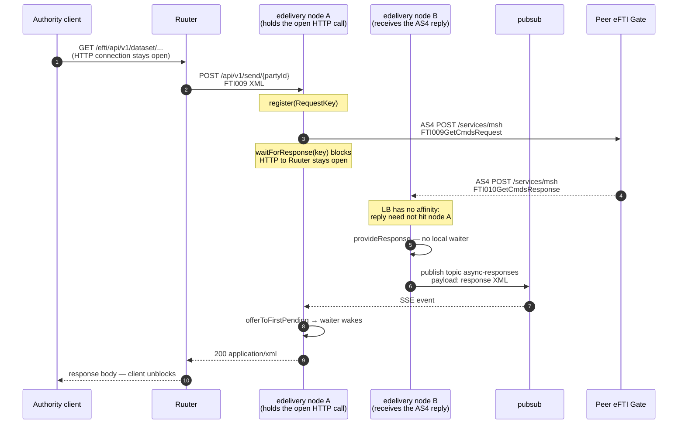

# Architecture: eDelivery multi-node response correlation

## Changes

- _Initial state. Change tracking begins at v1.0.0._

> Why `pubsub` is required to complete cross-node AS4 responses when `edelivery` is scaled.

## The problem

An authority REST call is synchronous — the client holds one HTTP connection open. The AS4 hop to a peer gate is not: the outbound request and the inbound reply are two separate HTTP connections, with no requirement that they land on the same process.

On a single `edelivery` instance the reply finds its waiter in process memory. With more than one instance it breaks:

1. The load balancer uses least-connections and **no sticky sessions**. Inbound AS4 is not bound to the node that sent the request.
2. Pending correlation state is in-process only. A reply that lands on another replica has no waiter and is discarded.
3. The authority call then blocks until timeout and returns `504`, even though the peer answered.

`pubsub` bridges that gap: it notifies every `edelivery` node of an incoming reply so the one still holding the authority HTTP connection can complete it.

## Why pubsub

| Option | Verdict |
|---|---|
| Sticky sessions | Forbidden — stateless JWT, no affinity. AS4 inbound is peer-initiated and cannot be pinned. |
| `async_responses` table + poll | Storing the response temporarily does **not** help node handover without `LISTEN`/`NOTIFY`: the waiting node only learns about the row by polling, and a dead waiter cannot be woken either way. Poll latency also hurts the authority p95, and the row is worthless once the call ends. |
| PostgreSQL `LISTEN`/`NOTIFY` | **Not available.** All DB traffic goes through ReSql, which has no notification channel. Services never talk to PostgreSQL directly. |
| Direct node-to-node HTTP | Needs peer discovery and still fans out to “whoever waits”. More moving parts, same problem. |
| **`pubsub` SSE bus** | Already the internal event bus. In-memory, no persistence. Unmatched reply is one publish away from every waiting node. |

`pubsub` is notification, not durable messaging — best-effort, not replayed. That is the right contract: if the waiting node is gone, its request is already dead and a replay would not help.

Wiring: `MultiNodeAsyncResponseProvider` (default `AsyncResponseProvider`) extends the in-memory single-node provider with the bus handoff. Topic `async-responses`.

## Sequence (reply lands on a different node)

Same-node fast path: the local map matches by `RequestKey` and steps 9–11 are skipped. Timeout is `EDELIVERY_TIMEOUT_SECONDS` (default 60) → `504 GatewayTimeout`.

Local match is exact (`pendingResponses[key]`). Cross-node match is first-waiter — the publish carries the XML, not the key — which is correct when one request per remote gate is outstanding.

## Waiting-node failure is terminal

If the node processing the original inbound HTTP request dies, its socket to Ruuter — and Ruuter’s to the client — is torn down with it. That attempt is finished.

There is **no way to restore the dropped connection**, whatever bus or store sits between nodes. Another replica cannot take over the client’s TCP stream, and a late reply has no waiter to complete. Per eFTI rules the **caller must retry automatically**: a new request, a new `RequestKey`, a new AS4 conversation, free to land on any healthy node.

## Failure modes

| Failure | Behaviour |
|---|---|
| Reply on the waiting node | Resolved in-process; pubsub unused. |
| Reply on another node, waiter open | Pubsub handoff. |
| Reply, no waiter anywhere | Discarded. |
| Waiting node fails mid-request | Connection terminated; caller retries (eFTI). Late reply discarded. |
| SSE to pubsub dropped | Reconnects after 1 s; events in between are **lost**. Authority call times out. |
| `PUBSUB_URL` unset | Multi-node handoff degrades to same-node only. |
| pubsub down | Cross-node completion unavailable until it returns. |
