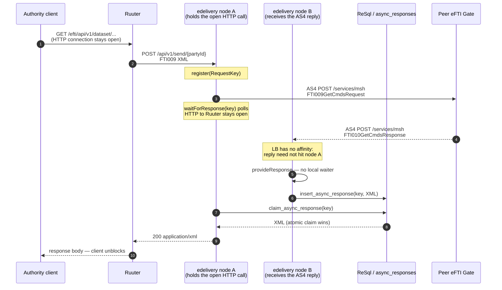

# Architecture: eDelivery multi-node response correlation

## Changes

- _Initial state. Change tracking begins at v1.0.0._
- Cross-node hand-off moved from the `pubsub` SSE bus to the `async_responses` table (atomic claim
  through ReSql). `pubsub` was removed.

> How a cross-node AS4 response completes the authority call when `edelivery` is scaled.

## The problem

An authority REST call is synchronous — the client holds one HTTP connection open. The AS4 hop to a peer gate is not: the outbound request and the inbound reply are two separate HTTP connections, with no requirement that they land on the same process.

On a single `edelivery` instance the reply finds its waiter in process memory. With more than one instance it breaks:

1. The load balancer uses least-connections and **no sticky sessions**. Inbound AS4 is not bound to the node that sent the request.
2. A reply that lands on another replica has no in-memory waiter.
3. Without a hand-off the authority call blocks until timeout and returns `504`, even though the peer answered.

## Solution: database hand-off with atomic claim

All DB traffic goes through ReSql, so the shared state is a table and the hand-off is plain
INSERT + polling. No message bus, no persistent connection between nodes.

| Option | Verdict |
|---|---|
| Sticky sessions | Forbidden — stateless JWT, no affinity. AS4 inbound is peer-initiated and cannot be pinned. |
| PostgreSQL `LISTEN`/`NOTIFY` | Not available. Services never talk to PostgreSQL directly; ReSql has no notification channel. |
| Direct node-to-node HTTP | Needs peer discovery. |
| SSE bus (`pubsub`, removed) | In-memory, no persistence, no ordering, no delivery guarantee; matched the *first* waiter, not the right one. |
| **`async_responses` + atomic claim** | Persistent, exact match by `RequestKey`, works through ReSql only. |

Components (`DbAsyncResponseProvider`, default `AsyncResponseProvider`):

- `register(key)` — local in-memory queue, as before.
- `provideResponse(key, xml)` — local match first. With no local waiter the response is inserted
  into `async_responses` (`insert_async_response`, append-only).
- `waitForResponse(key)` — polls the local queue and `claim_async_response` with back-off
  50 → 250 ms until `EDELIVERY_TIMEOUT_SECONDS` (default 60) → `504 GatewayTimeout`. A failed poll
  is logged and retried.
- The claim inserts a `claimed = TRUE` row selected from the stored response. The partial unique
  index `(request_key) WHERE claimed` guarantees one winner, so a response is consumed at most once.
- Retention: CronManager calls `POST /ops/v1/purge-async-responses` (default: rows older than
  10 minutes are deleted).

## Sequence (reply lands on a different node)

Same-node fast path: the local queue matches by `RequestKey` and the database is not written.
A response stored before node A first polls is still found.

## Waiting-node failure is terminal

If the node processing the original inbound HTTP request dies, its socket to Ruuter — and Ruuter’s to the client — is torn down with it. That attempt is finished.

There is **no way to restore the dropped connection**: another replica cannot take over the client’s TCP stream, and a late reply has no waiter to complete. Per eFTI rules the **caller must retry automatically**: a new request, a new `RequestKey`, a new AS4 conversation, free to land on any healthy node. The orphaned row is purged by retention.

## Gate / platform registry

There is no change broadcast. `edelivery` reloads gates and platforms from ReSql
every `REGISTRY_REFRESH_SECONDS` (default 60), so a registry change reaches every node within that
interval. A failed refresh keeps the previous data.

## Failure modes

| Failure | Behaviour |
|---|---|
| Reply on the waiting node | Resolved in-process; database not written. |
| Reply on another node, waiter open | Stored in `async_responses`, claimed by the waiter within one poll interval. |
| Reply, no waiter anywhere | Row stays until purged; never claimed. |
| Waiting node fails mid-request | Connection terminated; caller retries (eFTI). Late reply is purged unclaimed. |
| ReSql briefly unavailable while polling | Poll failure logged, next poll retries; the call times out only if it stays down for the whole timeout. |
| ReSql unavailable when storing a reply | AS4 handler fails; the peer sees an error and the authority call times out (`504`). |
| Purge job not running | Table grows; waiters are unaffected (lookups are by key). |
