# eFTI Gate Reference Architecture

## Changes

- _Initial state. Change tracking begins at v1.0.0._

**Version:** 2.0

**Date:** 2026-04-02

**Author:** Rainer Türner (KeMIT) — [@turnerrainer](https://github.com/turnerrainer), `rainer.turner@gmail.com`

**Purpose:** Technology-agnostic architectural reference for eFTI Gate

**Implementation Status:** eFTI Regulation (EU 2020/1056) fully applies from **July 9, 2027**. This document describes the target architecture per EU regulations 2020/1056, 2024/1942, 2024/2024, and 2025/2243.

---

## 1. System Actors & Components

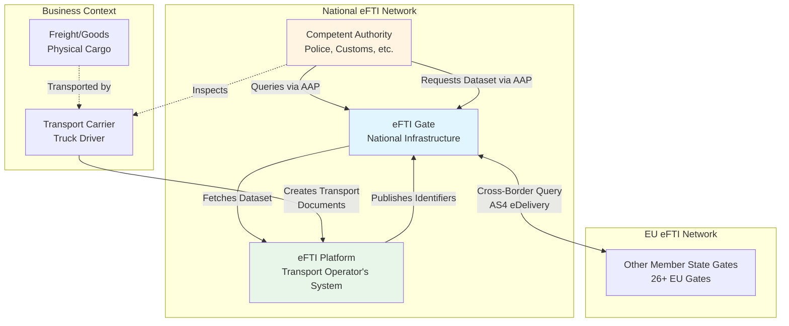

**Note:** AAP = Authority Access Point (the Gate's authority-facing REST API interface)

### Actor Roles

| Actor | Responsibility | Data Owned |
|-------|---------------|------------|
| **Platform** | Stores transport datasets | Full datasets (CMDS) |
| **Gate** | Routes queries, stores identifiers | Identifiers only |
| **Authority** | Inspects transports | None (queries only) |
| **Carrier** | Performs transport | None (platform user) |

---

## 2. Core Concepts

### 2.1 UIL (Unique Identifier Locator)

**Purpose:** Globally unique reference to a specific consignment dataset

```
UIL Structure: <gateURL>/<platformURL>/<datasetId>

Official Format (per Regulation 2024/1942):
- Gate URL: `<gateBaseUrl>` (operator-configured; e.g. `https://efti.<orgDomain>`)
- Platform URL: `<platformBaseUrl>/v1` (operator-configured per platform)
- Dataset ID: UUID v4

Simplified Example: <gateId>/platform-demo/550e8400-e29b-41d4-a716-446655440000
                    ↓        ↓             ↓
                    Gate     Platform      Dataset UUID
```

**Key Properties:**
- Created by Platform when publishing identifiers
- Immutable reference to dataset
- Used by Authorities to request full data

#### Roadside Inspection Scenario

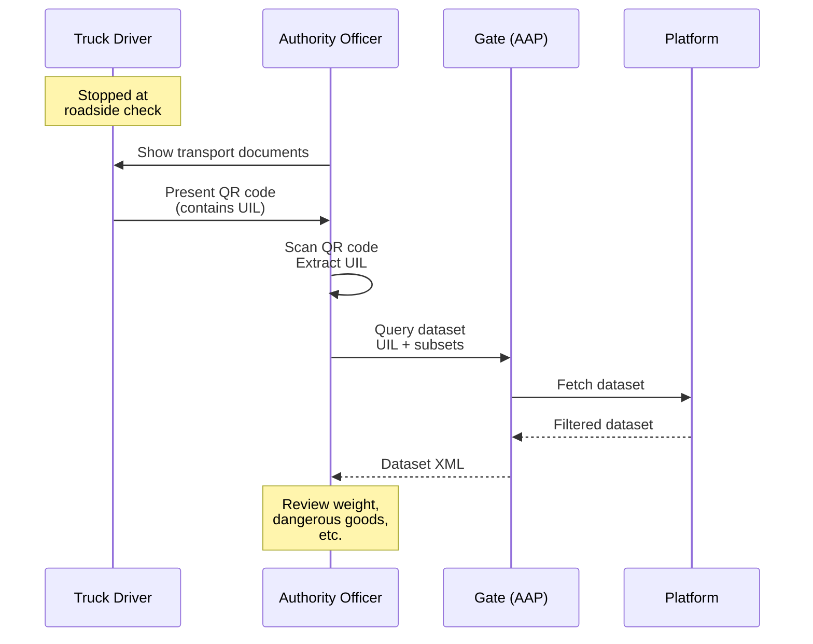

**UIL Presentation Methods:**
- QR code (on driver's mobile device or printed document)
- NFC tag
- Manual entry into authority application

---

### 2.2 Identifiers vs Datasets

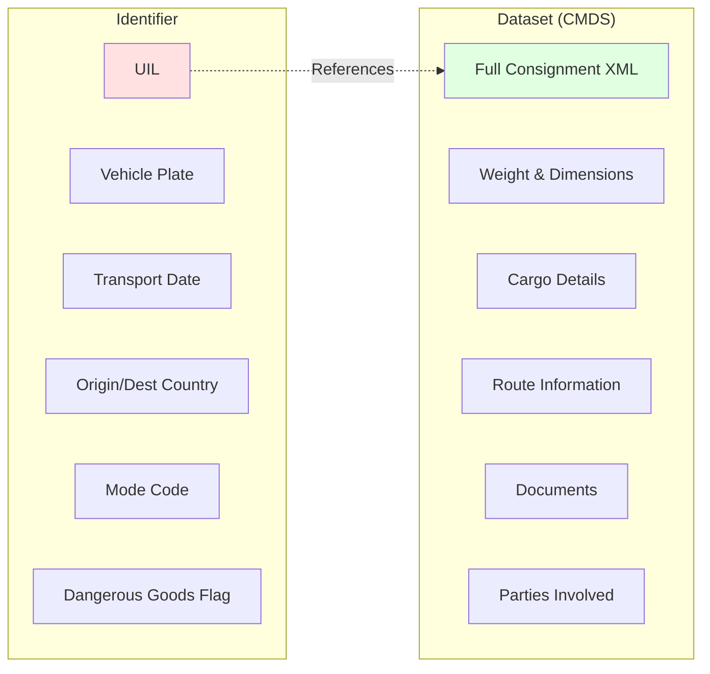

**Identifier:** Minimal searchable metadata (stored in Gate)
**Dataset (CMDS):** eFTI Common Data Set - Complete transport documentation (stored in Platform)

### 2.3 Data Subsets

**Regulated by EU Delegated Regulation 2024/2024**

Authorities request only legally-permitted subsets:

```
Dataset (Full CMDS)
├── common (basic info)
├── weight_and_dimensions
├── dangerous_goods (ADR)
├── cargo_information
├── customs_information
└── [other subsets...]

Authority requests: "Give me weight_and_dimensions + dangerous_goods"
Platform filters and returns only requested subsets
```

---

## 3. Data Lifecycle & Ownership

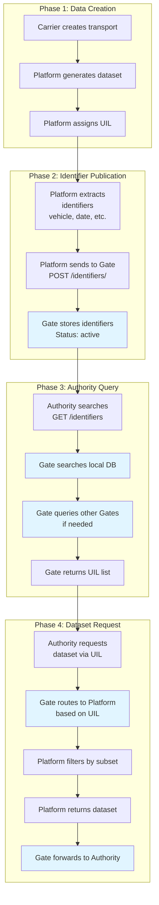

### Data Storage Matrix

| Data Type | Created By | Stored By | Used By | Lifecycle States | Lifetime |
|-----------|-----------|-----------|---------|------------------|----------|
| **Transport Document** | Carrier | Platform | Authority | N/A | Years (archival) |
| **Full Dataset (CMDS)** | Platform | Platform | Authority | active/inactive | Months (retention policy) |
| **Identifiers** | Platform | Gate | Authority | active/inactive/deleted | Days/Weeks (configurable) |
| **Query Results** | Gate | None | Authority | N/A | Transient (not stored) |

**CMDS Lifecycle States (per Regulation 2025/2243):**
- **active**: Available for authority queries (normal operational state)
- **inactive**: Archived but still accessible for historical queries
- **deleted**: No longer available, queries return "not found"

**Critical:** Gate NEVER stores full datasets (GDPR, performance, storage)

---

## 4. Protocol Architecture: Generic Envelope + Variable Payload

### 4.1 Conceptual Model

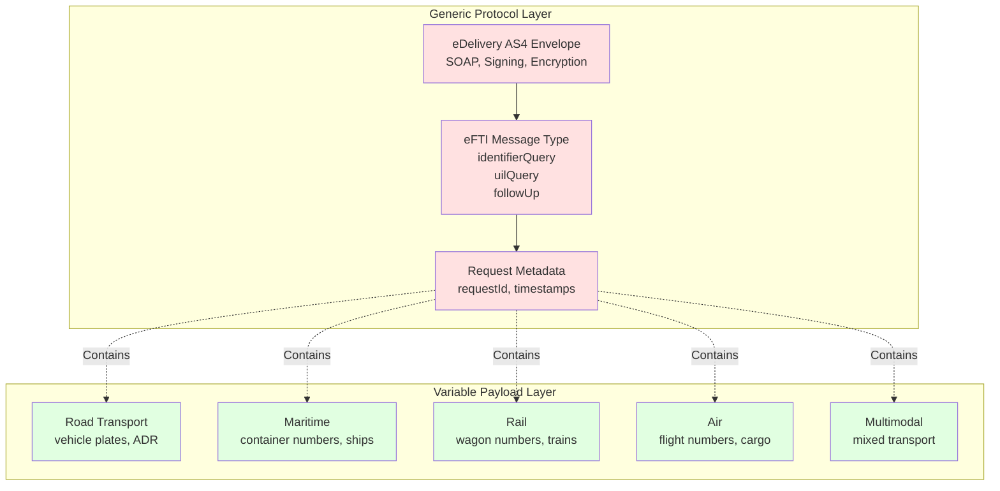

### 4.2 Message Structure Example

**Road Transport (Mode 3):**
```xml
<!-- GENERIC PROTOCOL ENVELOPE -->
<identifierQuery xmlns="http://efti.eu/v1/queries" requestId="req-123">
  <identifier type="VEHICLE_PLATE">ABC-123</identifier>
  <registrationCountryCode>EE</registrationCountryCode>
  <modeCode>3</modeCode>                    <!-- Road -->
  <dangerousGoodsIndicator>false</dangerousGoodsIndicator>
</identifierQuery>

<!-- VARIABLE PAYLOAD (stored at Platform, not Gate) -->
<consignment xmlns="http://efti.eu/v1/consignment">
  <mainCarriageTransportMovement>
    <modeCode>3</modeCode>                  <!-- Road specific -->
    <usedTransportMeans>
      <id>ABC-123</id>                      <!-- Truck plate -->
      <registrationCountry><code>EE</code></registrationCountry>
    </usedTransportMeans>
  </mainCarriageTransportMovement>
  <usedTransportEquipment>
    <id>298YPH</id>                         <!-- Trailer plate -->
  </usedTransportEquipment>
</consignment>
```

**Maritime Transport (Mode 1):**
```xml
<!-- SAME GENERIC PROTOCOL ENVELOPE -->
<identifierQuery xmlns="http://efti.eu/v1/queries" requestId="req-456">
  <identifier type="CONTAINER_NUMBER">MSCU1234567</identifier>
  <modeCode>1</modeCode>                    <!-- Maritime -->
</identifierQuery>

<!-- DIFFERENT VARIABLE PAYLOAD -->
<consignment xmlns="http://efti.eu/v1/consignment">
  <mainCarriageTransportMovement>
    <modeCode>1</modeCode>                  <!-- Maritime specific -->
    <usedTransportMeans>
      <id>IMO1234567</id>                   <!-- Ship IMO number -->
      <name>MSC Container Ship</name>       <!-- Vessel name -->
    </usedTransportMeans>
  </mainCarriageTransportMovement>
  <usedTransportEquipment>
    <id>MSCU1234567</id>                    <!-- Container number -->
    <categoryCode>CN</categoryCode>         <!-- Container type -->
  </usedTransportEquipment>
</consignment>
```

**Key Principle:**
- **Protocol:** Gate processes generic message types (queries, requests)
- **Payload:** Gate treats as opaque data, routes without interpretation
- **Gate is content-agnostic:** Works for road, maritime, rail, air, multimodal

---

## 5. Message Flow Sequences

### 5.1 Identifier Query (Cross-Border Search)

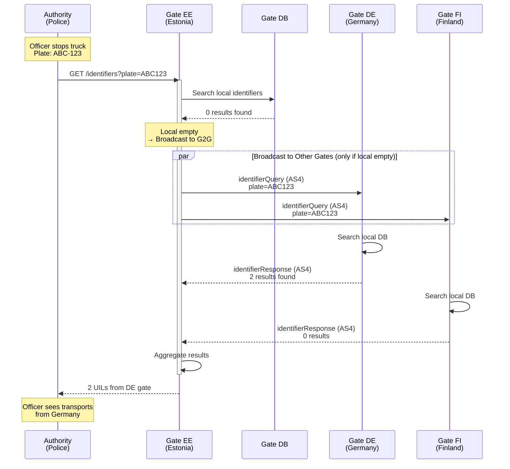

**Protocol Details:**
- **H2M (Authority → Gate):** REST API via AAP interface
- **M2M (Gate → Gate):** eDelivery AS4 (async SOAP, signed, encrypted)
- **Conditional Broadcast:** Cross-border queries ONLY happen when local search returns 0 results
- **Aggregation:** Gate collects responses from all connected gates
- **Result:** List of UILs from local and/or remote sources

**Critical Performance Design:**
> Gate does NOT broadcast every query to 26+ member states. Broadcast only occurs when local database has no matching identifiers. This prevents unnecessary network overhead and privacy exposure.

### 5.2 Dataset Query (Request Full Data)

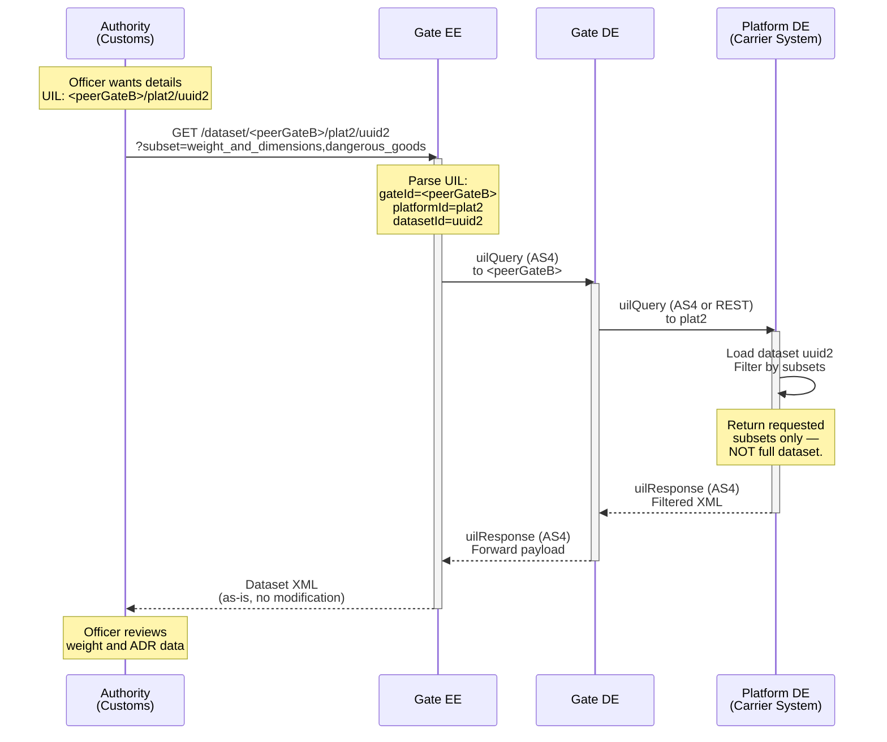

**Key Points:**
- Gate **routes** based on UIL (gateId determines target)
- Gate **does not parse or modify** payload
- Gate **does not store** dataset (passes through)
- Platform enforces subset filtering (legal compliance)

### 5.3 Follow-Up Message

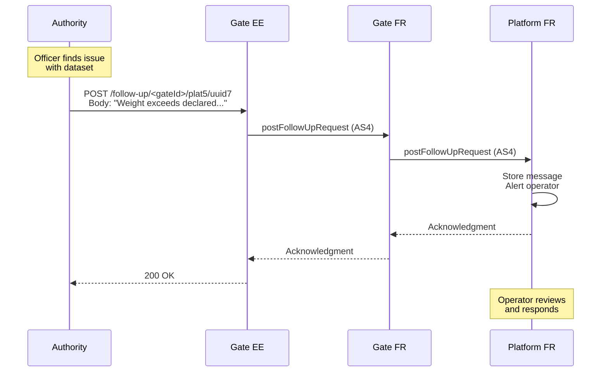

---

## 6. Gate Operations: What It Does & Doesn't Do

### 6.1 Gate Responsibilities

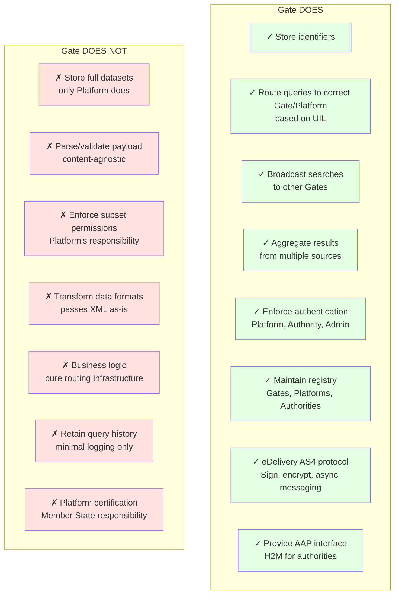

### 6.2 Data Processing Matrix

| Operation | Input | Gate Processing | Output | Storage |
|-----------|-------|-----------------|--------|---------|
| **Save Identifiers** | XML identifiers | Parse, extract search fields | 201 Created | Store in DB (active) |
| **Query Identifiers** | Search criteria | DB query + G2G broadcast | List of UILs | None |
| **Get Dataset** | UIL + subset list | Route to Platform via UIL | XML dataset | None |
| **Follow-Up** | UIL + message text | Route to Platform via UIL | Acknowledgment | None |

**Critical Design Principle:**
> Gate is a **stateless router** with **minimal persistence** (identifiers only)

---

## 7. Technical Architecture

### 7.1 Logical Component Layers

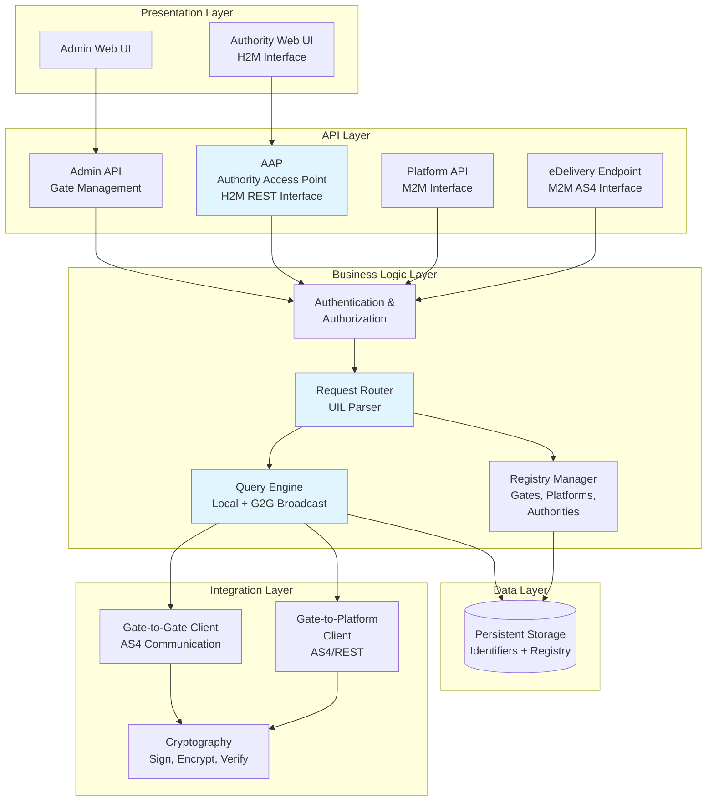

**Implementation Notes:**
- Components shown are logical layers
- Can be implemented in any technology stack
- AAP provides both H2M (browser/app) and M2M (API) access for authorities

### 7.2 Conceptual Data Model

**Entities and Relationships:**

```
Consignments (Identifiers)
├── uil (PK)
├── platform_id (FK)
├── status (active/inactive/deleted)
├── vehicle_plate (searchable)
├── transport_date (searchable)
├── origin_country (searchable)
├── destination_country (searchable)
├── mode_code (searchable)
├── dangerous_goods (searchable)
├── created_at
└── expires_at

Gates (Registry)
├── id (PK)
├── country_code
├── edelivery_url
├── edelivery_certificate
└── status (online/offline)

Platforms (Registry)
├── id (PK)
├── endpoint_url
├── certificate
└── status (active/inactive)

Authorities (Registry)
├── id (PK)
├── name
└── allowed_subsets (list)
```

**Key Design Principles:**
- Identifiers stored with searchable fields only
- No dataset storage (pass-through only)
- Registry maintains connectivity information
- CMDS lifecycle states (active/inactive/deleted) managed

---

## 8. Security & Compliance

### 8.1 Security Layers

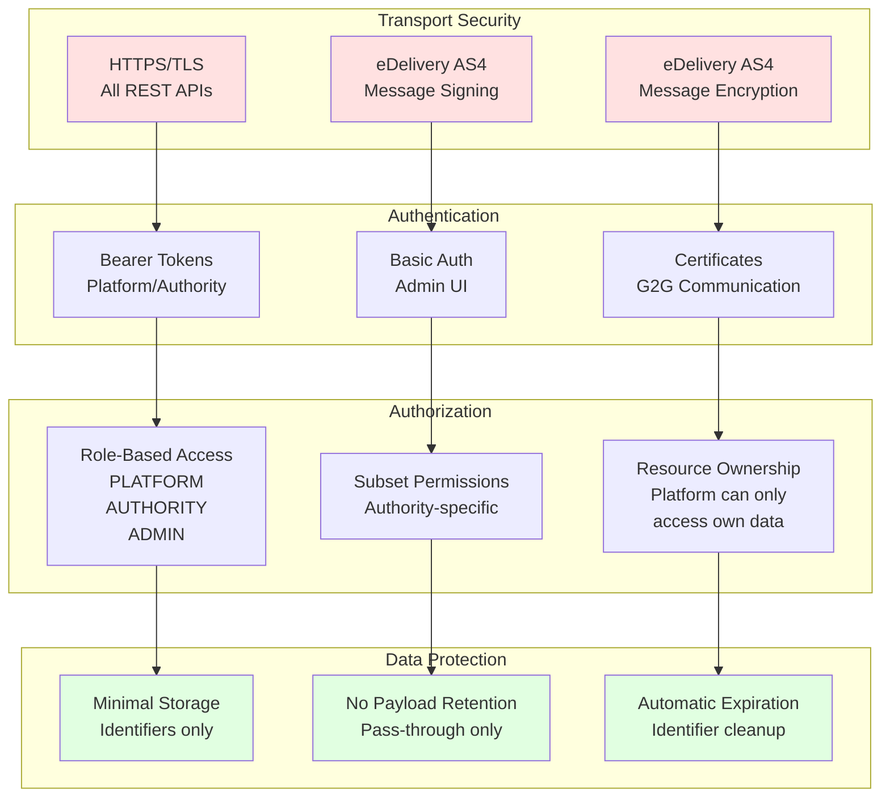

### 8.2 GDPR Compliance

**Key Principles:**
- **Data Minimization:** Gate stores only searchable metadata
- **Purpose Limitation:** Identifiers used only for routing queries
- **Storage Limitation:** Automatic expiration and lifecycle management
- **Pass-through Processing:** Full datasets not retained by Gate

Platform is responsible for GDPR compliance of full datasets.

---

## 9. API Reference

### 9.1 Platform API

**Endpoint:** `POST /v1/identifiers/:datasetId`

**Purpose:** Publish identifier metadata to Gate

**Authentication:** Bearer token

---

### 9.2 Authority API (AAP)

#### Identifier Search

**Endpoint:** `GET /v1/identifiers/:identifier`

**Purpose:** Search for consignments by criteria

**Parameters:**
- `modeCode` - Transport mode (1=maritime, 2=rail, 3=road, 4=air)
- `registrationCountryCode` - Vehicle registration country
- `dangerousGoodsIndicator` - Boolean flag for dangerous goods

**Authentication:** Bearer token

**Interface:** H2M (browser/app) and M2M (API)

---

#### Dataset Request

**Endpoint:** `GET /v1/dataset/:gateId/:platformId/:datasetId`

**Purpose:** Request full dataset by UIL

**Parameters:**
- `gateId` - Target gate identifier
- `platformId` - Platform identifier
- `datasetId` - Dataset UUID
- `subsetId` - Required list of permitted subsets (e.g., weight_and_dimensions, dangerous_goods)

**Authentication:** Bearer token

---

#### Follow-Up Message

**Endpoint:** `POST /v1/follow-up/:gateId/:platformId/:datasetId/:datasetRequestId`

**Purpose:** Send follow-up message to Platform

**Parameters:**
- `gateId` - Target gate identifier
- `platformId` - Platform identifier
- `datasetId` - Dataset UUID
- `datasetRequestId` - Original request ID
- Request body: Follow-up message text

**Authentication:** Bearer token

---

### 9.3 Audit Logging & Compliance Note

**Current Implementation Status:** Gates implementing minimal persistence architecture typically do **not** retain query/response logs in persistent storage. Only operational logs (ephemeral, for debugging) and data modification audit trails (for stored identifiers) are maintained.

**Regulatory Clarity Needed:** EU Regulations 2024/1942 and 2025/2243 do not explicitly mandate persistent audit logging of authority queries at the Gate level. However, Member States should verify compliance requirements with legal counsel, as some jurisdictions may require:
- Authority query audit trails (who accessed what data, when)
- Request/response logging for accountability
- Retention periods for compliance verification

**Recommendation:** Gate operators should confirm regulatory requirements for their jurisdiction before finalizing logging architecture.

---

## 10. Key Takeaways

### For Business Stakeholders

1. **Gate is infrastructure**, not a business system
2. **Platform owns data**, Gate only routes queries
3. **Authorities query across borders** seamlessly via AAP
4. **Protocol is standardized**, payload is flexible (road/maritime/rail/air)
5. **GDPR-friendly**: Minimal data storage by design

### For Technical Teams

1. **Content-agnostic router**: Gate doesn't parse payload XML
2. **UIL-based addressing**: Globally unique reference system
3. **AAP provides H2M + M2M**: Authorities access via REST (browser or API)
4. **Stateless design**: Easy to scale horizontally
5. **Minimal persistence**: Identifiers only, no datasets
6. **CMDS lifecycle**: active/inactive/deleted states per Regulation 2025/2243

### For Gate Operators

1. **Manual registry** (gates/platforms) - no auto-discovery yet
2. **Certificate management** required for AS4 trust
3. **AAP interface** must be provided for authorities
4. **CMDS lifecycle management** required
5. **Platform certification** handled by Member States (not Gate operator)

---

## 11. Document References

| Document | Purpose |
|----------|---------|
| EU Regulation 2020/1056 | Legal framework for eFTI |
| EU Delegated Regulation 2024/2024 | eFTI common data set and subsets |
| EU Implementing Regulation 2024/1942 | Procedures for authorities to access eFTI data |
| EU Implementing Regulation 2025/2243 | Functional requirements for eFTI platforms |
| UN/CEFACT MMT RDM | Multimodal Transport Reference Data Model |
| eDelivery AS4 Specification | Message exchange protocol |

---

## 12. Glossary

| Term | Definition |
|------|------------|
| **AAP** | Authority Access Point - Gate's authority-facing REST API interface (H2M + M2M) |
| **UIL** | Unique Identifier Locator - global reference to dataset (URL-based) |
| **CMDS** | eFTI Common Data Set - complete transport documentation |
| **Gate** | National eFTI infrastructure node (router) |
| **Platform** | Transport operator's system (data owner) |
| **Authority** | Competent authority (police, customs, etc.) |
| **Identifier** | Minimal searchable metadata |
| **Dataset** | Full transport documentation (CMDS) |
| **Subset** | Filtered portion of dataset (e.g., weight only) |
| **AS4** | eDelivery protocol (SOAP-based async messaging) |
| **G2G** | Gate-to-Gate communication (M2M) |
| **G2P** | Gate-to-Platform communication (M2M) |
| **H2M** | Human-to-Machine interface (browser/app access) |
| **M2M** | Machine-to-Machine interface (API/AS4) |
| **Mode** | Transport type (1=maritime, 2=rail, 3=road, 4=air, etc.) |

## 13. Compliance check — RA principles × epic coverage

A flat matrix mapping each Reference Architecture principle to the epics that implement it. Useful for audit-trail purposes and for spotting RA principles that lack epic coverage.

| RA principle | Epics | Status |
|---|---|---|
| Gate is a content-agnostic router | E3, E4, E5, E10 | Covered |
| Broadcast only on 0 local results | E4 | Covered |
| Platform filters subsets | E5 | Clarified |
| Gate does not store full datasets | E5, E9 | Covered |
| UIL = URL-based structure | E3, E4, E5 | Covered |
| CMDS statuses active / inactive / deleted | E9 | Addressed |
| AAP = authority REST interface (H2M + M2M) | E21 | Covered |
| Identifier `expires_at` field | E9 | Addressed |
| Audit logging jurisdiction question | E15 | Clarified |
| Multimodal support (road / sea / rail / air) | E3, E10 | Covered |
