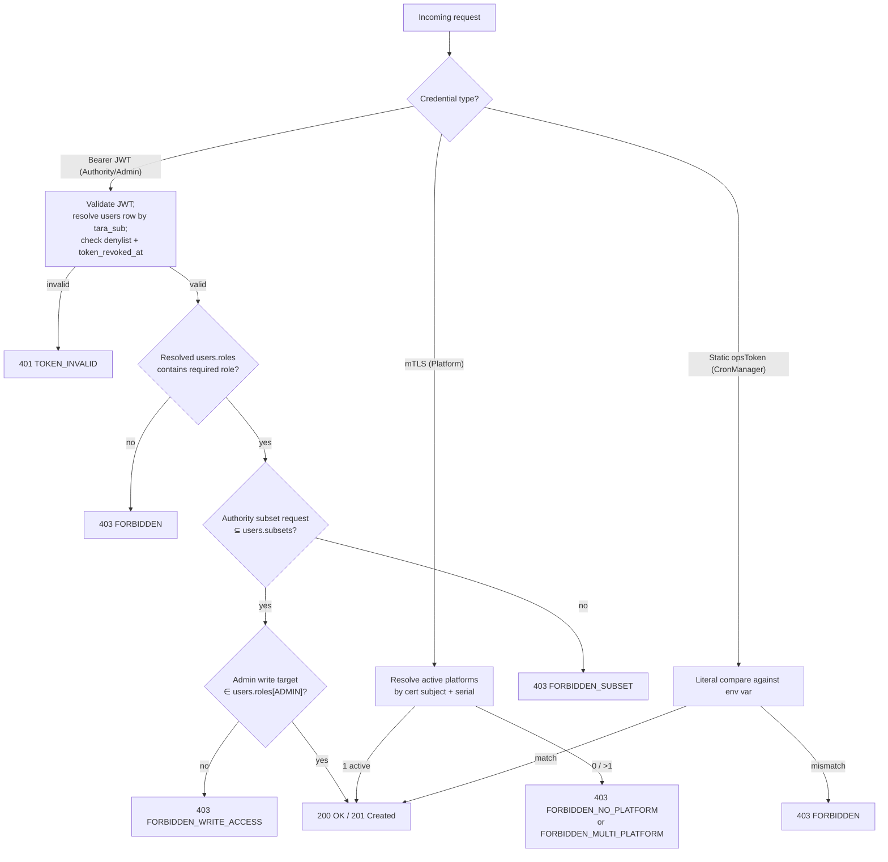

# Architecture: Identity and Access

## Changes

- _Initial state. Change tracking begins at v1.0.0._

> Theme-wide architectural rules. Every epic under this theme — and every Acceptance Criterion (AC) it carries — must derive from or at minimum **not conflict with** the rules stated here. AC live in the corresponding epic files under [`docs/cfr/`](../../cfr/); this document describes the *contract those AC implement*.

**System-wide reference:** [eFTI Gate Reference Architecture §8 Security](../eFTI-Gate-Reference-Architecture.md). This document narrows the system-wide rules to the Identity & Access surface.

**Sub-architectures in this theme** (each is the architectural surface for the AC tracked in the linked epic):

- [User Management and RBAC](user_management_and_rbac.md) — AC: [`docs/cfr/identity-and-access/user_management_and_rbac.md`](../../cfr/identity-and-access/user_management_and_rbac.md)
- [Authentication](authentication.md) — AC: [`docs/cfr/identity-and-access/authentication.md`](../../cfr/identity-and-access/authentication.md)
- [Authentication and Access Flows](authentication_and_access_flows.md) — AC: [`docs/cfr/identity-and-access/authentication_and_access_flows.md`](../../cfr/identity-and-access/authentication_and_access_flows.md)

---

## 1. Overarching rules

These are the cross-cutting invariants that every epic in this theme derives from. AC bullets in the epic files specialise these rules to verifiable conditions on specific endpoints, error codes, or DB state.

### 1.1 The JWT is the authorisation snapshot

When a JWT is issued by the gate, it carries the user's permission state at that moment (`tara_sub`, `roles`, `subsets`, `scopes`, plus standard claims). The gate validates the JWT and trusts its claims for the entire validity window — **no DB lookup for identity or permissions on the hot path by default**. When a JWT expires or needs refreshing, the gate re-resolves the user from `users` and mints a new JWT carrying the current snapshot.

The same logic holds across all TTLs:

- **Long-lived JWTs** (e.g. multi-hour admin sessions): efficient — rare refresh cycles, no per-request DB load.
- **Short-lived JWTs** (e.g. minutes): faster permission propagation — a DB-side change reaches every caller within one TTL window.
- **Extremely short-lived / one-shot JWTs** (e.g. step-up auth for a single sensitive operation): strongest binding between JWT and intent — the token cannot outlive the operation it was issued for.

The TTL is the *granularity of permission propagation*. Pick long where permissions are stable and request volume is high; pick short (or one-shot) where revocation latency matters more than request overhead. The validation pipeline is identical regardless of TTL.

Note that the JWT here is the **gate-issued access token**, not the upstream TARA OIDC ID token. TARA proves identity at login; the gate exchanges the TARA ID token (one DB lookup at exchange time) for its own JWT carrying identity + permissions. Refresh re-mints from the current DB state.

### 1.2 The gate is a stateless OAuth 2.0 Resource Server

For Authority and Admin traffic: **no server-side session, no `session_id` cookie, no per-request DB lookup**. The JWT *is* the session and carries everything the gate needs to authorise the request. Multi-node deployment requires no session affinity or shared cache: any node can validate any gate-issued JWT against the gate's own signing key.

### 1.3 Revocation = refresh denial (default profile)

A revocation primitive marks the user as no-refresh in `users`. The currently-held JWT continues to validate until its `exp` claim — there is **no per-request denylist lookup** in the default profile. Latency between a revoke action and its taking effect is bounded by the JWT TTL; operators pick a short TTL for scopes where rapid revocation matters.

- **Logout** (`POST /api/v1/auth/logout`): marks the calling user (or specific token, by `jti`) as no-refresh. The currently-held JWT lives until `exp`. Subsequent refresh attempts for the same token / user fail.
- **Admin revoke** (`POST /api/v1/users/{userId}/revoke-token`): INSERTs a new `users` row with `token_revoked_at = NOW()` (append-only). The currently-held JWT for that user lives until `exp`; subsequent refresh attempts fail because the refresh pipeline checks `users.token_revoked_at`.
- **Break-glass JWT**: hard-coded 600 s TTL (`BREAK_GLASS_JWT_TTL_SECONDS`) provides naturally bounded revocation latency without any explicit revoke action.

> **Future mode (opt-in, not in the default profile):** environments where TTL-bounded revocation latency is unacceptable can enable a **per-request denylist check** against `sessions` (per-token `jti`) and `users.token_revoked_at` (per-user `jwt.iat` comparison). This adds two DB lookups per request and reintroduces hot-path DB load — the trade is hard immediate revocation versus the default's stateless throughput. The schema (`sessions` table, `users.token_revoked_at`) already supports this mode; the toggle is a runtime configuration item.

### 1.4 Channel routing

The gate has exactly four authentication channels, each with one credential type and one validation pipeline. There are no fallbacks between channels.

| Channel | Credential on the wire | Validated against | Hot-path DB lookup |
|---|---|---|---|
| Authority / Admin API | Gate-issued RS256 JWT | Gate signing key (cached) — JWT carries `tara_sub`, `roles`, `subsets`, `scopes` | none (default profile) |
| Authority / Admin login (one-time) | TARA OIDC RS256 ID token | Cached TARA JWKS | `users` by `tara_sub` (at JWT exchange / refresh only) |
| Platform API | mTLS X.509 client cert | Reverse proxy + cert chain | `platforms` by `(cert_subject, cert_serial)` |
| CronManager admin endpoints | Static Bearer | Literal compare against `ARCHIVE_OPS_TOKEN` env var | none |
| Gate-to-gate (G2G) | mTLS at AS4 access point | EU Trust Service trust list, OCSP/CRL fail-closed | none (peer gate cert) |

The break-glass channel (`POST /api/v1/auth/local-token`) is **default-disabled** (`LOCAL_ADMIN_FALLBACK_ENABLED=false`); when enabled, it issues a gate-signed JWT (`tara_sub='local-admin'`, 600 s TTL) that then follows the Authority/Admin path. Break-glass is therefore not a fifth channel — it's a recoverable backdoor onto channel 1.

### 1.5 Secrets never live in the container image

TARA client secret, break-glass JWT signing key, mTLS certificates, and the static `ARCHIVE_OPS_TOKEN` are all loaded at startup from a runtime secret (Kubernetes Secret / Vault). The container image is never the carrier.

---

## 2. Authorisation decision tree

The single decision tree that every request runs through, regardless of which channel it arrived on. Each leaf maps to an HTTP status + `efti.error.code`.

The canonical path × role × subset matrix is in [`docs/specs/permissions-matrix.md`](../../specs/permissions-matrix.md) §1; the canonical error catalog is in [`docs/specs/errors.json`](../../specs/errors.json).

---

## 3. Theme business value

- TARA authentication eliminates password management overhead and satisfies the Estonian e-government standard for production identity.
- Centralised identity management via TARA + `users` table.
- GDPR Art. 30 compliance — record of processing with audit log of every authorisation denial.

## 4. Rationale

Identity is federated (TARA owns it for Authority/Admin), cert-based (mTLS for Platform and G2G), or pinned-by-token (CronManager). Authorisation is computed from the DB-resolved row on every request — never from JWT claims directly — because the gate's authorisation snapshot must be current, not as-of-token-minting. The gate maintains no admin session state; this is what makes it horizontally scalable without session affinity and what makes revocation cheap (insert into `sessions` denylist or new `users` row with `token_revoked_at`).
