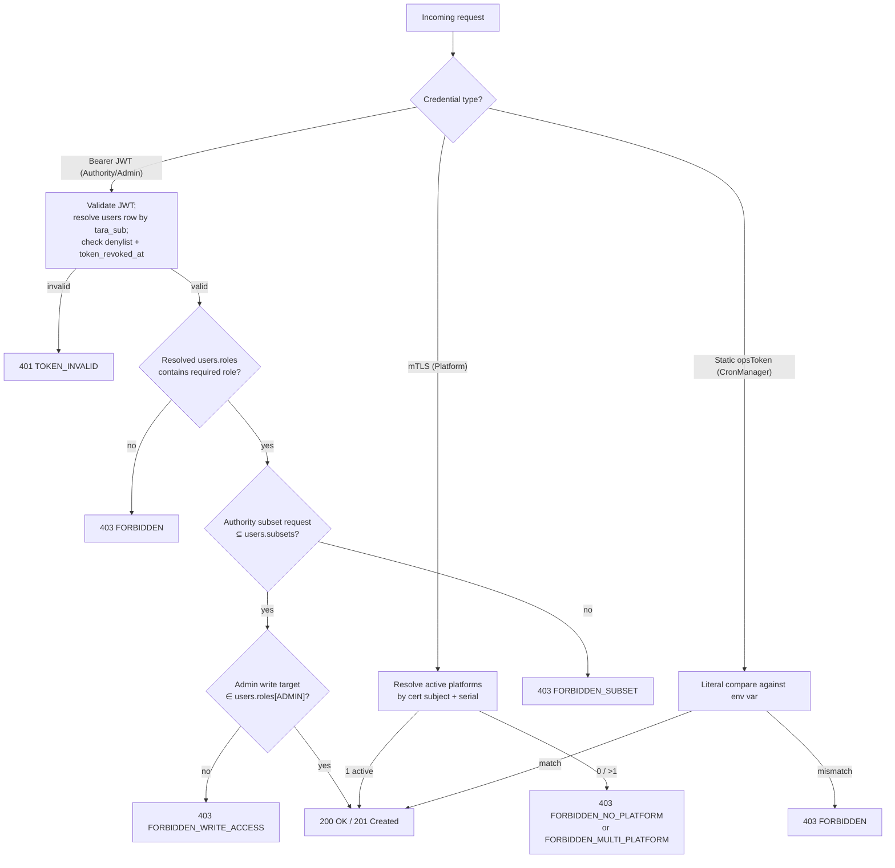

# Architecture — Identity & Access (Theme 1)

> Theme-wide architectural rules. Every epic under this theme — and every Acceptance Criterion (AC) it carries — must derive from or at minimum **not conflict with** the rules stated here. AC live in the corresponding epic files under [`docs/epics/`](../../epics/); this document describes the *contract those AC implement*.

**System-wide reference:** [eFTI Gate Reference Architecture §8 Security](../eFTI-Gate-Reference-Architecture.md). This document narrows the system-wide rules to the Identity & Access surface.

**Sub-architectures in this theme** (each is the architectural surface for the AC tracked in the linked epic):

- [User Management and RBAC](user_management_and_rbac.md) — AC: [`docs/epics/epic_1_en.md`](../../epics/epic_1_en.md)
- [Authentication](authentication.md) — AC: [`docs/epics/epic_2_en.md`](../../epics/epic_2_en.md)
- [Authentication and Access Flows](authentication_and_access_flows.md) — AC: [`docs/epics/epic_23_en.md`](../../epics/epic_23_en.md)

---

## 1. Overarching rules

These are the cross-cutting invariants that every epic in this theme derives from. AC bullets in the epic files specialise these rules to verifiable conditions on specific endpoints, error codes, or DB state.

### 1.1 Authorisation snapshot lives in the DB, never in the JWT

Permissions (roles, subsets, scope-IDs, platform binding) are read from the resolved DB row on every request — `users.roles` / `users.subsets` for Authority/Admin, `platforms.id` for Platform. **The JWT is identity-only** (`sub`, `iat`, `jti`, `exp`). This is non-negotiable because the gate's authorisation snapshot can change after a token was minted, and we must honour the current snapshot — not the one frozen in the token claims.

### 1.2 The gate is a stateless OAuth 2.0 Resource Server

For Authority and Admin traffic: **no server-side session, no `session_id` cookie**. The JWT *is* the session. The `sessions` table is a JWT **denylist** (per-token revocation), not a session store. Multi-node deployment requires no session affinity: any node can validate any JWT against the cached TARA JWKS plus the denylist.

### 1.3 Append-only revocation model

Revocation never mutates a row. Three append-only revocation channels:

- **Per-token revocation** (`POST /api/v1/auth/logout`): INSERT a row into `sessions` carrying `(jti, revoked_at, reason='logout')`.
- **Per-user broadcast revocation** (`POST /api/v1/users/{userId}/revoke-token`): INSERT a new `users` row with `token_revoked_at = NOW()`. Every previously issued JWT for that user becomes invalid on the next request via `jwt.iat < users.token_revoked_at`.
- **Token expiry**: TARA owns expiry for the federated path; the gate's break-glass path uses a hard-coded 600 s TTL.

### 1.4 Channel routing

The gate has exactly four authentication channels, each with one credential type and one validation pipeline. There are no fallbacks between channels.

| Channel | Credential | Validated against | Identity resolution |
|---|---|---|---|
| Authority / Admin API | TARA OIDC RS256 JWT | Cached TARA JWKS + `sessions` denylist | `users` by `tara_sub` |
| Platform API | mTLS X.509 client cert | Reverse proxy + cert chain | `platforms` by `(cert_subject, cert_serial)` |
| CronManager admin endpoints | Static Bearer | Literal compare against `ARCHIVE_OPS_TOKEN` env var | n/a (operational identity) |
| Gate-to-gate (G2G) | mTLS at AS4 access point | EU Trust Service trust list, OCSP/CRL fail-closed | Peer gate cert |

The break-glass channel (`POST /api/v1/auth/local-token`) is **default-disabled** (`LOCAL_ADMIN_FALLBACK_ENABLED=false`); when enabled, it issues a gate-signed JWT (`tara_sub='local-admin'`, 600 s TTL) that then follows the Authority/Admin path. Break-glass is therefore not a fifth channel — it's a recoverable backdoor onto channel 1.

### 1.5 Secrets never live in the container image

TARA client secret, break-glass JWT signing key, mTLS certificates, and the static `ARCHIVE_OPS_TOKEN` are all loaded at startup from a runtime secret (Kubernetes Secret / Vault). The container image is never the carrier.

---

## 2. Authorisation decision tree

The single decision tree that every request runs through, regardless of which channel it arrived on. Each leaf maps to an HTTP status + `efti.error.code`.

The canonical path × role × subset matrix is in [`docs/specs/permissions-matrix.md`](../../specs/permissions-matrix.md) §1; the canonical error catalog is in [`docs/specs/errors.json`](../../specs/errors.json).

---

## 3. Theme business value

- TARA authentication eliminates password management overhead and satisfies the Estonian e-government standard for production identity.
- Centralised identity management via TARA + `users` table.
- GDPR Art. 30 compliance — record of processing with audit log of every authorisation denial.

## 4. Rationale

Identity is federated (TARA owns it for Authority/Admin), cert-based (mTLS for Platform and G2G), or pinned-by-token (CronManager). Authorisation is computed from the DB-resolved row on every request — never from JWT claims directly — because the gate's authorisation snapshot must be current, not as-of-token-minting. The gate maintains no admin session state; this is what makes it horizontally scalable without session affinity and what makes revocation cheap (insert into `sessions` denylist or new `users` row with `token_revoked_at`).
