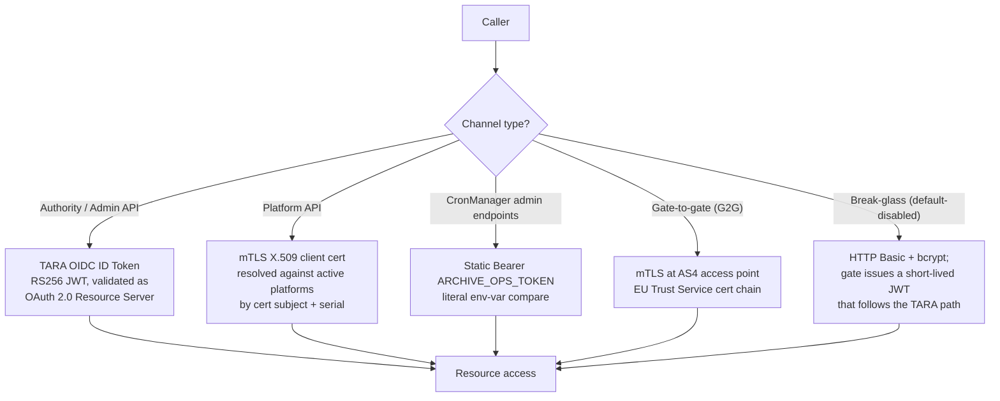

# Architecture: Authentication

## Changes

- _Initial state. Change tracking begins at v1.0.0 (not yet released)._

> Sub-architecture for the authentication surface. For overarching rules (DB-backed authorisation snapshot, stateless Resource Server, append-only revocation, channel routing, secret loading) see [theme README](README.md). AC are in [`docs/cfr/identity-and-access/authentication.md`](../../cfr/identity-and-access/authentication.md).

## 1. Authentication channels — detailed view

The theme README's channel table covers the routing rules. This section drills into the validation pipeline of each channel.

## 2. TARA OIDC pipeline (login + gate-JWT exchange)

This pipeline runs at **login and refresh**, not on every request. Hot-path requests are validated against the gate-issued JWT only (no DB lookup) — see [theme README §1.1](README.md).

- **Issuer:** discovered from `TARA_OIDC_DISCOVERY_URL`; the gate is registered as an OAuth client with `TARA_CLIENT_ID` / `TARA_CLIENT_SECRET`.
- **Code exchange happens in the admin UI**, not in the gate. The gate receives the resulting TARA OIDC ID token from the UI.
- **TARA ID-token validation:** RS256, JWKS fetched from the discovered URL, cached for `TARA_JWKS_CACHE_SECONDS`. Required claims: `iss`, `aud`, `exp`, `sub` (Estonian PIC), `jti`. Clock-skew tolerance ±60 s.
- **Identity resolution (one DB lookup at exchange/refresh time):** `users` row by `tara_sub = jwt.sub` AND `is_active = TRUE`. If no row exists, the exchange is rejected — the gate **does not auto-provision** on first inbound JWT; an admin must `POST /api/v1/users` first.
- **Refresh denial check:** if the latest `users` row carries `token_revoked_at` such that `token_revoked_at > tara_id_token.iat`, the exchange is rejected (refresh denied).
- **Gate-JWT mint:** the gate mints its own RS256 JWT signed with the gate's signing key, carrying `tara_sub`, the resolved `roles`, `subsets`, scope-IDs, plus standard claims (`iat`, `exp`, `jti`). TTL is configurable per use case (long-lived admin session vs. short-lived API call vs. one-shot step-up).
- **Subsequent requests:** the UI sends the gate-JWT as `Authorization: Bearer ...`. Validation is local (signature + claims); no DB query in the default profile.

## 3. Platform mTLS pipeline

- TLS terminated by a trusted reverse proxy (Envoy, Nginx, etc.) that validates the cert chain.
- Proxy forwards the request with `X-Client-Cert-Subject` and `X-Client-Cert-Serial` headers (header names configurable via `MTLS_HEADER_SUBJECT` / `MTLS_HEADER_SERIAL` per [`docs/specs/non-functional.md`](../../specs/non-functional.md) §4.1).
- Gate resolves `platforms` by `(cert_subject, cert_serial)` against rows with `is_active = TRUE`.
- 0 rows → `403 FORBIDDEN_NO_PLATFORM`. >1 rows → `403 FORBIDDEN_MULTI_PLATFORM` (operator misconfiguration; both conditions are detectable and distinguishable).

## 4. CronManager static token

A literal `Bearer` compare against `ARCHIVE_OPS_TOKEN`. Constant-time compare to avoid timing side-channels. Mismatch → `403 FORBIDDEN`. No DB lookup — this is operational identity, not user identity. Documented in [Epic 26 — Append-Only Archival](../../cfr/epic_26_en.md).

## 5. Gate-to-gate fast protocol — mTLS only

`POST /services/fast` is mTLS-only. There is no `X-API-Key` fallback; if a caller presents `X-API-Key`, it is never honoured. The presenting gate's certificate must chain to the EU Trust Service trust list; OCSP / CRL revocation checks **fail closed** — a check that cannot be performed (responder down, network error) is treated as revocation.

## 6. Break-glass channel

Default-disabled (`LOCAL_ADMIN_FALLBACK_ENABLED=false`). The reserved `users` row carries the literal `tara_sub='local-admin'` (lower-case; chosen because PIC values are uppercase digits and never collide). The break-glass endpoint validates HTTP Basic against `users.secret_hash` (the only bcrypt-hashed password in the system — every other user has `secret_hash IS NULL`) and, on success, issues a gate-signed JWT carrying `sub='local-admin'` and a hard-coded 600 s TTL (`BREAK_GLASS_JWT_TTL_SECONDS`).

The issued JWT then **follows the TARA path** — the gate's `tara_sub` lookup resolves the `local-admin` row identically to how it would resolve any other user. This is why break-glass is not a fifth channel: it's a recoverable backdoor onto channel 1.

## 7. Revocation model — refresh denial (default profile)

The default profile honours the in-flight JWT to its `exp` (see [theme README §1.3](README.md)). Revocation acts on the refresh path, not on individual requests.

- **`POST /api/v1/auth/logout`**: marks the calling user (or specific token `jti`) as no-refresh. Implementation: INSERT a row into `sessions` carrying `(jti, revoked_at, reason='logout')` — the row is **not** consulted on the hot path in the default profile, but it is consulted by the refresh pipeline (a `jti` that appears in `sessions` cannot be exchanged for a new gate-JWT). The currently-held gate-JWT lives until its `exp`. Idempotent.
- **`POST /api/v1/users/{userId}/revoke-token`**: INSERTs a new `users` row with `token_revoked_at = NOW()` (append-only; the previous row is unchanged). The refresh pipeline (see §2 above) rejects any TARA ID token with `iat < users.token_revoked_at`. The currently-held gate-JWT for that user lives until its `exp`; rapid revocation requires a short TTL.
- **Break-glass JWT**: hard 600 s TTL (`BREAK_GLASS_JWT_TTL_SECONDS`) — no explicit revocation primitive needed at that timescale.

**Latency contract:** revocation takes effect within one JWT TTL window. For scopes where TTL-bounded latency is too long, mint short-lived or one-shot JWTs.

**Future opt-in mode** (per theme README §1.3): a per-request denylist check against `sessions` (by `jti`) and `users.token_revoked_at` (by `jwt.iat`) can be enabled. This restores immediate revocation at the cost of two hot-path DB queries per request. The schema already supports this; the toggle is a runtime config item.

**Retention:** a `sessions` row remains effective until the underlying token's `exp`; expired entries are archived per the standard append-only retention (see Epic 26).

---

## See also

- [Reference Architecture §8 Security](../eFTI-Gate-Reference-Architecture.md#8-security)
- [`docs/specs/permissions-matrix.md`](../../specs/permissions-matrix.md) §1.1, §8.1 — credential routing + JWT validation pipeline.
- [`docs/specs/diagrams/seq-12-user-authentication.mmd`](../../specs/diagrams/seq-12-user-authentication.mmd), [`seq-16-mtls-fast-protocol.mmd`](../../specs/diagrams/seq-16-mtls-fast-protocol.mmd), [`flow-02-authorization-check.mmd`](../../specs/diagrams/flow-02-authorization-check.mmd).
- [`docs/specs/non-functional.md`](../../specs/non-functional.md) §4.1 — environment variables for TARA, mTLS headers, break-glass.

## Rationale

Identity is federated (TARA proves who the user is at login), cert-based for Platform and G2G (mTLS), and pinned-by-token for CronManager. For Authority/Admin paths the gate exchanges the TARA ID token for its own gate-JWT carrying identity and permissions, and that gate-JWT — validated against the gate's own signing key only — is the authoritative session token. The gate maintains no per-request server state and performs no per-request DB query in the default profile; this is what makes it horizontally scalable without session affinity or shared cache. Revocation operates on the refresh path; the JWT TTL is the latency knob. Break-glass exists for total TARA outage and is default-disabled so an enabled break-glass channel is always a deliberate operational decision.
