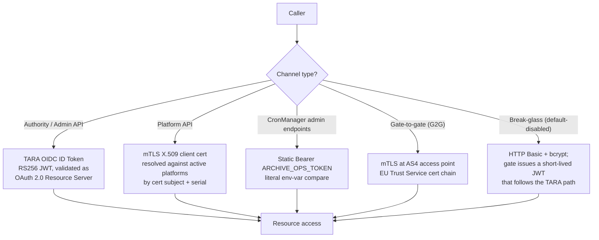

# Architecture: Authentication

## Changes

- **v1.1** — Reconciled with the implementation. Bürokratt **TIM** owns the TARA code
  exchange and mints the session JWT (§2); the gate no longer mints its own. Revocation is
  **immediate** rather than refresh-denial (§7), because the caller is resolved against the
  database on every request. Rationale for keeping that lookup on the hot path is in §2.1.
- _Initial state. Change tracking begins at v1.0.0._

> Sub-architecture for the authentication surface. For overarching rules (DB-backed authorisation snapshot, append-only revocation, channel routing, secret loading) see [theme README](README.md). AC are in [`docs/cfr/identity-and-access/authentication.md`](../../cfr/identity-and-access/authentication.md).

## 1. Authentication channels — detailed view

The theme README's channel table covers the routing rules. This section drills into the validation pipeline of each channel.

## 2. TARA OIDC pipeline (login via TIM)

> **Changed v1.1.** An earlier draft of this section had the admin UI run the OIDC code
> exchange and the gate mint its own JWT, validated locally with no hot-path DB lookup. That
> design is **superseded**: Bürokratt **TIM** owns the exchange and the token, and the gate
> resolves the caller against the database on every request. The rationale is in §2.1.

Login is a browser ↔ TIM ↔ TARA conversation that Ruuter never sees. Ruuter's involvement
begins once the caller holds a token.

- **Issuer:** TIM is the registered OAuth client (`TARA_CLIENT_ID` / `TARA_CLIENT_SECRET`).
  The endpoints come from `TARA_OIDC_DISCOVERY_URL`; in development they point at the local
  TARA-Mock instead.
- **Code exchange happens in TIM**, not in the UI and not in Ruuter. The browser hits
  `GET /oauth2/authorization/tara?callback_url=…`, TARA redirects back to TIM's
  `/authenticate` with the code, and TIM performs the back-channel exchange. The
  `client_secret` therefore lives in exactly one place.
- **TARA ID-token validation:** RS256 against the JWKS from the discovered URL. Performed by
  TIM, not by the gate.
- **Session-token mint:** TIM mints its **own** RS256 JWT carrying `personalCode`, `sub`,
  `firstName`, `lastName`, `authenticatedAs`, `iss`, `iat`, `exp`, `jti` and `hash`. It is
  returned as the `customJwtCookie` cookie — that is TIM's only delivery mechanism.
  **TTL is TIM's** `legacy-portal-integration.sessionTimeoutMinutes` (default 30), applied in
  `JwtUtils.createSignedJwt()`.
- **Subsequent requests use `Authorization: Bearer <token>`**, per
  [user-interfaces README §1.3](../user-interfaces/README.md). The client reads the token out
  of the login response and sends it as a Bearer header; the gate's own API never accepts a
  cookie. Because TIM validates only via its cookie, the shared
  `TEMPLATES/check-user-authority` re-frames the Bearer value as
  `cookie: customJwtCookie=<token>` on that one internal hop.
- **Per-request validation (two steps, one DB lookup):** the template calls TIM
  `GET /jwt/userinfo` to prove the token is valid and unrevoked, then resolves the caller
  against the database — the latest `users` row per logical id, rejected unless it is active,
  still carries the presented `tara_sub`, and has no `token_revoked_at` later than the
  token's issuance time. Roles, subsets and scope-IDs come from that row.
- **No auto-provisioning:** a valid TARA identity with no `users` row is rejected. An admin
  must `POST /api/v1/users` first.

### 2.1 Why the DB lookup stays on the hot path

The superseded design bought statelessness by trusting the token's claims for its whole
lifetime, which made revocation latency equal to the TTL. Keeping one indexed lookup per
request buys three properties that matter more at this scale:

- **Immediate revocation.** Logout and `POST /api/v1/users/{userId}/revoke-token` take effect
  on the next request, not within one TTL window.
- **Immediate permission changes.** A role or subset edit applies at once, so the
  authorisation snapshot cannot drift from the database.
- **Soft-delete and identifier correction take effect at once** — a deactivated user or a
  corrected `tara_sub` stops authenticating immediately.

The cost is one indexed single-table read per request. Revisit if measurements ever justify
it; the schema still supports the stateless profile unchanged.

## 3. Platform mTLS pipeline

- TLS terminated by a trusted reverse proxy (Envoy, Nginx, etc.) that validates the cert chain.
- Proxy forwards the request with `X-Client-Cert-Subject` and `X-Client-Cert-Serial` headers (header names configurable via `MTLS_HEADER_SUBJECT` / `MTLS_HEADER_SERIAL` per [`docs/specs/non-functional.md`](../../specs/non-functional.md) §4.1).
- Gate resolves `platforms` by `(cert_subject, cert_serial)` against rows with `is_active = TRUE`.
- 0 rows → `403 FORBIDDEN_NO_PLATFORM`. >1 rows → `403 FORBIDDEN_MULTI_PLATFORM` (operator misconfiguration; both conditions are detectable and distinguishable).

## 4. CronManager static token

A literal `Bearer` compare against `ARCHIVE_OPS_TOKEN`. Constant-time compare to avoid timing side-channels. Mismatch → `403 FORBIDDEN`. No DB lookup — this is operational identity, not user identity. Documented in [Epic 26 — Append-Only Archival](../../cfr/epic_26_en.md).

## 5. Gate-to-gate fast protocol — mTLS only

`POST /services/fast` is mTLS-only. There is no `X-API-Key` fallback; if a caller presents `X-API-Key`, it is never honoured. The presenting gate's certificate must chain to the EU Trust Service trust list; OCSP / CRL revocation checks **fail closed** — a check that cannot be performed (responder down, network error) is treated as revocation.

## 6. Break-glass channel

Default-disabled (`LOCAL_ADMIN_FALLBACK_ENABLED=false`). The reserved `users` row carries the literal `tara_sub='local-admin'` (lower-case; chosen because PIC values are uppercase digits and never collide). The break-glass endpoint validates HTTP Basic against `users.secret_hash` (the only bcrypt-hashed password in the system — every other user has `secret_hash IS NULL`) and, on success, issues a gate-signed JWT carrying `sub='local-admin'` and a hard-coded 600 s TTL (`BREAK_GLASS_JWT_TTL_SECONDS`).

The issued JWT then **follows the TARA path** — the gate's `tara_sub` lookup resolves the `local-admin` row identically to how it would resolve any other user. This is why break-glass is not a fifth channel: it's a recoverable backdoor onto channel 1.

## 7. Revocation model — immediate

> **Changed v1.1.** Previously specified as *refresh denial*: the in-flight JWT was honoured
> to its `exp` and revocation only blocked the next refresh, giving a latency of one TTL
> window. Revocation is now **immediate on both paths**, which is what §2's per-request
> resolution buys.

- **`POST /api/v1/auth/logout`** — two steps, in this order. First TIM
  `POST /jwt/blacklist` revokes the token: TIM's `/jwt/userinfo` rejects it from then on, so
  the very next gate request fails authentication. Then a `sessions` row is appended
  carrying `(user_id, jti, expires_at, reason='logout')` as the durable audit record.
  Enforcement precedes audit deliberately — a failed INSERT must never block a revocation.
  Idempotent: a second logout on a dead token is still 204.
- **`POST /api/v1/users/{userId}/revoke-token`** — INSERTs a new `users` row with
  `token_revoked_at = NOW()` (append-only; the previous row is untouched). Every subsequent
  request by that user is rejected, because the identity query compares the presented token's
  issuance time against the resolved row's `token_revoked_at`. No TTL wait.
- **Soft-delete** (`is_active = FALSE` on the latest row) and a **corrected `tara_sub`** have
  the same immediate effect, through the same query.
- **Break-glass JWT**: hard 600 s TTL (`BREAK_GLASS_JWT_TTL_SECONDS`) — no explicit
  revocation primitive needed at that timescale.

**Latency contract:** revocation takes effect on the next request. JWT TTL is therefore no
longer the revocation-latency knob; it only bounds how long an *unrevoked* session lasts.

**`jti` provenance.** TIM's `/jwt/userinfo` exposes neither `jti` nor `exp` — it returns
`loggedInDate` / `loginExpireDate` and no token id. The denylist row's `jti` is therefore
decoded from the token's own payload segment. Only that segment reaches the database, never
the signature, so the DB layer never holds a replayable credential.

**Retention:** a `sessions` row remains effective until the underlying token's `exp`; expired
entries are archived per the standard append-only retention (see Epic 26).

**Retention:** a `sessions` row remains effective until the underlying token's `exp`; expired entries are archived per the standard append-only retention (see Epic 26).

---

## See also

- [Reference Architecture §8 Security](../eFTI-Gate-Reference-Architecture.md#8-security)
- [`docs/specs/permissions-matrix.md`](../../specs/permissions-matrix.md) §1.1, §8.1 — credential routing + JWT validation pipeline.
- [`docs/specs/diagrams/seq-12-user-authentication.mmd`](../../specs/diagrams/seq-12-user-authentication.mmd), [`seq-16-mtls-fast-protocol.mmd`](../../specs/diagrams/seq-16-mtls-fast-protocol.mmd), [`flow-02-authorization-check.mmd`](../../specs/diagrams/flow-02-authorization-check.mmd).
- [`docs/specs/non-functional.md`](../../specs/non-functional.md) §4.1 — environment variables for TARA, mTLS headers, break-glass.

## Rationale

Identity is federated (TARA proves who the user is at login), cert-based for Platform and G2G (mTLS), and pinned-by-token for CronManager. For Authority/Admin paths the gate exchanges the TARA ID token for its own gate-JWT carrying identity and permissions, and that gate-JWT — validated against the gate's own signing key only — is the authoritative session token. The gate maintains no per-request server state and performs no per-request DB query in the default profile; this is what makes it horizontally scalable without session affinity or shared cache. Revocation operates on the refresh path; the JWT TTL is the latency knob. Break-glass exists for total TARA outage and is default-disabled so an enabled break-glass channel is always a deliberate operational decision.
