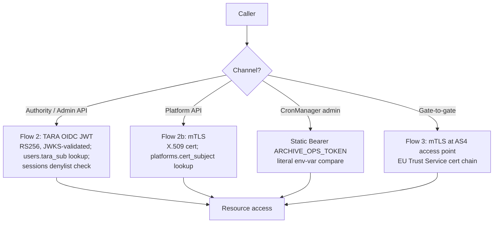
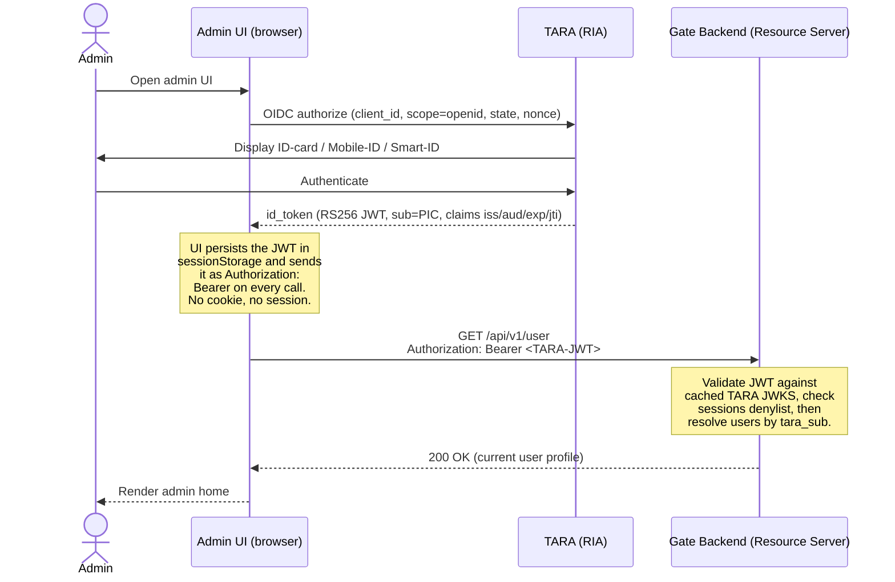
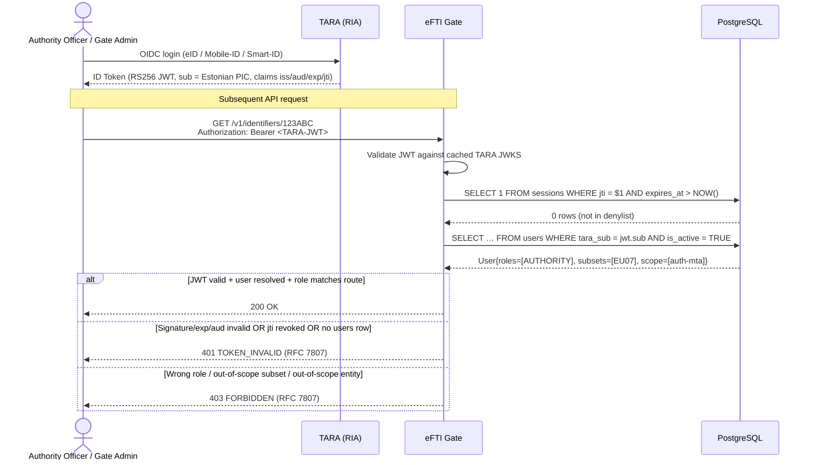
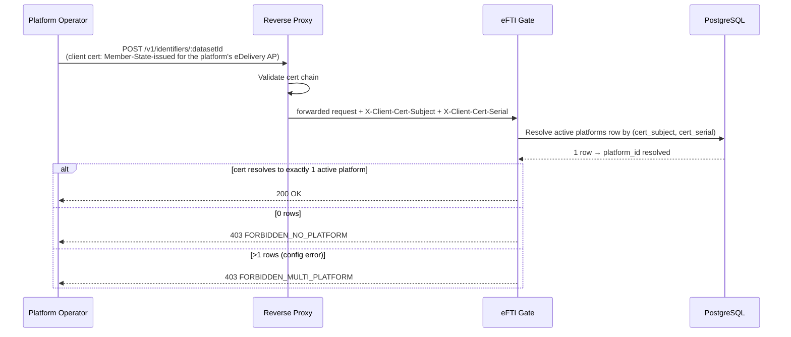
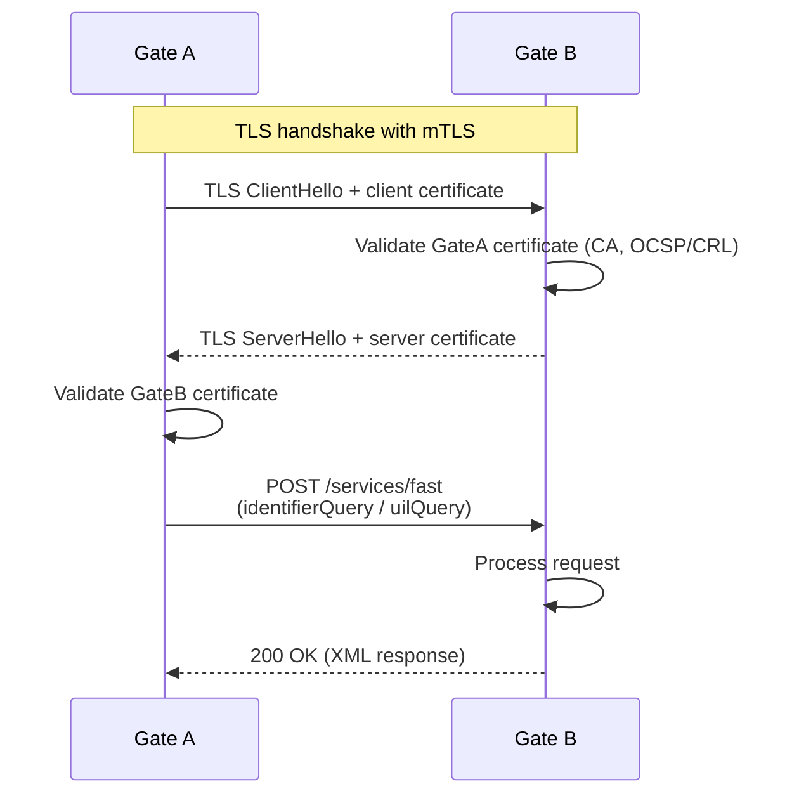

# Architecture: Authentication and Access Flows

> Sub-architecture: the four canonical sequence diagrams that document the four authentication channels end-to-end. For overarching rules see [theme README](README.md); for credential-routing detail see [Authentication architecture](authentication.md). AC are in [`docs/epics/epic_23_en.md`](../../epics/epic_23_en.md).

This sub-architecture's deliverable *is* this document: keeping the four flow diagrams accurate and in lockstep with the AC in [Epic 1 (RBAC)](../../epics/epic_1_en.md) and [Epic 2 (Authentication)](../../epics/epic_2_en.md).

## 1. Channel decision

## 2. Flow 1 — Admin UI login (UI-side OIDC → JWT to gate)

Logout is `POST /api/v1/auth/logout` carrying the same Bearer; the gate writes the JWT's `jti` to the `sessions` denylist with `reason='logout'`. Subsequent calls with the same JWT return `401 TOKEN_INVALID`.

## 3. Flow 2 — Authority / Admin API (TARA OIDC JWT)

## 4. Flow 2b — Platform API (mTLS)

## 5. Flow 3 — Gate-to-gate fast protocol (mTLS)

---

## See also

- [`docs/specs/diagrams/seq-12-user-authentication.mmd`](../../specs/diagrams/seq-12-user-authentication.mmd), [`seq-16-mtls-fast-protocol.mmd`](../../specs/diagrams/seq-16-mtls-fast-protocol.mmd), [`flow-02-authorization-check.mmd`](../../specs/diagrams/flow-02-authorization-check.mmd) — canonical Mermaid sources reused above.
- [`docs/specs/errors.json`](../../specs/errors.json) — error catalog for the denial branches.

## Rationale

The four flows are the entire access surface of the gate. Keeping them as diagrams rather than prose lets a reader trace allowed / denied paths visually. The flows are intentionally minimal: they show **what** happens, not **how** to implement it — implementation details belong in Epic 1, Epic 2, and `permissions-matrix.md`.
