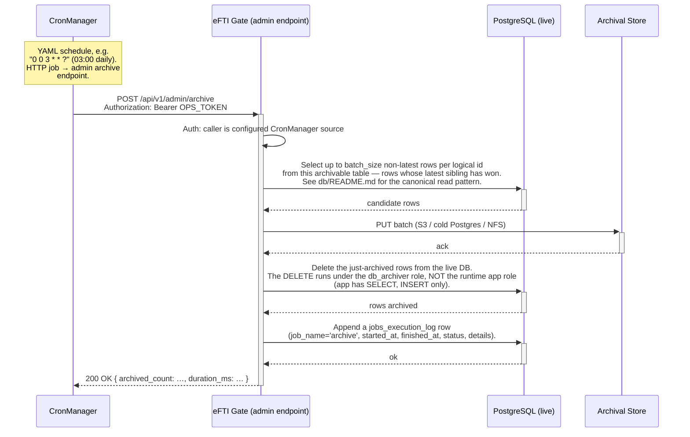

# Architecture: Append-Only Archival via CronManager

## Changes

- _Initial state. Change tracking begins at v1.0.0._

> Sub-architecture for the Append-Only Archival via CronManager surface. For overarching rules see [theme README](README.md). AC are in [`../../cfr/infrastructure/append_only_archival.md`](../../cfr/infrastructure/append_only_archival.md).

## Flow at a glance

## Rationale

The gate's append-only design preserves complete history without UPDATE-triggers or `_history` tables — but that history would unboundedly grow the live DB. The CronManager-driven nightly sweep moves non-latest rows to a separate archival destination, keeping the live DB compact while the full history remains queryable from cold storage. The two-role split (`app` cannot DELETE, `db_archiver` can DELETE operational tables but cannot DELETE `audit_log`) means the append-only invariant survives even though the archive job has to delete from the live DB. `audit_log` lives only on the live DB because GDPR Art. 30 audit access must be queryable indefinitely without a cold-storage roundtrip.

### Concrete destination and sweep (consignments)

`DSL/Liquibase/changelog/20260910-consignments-archive.sql` provides:

- **`archive` schema** — cold storage, `db_archiver` gets `USAGE`; `app` gets nothing. Can later be relocated behind `postgres_fdw` to a physically separate database with no change to the sweep.
- **`archive.consignments`** — same columns as `public.consignments` plus `archived_at`, but **no CHECK constraints, no FK**, only a `row_id` primary key. Every insert is `ON CONFLICT (row_id) DO NOTHING`, so a re-run or an overlapping sweep can never fail on a duplicate. It is a landing table, not a validated one.
- **`archive.sweep_consignments(p_older_than interval DEFAULT '30 days')`** — one atomic statement (three data-modifying CTEs sharing a snapshot) that copies then deletes. Moves only rows that are **provably never returned by a latest-row read**: a newer row exists for the same `(platform_id, dataset_id)` **and** that newer row is itself older than `now() - p_older_than`. The current row of every dataset — including a `DELETED` tombstone — therefore always stays in `public.consignments`, so `get_consignment_by_id` / `get_consignments` / the X-Road reads are unaffected. `SECURITY INVOKER`, called as `db_archiver`; a `pg_advisory_xact_lock` serialises concurrent sweeps. Returns the row count moved.
- **`archive.purge_consignments(p_keep interval DEFAULT '7 years')`** — cold-storage retention, separate from the sweep so the policy can be tuned independently.

The gate admin endpoint (`POST /api/v1/admin/archive`, `ARCHIVE_OPS_TOKEN`) that CronManager calls, and its `jobs_execution_log` write, are still to be wired — the endpoint just needs to `SELECT archive.sweep_consignments()` (and periodically `archive.purge_consignments()`) as `db_archiver`. Smoke test: `docs/architecture/infrastructure/consignments-archive-test.sql`.

