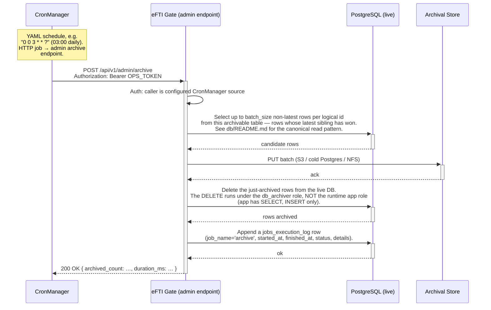

# Architecture: Append-Only Archival via CronManager

## Changes

- _Initial state. Change tracking begins at v1.0.0._

> Sub-architecture for the Append-Only Archival via CronManager surface. For overarching rules see [theme README](README.md). AC are in [`../../cfr/infrastructure/append_only_archival.md`](../../cfr/infrastructure/append_only_archival.md).

## Flow at a glance

## Rationale

The gate's append-only design preserves complete history without UPDATE-triggers or `_history` tables — but that history would unboundedly grow the live DB. The CronManager-driven nightly sweep moves non-latest rows to a separate archival destination, keeping the live DB compact while the full history remains queryable from cold storage. The two-role split (`app` cannot DELETE, `db_archiver` can DELETE operational tables but cannot DELETE `audit_log`) means the append-only invariant survives even though the archive job has to delete from the live DB. `audit_log` lives only on the live DB because GDPR Art. 30 audit access must be queryable indefinitely without a cold-storage roundtrip.

