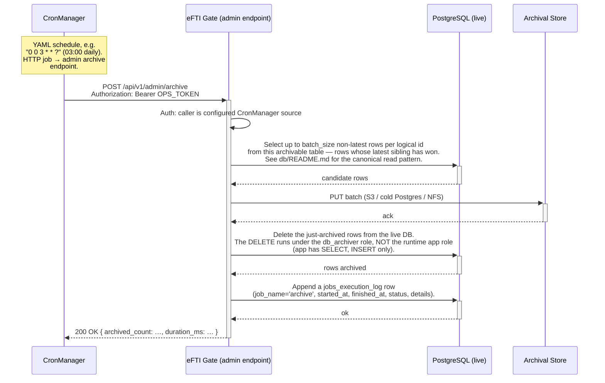

# Architecture: Append-Only Archival via CronManager

## Changes

- _Initial state. Change tracking begins at v1.0.0._

> Sub-architecture for the Append-Only Archival via CronManager surface. For overarching rules see [theme README](README.md). AC are in [`../../cfr/infrastructure/append_only_archival.md`](../../cfr/infrastructure/append_only_archival.md).

## Flow at a glance

## Rationale

The gate's append-only design preserves complete history without UPDATE-triggers or `_history` tables — but that history would unboundedly grow the live DB. The CronManager-driven nightly sweep moves non-latest rows to a separate archival destination, keeping the live DB compact while the full history remains queryable from cold storage. The two-role split (`app` cannot DELETE, `db_archiver` can DELETE operational tables but cannot DELETE `audit_log`) means the append-only invariant survives even though the archive job has to delete from the live DB. `audit_log` lives only on the live DB because GDPR Art. 30 audit access must be queryable indefinitely without a cold-storage roundtrip.

### Concrete flow (consignments) — everything through Ruuter + ReSql

Cold storage is a **separate PostgreSQL instance** — compose service `archive-database`, DB
`efti_archive`. Its `consignments` table (`DSL/Liquibase/archive-init.sql`) uses plain types
(`text`, not `citext`/enum), has **no CHECK constraints and no FK**, and its only key is `row_id`
— a landing table, so an idempotent `ON CONFLICT (row_id) DO NOTHING` insert can never fail on a
duplicate. It is reached **only through ReSql** — `resql.yaml` gives ReSql a second datasource
`archive`, and SQL files under `DSL/Resql/archive/` run against it. No foreign-data wrapper, no
direct connection from anywhere else. Rows are carried between the two datasources over Ruuter.

CronManager calls **`POST /ops/v1/archive-consignments`** on its schedule
(`Authorization: Bearer ARCHIVE_OPS_TOKEN`, guard `DSL/Ruuter/ops/.guard.yml` — static bearer, no
JWT; `/ops/**` is not proxied by nginx). One batch per call — CronManager re-invokes until
`candidates` is 0. The route (`DSL/Ruuter/ops/POST/v1/archive-consignments.yml`) makes four ReSql
calls and writes `jobs_execution_log`:

1. **`efti/select_archivable_consignments.sql`** (live DB) — picks a batch (default 100) of
   candidate rows: a row with a newer sibling for the same `(platform_id, dataset_id)` **whose
   newer sibling is itself older than `olderThanDays`** (default 2). The current row of every
   dataset — including a `DELETED` tombstone — is therefore never a candidate, so
   `get_consignment_by_id` / `get_consignments` / the X-Road reads are unaffected. Returns
   `candidateCount`, `candidateRowIds`, and `rows` (the full rows as JSONB).
2. **`archive/insert_archived_consignments.sql`** (archive DB) — `jsonb_to_recordset` unpacks the
   carried `rows` and inserts them, `ON CONFLICT (row_id) DO NOTHING`.
3. **`archive/verify_archived_consignments.sql`** (archive DB) — reads those `row_id`s back and
   confirms each is present and its payload reads. This is the "moved elsewhere and accessible
   from there" gate.
4. **`efti/delete_consignments.sql`** (live DB) — runs **only** if step 3 confirmed 100 % of the
   candidates. A real `DELETE FROM consignments` by `row_id`, with an `EXISTS (newer sibling)`
   guard so a current row can never be deleted.

A verification mismatch logs `FAILED` and deletes nothing (idempotent insert → the next run
retries). Cold-storage retention: **`POST /ops/v1/purge-archive`** →
`archive/purge_archived_consignments.sql` (`keepDays`, default 2555 ≈ 7 y). Full version history
(live rows + archived rows): **`GET /admin/v1/consignment-history?datasetId=…`** (admin JWT). The
existing latest-row reads don't need an archive fallback — the current row is never archived, and
the transport-means reads already require the *current* row to still carry the identifier.

Smoke test: `docs/architecture/infrastructure/archive-flow-test.sh`; guard + happy path in
`tests/http/ops-archive.http`; history read in `tests/admin/consignment-history.http`.

