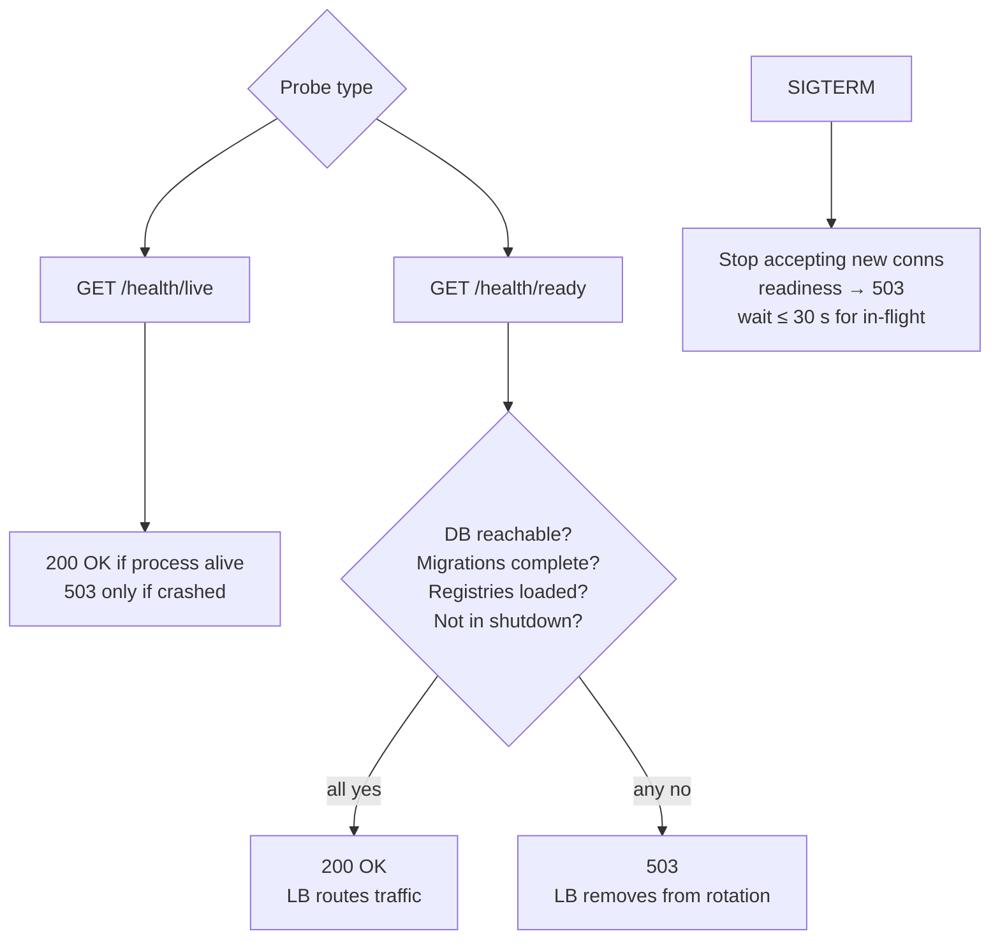

# Architecture: Health Checks and Graceful Shutdown

## Changes

- _Initial state. Change tracking begins at v1.0.0._

> Sub-architecture for the Health Checks and Graceful Shutdown surface. For overarching rules see [theme README](README.md). AC are in [`../../cfr/infrastructure/health_checks_and_graceful_shutdown.md`](../../cfr/infrastructure/health_checks_and_graceful_shutdown.md).

## Liveness vs readiness at a glance

## Rationale

Separating liveness from readiness lets orchestrators (Kubernetes, ECS, etc.) distinguish "process needs restarting" from "this replica shouldn't receive traffic right now". The DB-readiness signal on `/health/ready` lets the load balancer drain transient DB connectivity issues without killing the pod. Coordinated `SIGTERM` handling (readiness → 503 first, then drain in-flight) keeps the SLO error budget intact during rolling deploys and HPA scale-downs.

