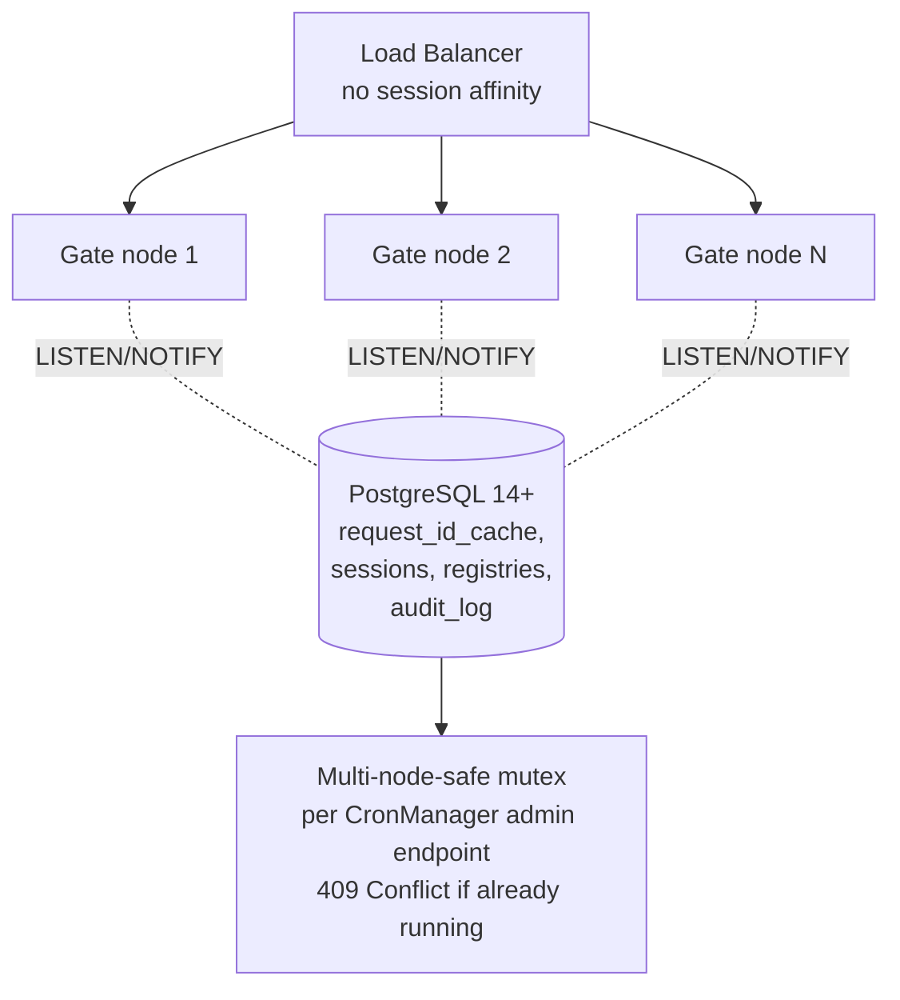

# Architecture: Scalability and Statelessness

## Changes

- _Initial state. Change tracking begins at v1.0.0._

> Sub-architecture for the Scalability and Statelessness surface. For overarching rules see [theme README](README.md). AC are in [`../../cfr/infrastructure/scalability_and_statelessness.md`](../../cfr/infrastructure/scalability_and_statelessness.md).

## Multi-node topology at a glance

## Rationale

The gate scales horizontally because every piece of cross-request state lives in PostgreSQL (`sessions` denylist, `request_id_cache`, registries, `audit_log`). The application layer is fully stateless. `LISTEN/NOTIFY` removes the polling-vs-cache-staleness trade-off without adding Redis / Hazelcast / etc. Advisory locks give CronManager-driven jobs a cluster-wide mutex without any extra coordinator. Two-replica floor + HPA covers the SLO error budget under rolling upgrade or single-host failure.

