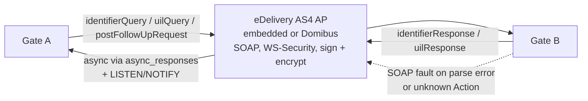
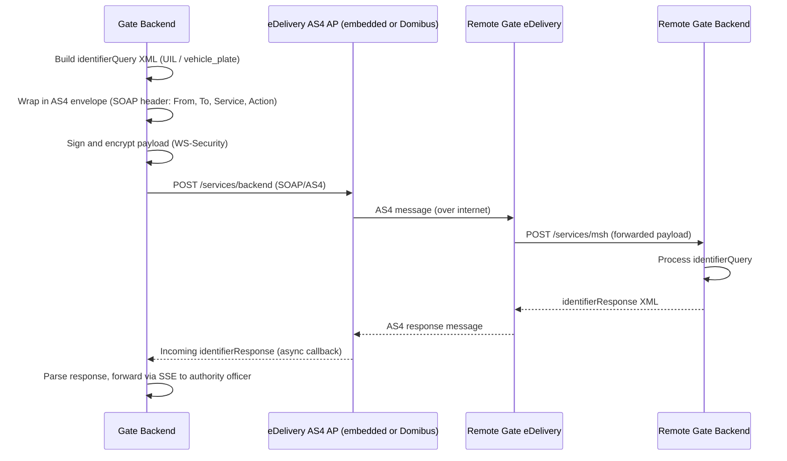
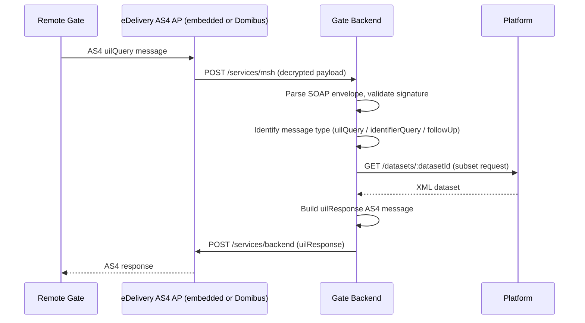

# Architecture: eDelivery AS4 Message Flow

## Changes

- _Initial state. Change tracking begins at v1.0.0._

> Sub-architecture for the eDelivery AS4 Message Flow surface. For overarching rules see [theme README](README.md). AC are in [`../../cfr/integrations/as4_message_flow.md`](../../cfr/integrations/as4_message_flow.md).

## AS4 message types at a glance

## Acceptance Criteria

**Business rules:**
- [ ] Both AS4 flows (outgoing identifier search, incoming UIL request) are documented as sequence diagrams below.
- [ ] Each diagram covers: SOAP envelope construction, WS-Security signing + encryption, parse + signature verification on the receiver, and failure handling (SOAP fault on parse error or unknown Action).
- [ ] The diagrams stay in sync with Epic 10 ACs — any change to the AS4 contract there must be reflected here in the same PR.

### Flow 1 — Outgoing identifier search (Gate → eDelivery → Remote Gate)

### Flow 2 — Incoming UIL request (Remote Gate → Gate → Platform)

## Rationale

eDelivery AS4 is the EU's standard cross-border message bus; documenting the on-wire shape (SOAP envelope, WS-Security, async callback via `async_responses` + `LISTEN/NOTIFY`) is what lets a partner trace any failure mode without reading the gate source. The "embedded or Domibus" framing makes the AS4 implementation a deployment-time decision rather than a hard spec mandate.

