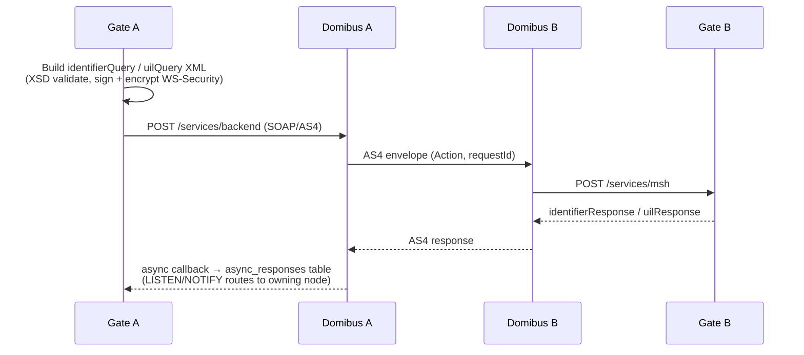

# Architecture: eDelivery AS4 Integration

## Changes

- _Initial state. Change tracking begins at v1.0.0._

> Sub-architecture for the eDelivery AS4 Integration surface. For overarching rules see [theme README](README.md). AC are in [`../../cfr/integrations/edelivery_as4.md`](../../cfr/integrations/edelivery_as4.md).

## AS4 message exchange at a glance

## Rationale

eDelivery AS4 is the EU's standard cross-border message bus for regulatory data exchange. The gate is content-agnostic for dataset payloads (the platform owns content) but **wire-strict** for envelope handling — XSD validation on outbound and inbound, signature verification, AES-GCM/RSA-OAEP per the conformance profile. Async response routing via `LISTEN/NOTIFY` lets any gate node receive a peer-gate reply and dispatch it back to the originating in-flight handler without session affinity.

