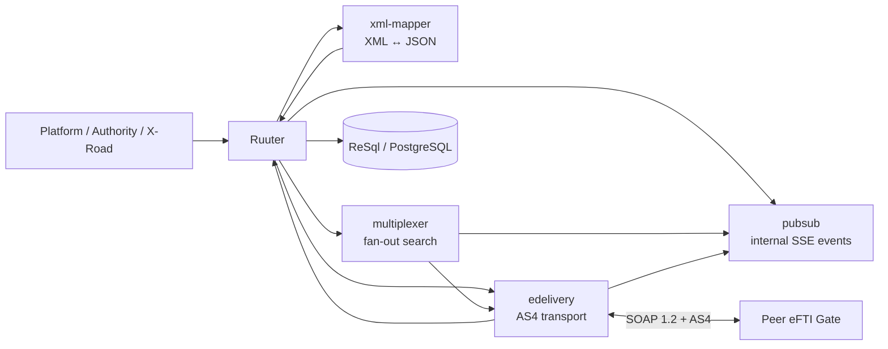
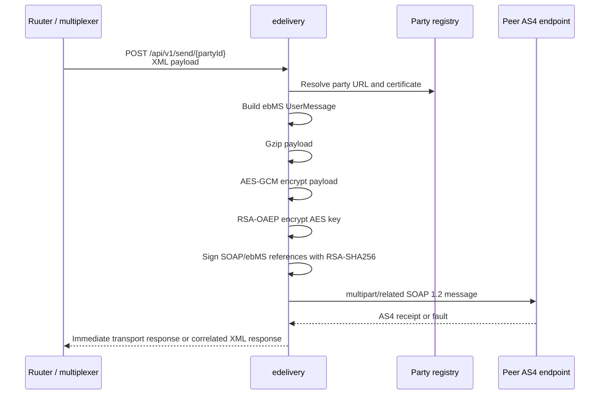
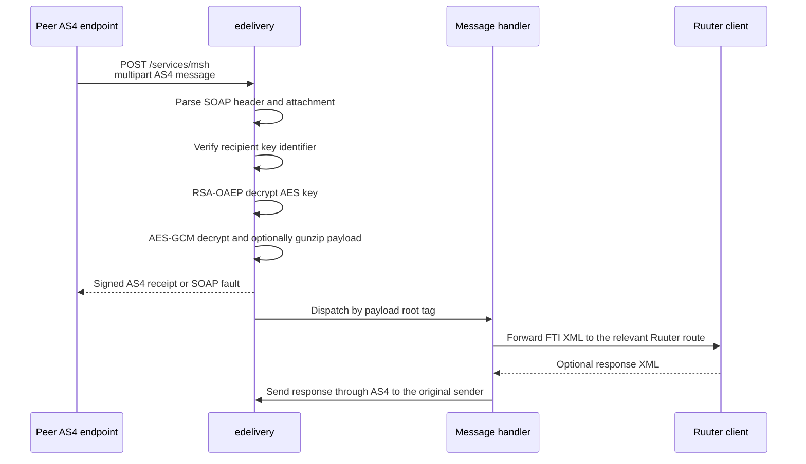
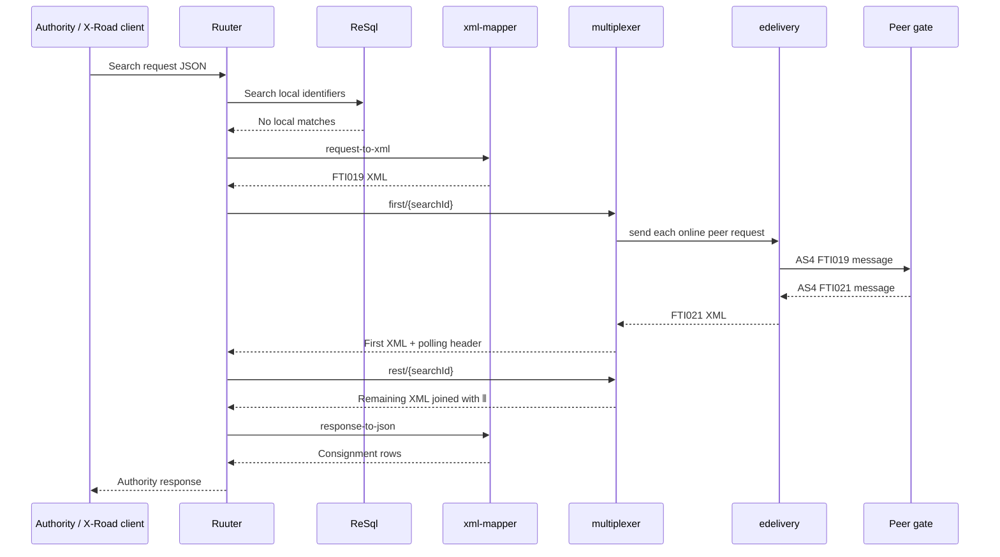

# Architecture: Internal Kotlin Services

## Changes

- **v1.1** — Added the `pubsub` internal event bus and documented its SSE contract and transient delivery semantics.
- _Initial state. Change tracking begins at v1.0.0._

> This document describes the internal service boundary between Ruuter and the
> Kotlin services. For the external AS4 contract, see [eDelivery AS4 Integration](edelivery_as4.md)
> and [eDelivery AS4 Message Flow](as4_message_flow.md).

## Purpose

The Kotlin services keep protocol-specific work out of Ruuter DSL. Ruuter remains
the orchestration layer: it validates the request, calls the appropriate internal
service, persists or retrieves data through ReSql, and shapes the public response.

The services are internal network components. Their REST APIs are service-to-service
interfaces, not public authority or platform APIs.

## Service responsibilities

| Service | Port | Responsibility                                                                                                                                                      | Does not own |
|---|---:|---------------------------------------------------------------------------------------------------------------------------------------------------------------------|---|
| `xml-mapper` | 8082 | Parse and generate eFTI XML for FTI004/029, FTI009/010, FTI019/021 and FTI025/030 messages; preserve the identifier criteria XML needed for storage and forwarding. | Routing, authorization, database access, or AS4 transport |
| `multiplexer` | 8083 | Fan out an identifier-search XML request to all registered online peer gates and expose the first and remaining responses.                                          | XML parsing, gate registry persistence, or AS4 envelope handling |
| `edelivery` | 8081 | Generate, sign, encrypt, send, receive, decrypt and dispatch AS4 messages; correlate responses to requests.                                                         | Business searches, identifier persistence, or authority authorization |
| `pubsub` | 8084 | Broadcast transient internal events by topic to connected SSE subscribers.                                                                                          | Persistence, replay, delivery guarantees, authorization, or business processing |

## Internal HTTP surfaces

Each service exposes a health endpoint at `/health`. OpenAPI and Swagger UI are
available under the service's `/api/v1/openapi` context where the internal API is
registered.

### `xml-mapper`

Base URL in Compose: `http://xml-mapper:8082/api/v1`.

The mapper accepts JSON domain objects for generated messages and raw XML for parsed
messages. Generated XML is returned as `application/xml`; parsed results are JSON.

| Route | Direction | Purpose |
|---|---|---|
| `POST /upload/request-to-json` | XML → JSON | Parse FTI004 upload requests or ParameterIDSetCriteria into a `ConsignmentRow`. |
| `POST /upload/response-to-xml` | JSON → XML | Generate an FTI029 upload response from a UIL. |
| `POST /search/request-to-xml` | JSON → XML | Generate an FTI019 identifier-search request. |
| `POST /search/request-to-json` | XML → JSON | Parse an FTI019 identifier-search request. |
| `POST /search/response-to-json` | XML → JSON | Parse one or more ⦀-delimited FTI021 responses into consignment rows. |
| `POST /search/response-to-xml` | JSON → XML | Generate an FTI021 identifier-search response. |
| `POST /dataset/request-to-xml` | JSON → XML | Generate an FTI009 dataset request. |
| `POST /dataset/request-to-json` | XML → JSON | Parse an FTI009 dataset request. |
| `POST /dataset/response-to-xml` | JSON → XML | Wrap a platform consignment in an FTI010 dataset response, or pass through an existing FTI010 response. |
| `POST /dataset/response-to-json` | XML → JSON | Extract a specified supply-chain consignment from an FTI010 response. |
| `POST /followup/request-to-xml` | JSON → XML | Generate an FTI025 follow-up request. |
| `POST /followup/request-to-json` | XML → JSON | Parse an FTI025 follow-up request. |
| `POST /followup/response-to-json` | XML → JSON | Parse an FTI030 follow-up response. |
| `POST /followup/response-to-xml` | JSON → XML | Generate an FTI030 follow-up response. |

The mapper owns the XSD-shaped message models and XML rendering/parsing. Ruuter
decides which operation is needed and remains responsible for the surrounding
business flow.

## `pubsub` processing

`pubsub` is a small internal event bus for coordination between services running
in the same Compose deployment. It is available at
`http://pubsub:8084/api/v1` and exposes:

| Route | Purpose |
|---|---|
| `POST /publish` | Publish a JSON SSE event. The event's `name` selects the topic; if it is omitted, the topic is `message`. Returns `201 Created`. |
| `GET /subscribe/{topic}` | Open an SSE stream for a topic. Events published while the connection is open are delivered to that subscriber. |

Topics currently used by the gate are:

| Topic | Publishers | Subscribers | Event meaning |
|---|---|---|---|
| `gate-changes` | Ruuter admin gate CRUD and ping routes | `edelivery`, `multiplexer` | Reload the latest gate registry data from ReSql. |
| `platform-changes` | Ruuter admin platform CRUD routes | `edelivery` | Reload the latest platform registry data from ReSql. |
| `async-responses` | `edelivery`'s multi-node response provider | `edelivery` instances | Offer an unmatched peer response to the first local pending request. |

The registry is process-local and each topic owns a set of per-subscriber queues.
Publishing is a best-effort broadcast: an event is offered to every currently
connected subscriber, is discarded when no subscriber is connected, and is not
persisted or replayed. A disconnected client must reconnect and refresh its
authoritative state from ReSql where applicable.
The service therefore provides notification, not durable messaging or a
cross-deployment broker. The Compose topology keeps one pubsub instance for the
gate deployment; a multi-instance deployment would need an external shared bus
or explicit routing between pubsub instances.

The long-lived consumers reconnect after SSE failures. Registry consumers treat
an event as an invalidation signal and reload the full registry rather than
depending on the event payload. The async-response consumer instead forwards the
event payload to its first matching in-memory pending response queue; if no
matching request remains, the response is discarded.

## `edelivery` processing

`edelivery` has two distinct surfaces:

- `POST /api/v1/send/{partyId}` and `POST /api/v1/ping/{partyId}` are internal
  REST calls used by Ruuter and multiplexer.
- `GET /services/msh` reports that the message service is available, while
  `POST /services/msh` receives multipart AS4 messages from a peer access point.

### Outbound message

The outbound message contains the `RequestKey` identifiers used for conversation
and response correlation. The party registry is loaded from ReSql and refreshed
periodically; the destination party supplies the eDelivery URL and certificate
used by the message generator.

### Inbound message

Supported payload roots are:

| Root tag | Handling |
|---|---|
| `hello` | Connectivity ping; no business response is sent. |
| `FTI004UploadIdentifierRequest` | Forward to the consignment upload flow. |
| `FTI009GetCmdsRequest` | Forward to dataset retrieval. |
| `FTI019SearchIdentifierRequest` | Forward to identifier search. |
| `FTI025LodgeFollowUpCommRequest` | Forward to follow-up handling. |
| `FTI010GetCmdsResponse`, `FTI021SearchIdentifierResponse`, `FTI029UploadIdentifierResponse`, `FTI030LodgeFollowUpCommResponse` | Complete the matching outbound request. |

Unknown roots or invalid cryptographic metadata result in a SOAP fault. The
application acknowledges a recognized message before running the business handler
asynchronously, so message receipt and business processing are separate stages.

### Response correlation

The default application wiring uses `SingleNodeAsyncResponseProvider`: pending
responses are held in memory on the node that initiated the request. The codebase
also contains `MultiNodeAsyncResponseProvider`, which persists unmatched responses
to `async_responses` and uses PostgreSQL notifications to wake another node, but
that provider is not the default launcher configuration. Deployments that require
cross-node response ownership must configure the multi-node provider explicitly.

## `multiplexer` processing

The multiplexer is used after the local identifier search has produced no result.
It loads `ONLINE` gates from ReSql, excludes the own gate, and sends the same XML
search request to every remaining gate through eDelivery.

```mermaid
sequenceDiagram
    participant R as Ruuter
    participant M as multiplexer
    participant E as eDelivery
    participant G1 as Peer gate 1
    participant G2 as Peer gate 2

    R->>M: POST /api/v1/first/{searchId}<br/>FTI019 XML
    M->>E: POST /api/v1/send/{gate-1}
    M->>E: POST /api/v1/send/{gate-2}
    E->>G1: AS4 search request
    E->>G2: AS4 search request
    G1-->>E: FTI021 response
    G2-->>E: FTI021 response
    E-->>M: XML responses
    M-->>R: First response + x-poll-more
    R->>M: GET /api/v1/rest/{searchId}
    M-->>R: Remaining responses joined with ⦀
```

`POST /first/{searchId}` waits up to approximately 63 seconds for the first
response. The fan-out requests use a 62-second eDelivery timeout. Responses that
arrive after the first one are queued for `GET /rest/{searchId}`. Both endpoints
set `x-poll-more` to indicate whether more responses may arrive. Pending results
are retained in an in-memory cache for 90 seconds.

The multiplexer only accepts responses containing `ParameterIDSetCriteria`; other
successful XML responses are ignored. It returns peer responses as XML so the
caller can pass the combined result to `xml-mapper` for the canonical JSON
projection.

## End-to-end search example

This separation keeps each concern replaceable: XSD changes belong in
`xml-mapper`, AS4 or certificate changes belong in `edelivery`, fan-out or
polling policy belongs in `multiplexer`, and transient coordination belongs in
`pubsub`. None of the four services should access PostgreSQL directly; registry
and persistence access is mediated by ReSql or by Ruuter-owned workflows.
