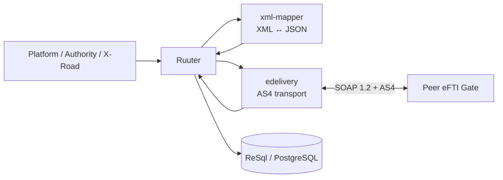
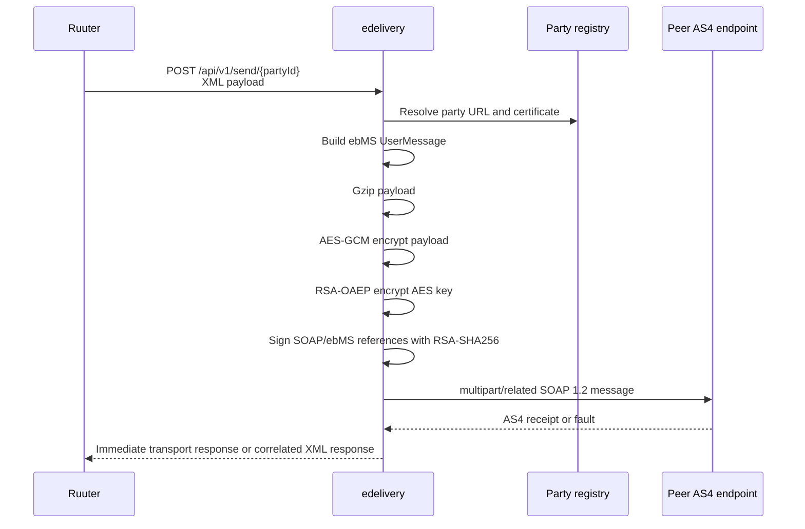
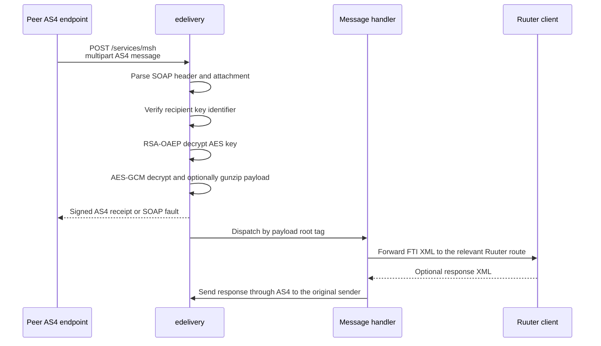
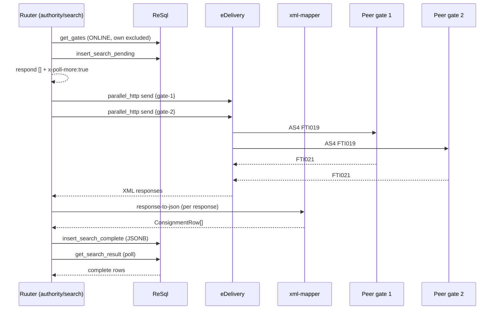
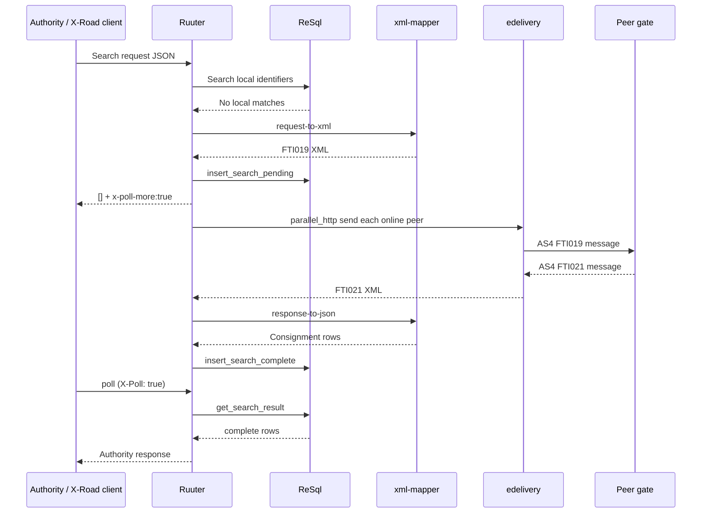

# Architecture: Internal Kotlin Services

## Changes

- _Initial state. Change tracking begins at v1.0.0._

> This document describes the internal service boundary between Ruuter and the
> Kotlin services. For the external AS4 contract, see [eDelivery AS4 Integration](edelivery_as4.md)
> and [eDelivery AS4 Message Flow](as4_message_flow.md).

## Purpose

The Kotlin services keep protocol-specific work out of Ruuter DSL. Ruuter remains
the orchestration layer: it validates the request, calls the appropriate internal
service, persists or retrieves data through ReSql, and shapes the public response.

```mermaid
flowchart LR
    Caller[Platform / Authority / X-Road] --> R[Ruuter]
    R --> XM[xml-mapper<br/>XML ↔ JSON]
    R --> E[edelivery<br/>AS4 transport]
    XM --> R
    E --> R
    R --> DB[(ReSql / PostgreSQL)]
    E <-->|SOAP 1.2 + AS4| Peer[Peer eFTI Gate]
```

The services are internal network components. Their REST APIs are service-to-service
interfaces, not public authority or platform APIs.

Cross-gate identifier search fan-out is **not** a Kotlin service: Ruuter's
`parallel_http` step queries the peer gates through `edelivery` and records the
aggregated result in ReSql (see [Cross-gate search](#cross-gate-search-ruuter)).

## Service responsibilities

| Service | Port | Responsibility                                                                                                                                                      | Does not own |
|---|---:|---------------------------------------------------------------------------------------------------------------------------------------------------------------------|---|
| `xml-mapper` | 8082 | Parse and generate eFTI XML for FTI004/029, FTI009/010, FTI019/021 and FTI025/030 messages; preserve the identifier criteria XML needed for storage and forwarding. | Routing, authorization, database access, or AS4 transport |
| `edelivery` | 8081 | Generate, sign, encrypt, send, receive, decrypt and dispatch AS4 messages; correlate responses to requests.                                                         | Business searches, identifier persistence, or authority authorization |

## Internal HTTP surfaces

Each service exposes a health endpoint at `/health`. OpenAPI and Swagger UI are
available under the service's `/api/v1/openapi` context where the internal API is
registered.

### `xml-mapper`

Base URL in Compose: `http://xml-mapper:8082/api/v1`.

The mapper accepts JSON domain objects for generated messages and raw XML for parsed
messages. Generated XML is returned as `application/xml`; parsed results are JSON.

| Route | Direction | Purpose |
|---|---|---|
| `POST /upload/request-to-json` | XML → JSON | Parse FTI004 upload requests or ParameterIDSetCriteria into a `ConsignmentRow`. |
| `POST /upload/response-to-xml` | JSON → XML | Generate an FTI029 upload response from a UIL. |
| `POST /search/request-to-xml` | JSON → XML | Generate an FTI019 identifier-search request. |
| `POST /search/request-to-json` | XML → JSON | Parse an FTI019 identifier-search request. |
| `POST /search/response-to-json` | XML → JSON | Parse one or more ⦀-delimited FTI021 responses into consignment rows. |
| `POST /search/response-to-xml` | JSON → XML | Generate an FTI021 identifier-search response. |
| `POST /dataset/request-to-xml` | JSON → XML | Generate an FTI009 dataset request. |
| `POST /dataset/request-to-json` | XML → JSON | Parse an FTI009 dataset request. |
| `POST /dataset/response-to-xml` | JSON → XML | Wrap a platform consignment in an FTI010 dataset response, or pass through an existing FTI010 response. |
| `POST /dataset/response-to-json` | XML → JSON | Extract a specified supply-chain consignment from an FTI010 response. |
| `POST /followup/request-to-xml` | JSON → XML | Generate an FTI025 follow-up request. |
| `POST /followup/request-to-json` | XML → JSON | Parse an FTI025 follow-up request. |
| `POST /followup/response-to-json` | XML → JSON | Parse an FTI030 follow-up response. |
| `POST /followup/response-to-xml` | JSON → XML | Generate an FTI030 follow-up response. |

The mapper owns the XSD-shaped message models and XML rendering/parsing. Ruuter
decides which operation is needed and remains responsible for the surrounding
business flow.

## Cross-node coordination without a message bus

There is no event bus. Nodes of one service coordinate only through ReSql, so any number of
replicas can run behind a load balancer without affinity:

- **AS4 responses.** A reply with no local waiter is inserted into `async_responses`
  (`insert_async_response`). The node holding the open request polls `claim_async_response` by its
  exact `RequestKey`; the claim is an atomic INSERT guarded by a partial unique index, so exactly
  one claimer wins. See `docs/architecture/eDelivery-multi-node-support.md`. Rows older than ten
  minutes are purged by CronManager (every 5 minutes) through `POST /ops/v1/purge-async-responses`.
- **Gate and platform registries.** `edelivery` reloads the registry from the `registry` service
  every `REGISTRY_REFRESH_SECONDS` (default 60). A registry change reaches every node within that
  interval; a failed refresh keeps the previous data. The Ruuter cross-gate search reads `/gates.json`
  fresh per search instead of caching.

## `edelivery` processing

`edelivery` has two distinct surfaces:

- `POST /api/v1/send/{partyId}` and `POST /api/v1/ping/{partyId}` are internal
  REST calls used by Ruuter (including the cross-gate search fan-out).
- `GET /services/msh` reports that the message service is available, while
  `POST /services/msh` receives multipart AS4 messages from a peer access point.

### Outbound message

```mermaid
sequenceDiagram
    participant R as Ruuter
    participant E as edelivery
    participant P as Party registry
    participant A as Peer AS4 endpoint

    R->>E: POST /api/v1/send/{partyId}<br/>XML payload
    E->>P: Resolve party URL and certificate
    E->>E: Build ebMS UserMessage
    E->>E: Gzip payload
    E->>E: AES-GCM encrypt payload
    E->>E: RSA-OAEP encrypt AES key
    E->>E: Sign SOAP/ebMS references with RSA-SHA256
    E->>A: multipart/related SOAP 1.2 message
    A-->>E: AS4 receipt or fault
    E-->>R: Immediate transport response or correlated XML response
```

The outbound message contains the `RequestKey` identifiers used for conversation
and response correlation. The party registry is loaded from the `registry` service and refreshed
periodically; the destination party supplies the eDelivery URL and certificate
used by the message generator.

### Inbound message

```mermaid
sequenceDiagram
    participant A as Peer AS4 endpoint
    participant E as edelivery
    participant H as Message handler
    participant R as Ruuter client

    A->>E: POST /services/msh<br/>multipart AS4 message
    E->>E: Parse SOAP header and attachment
    E->>E: Verify recipient key identifier
    E->>E: RSA-OAEP decrypt AES key
    E->>E: AES-GCM decrypt and optionally gunzip payload
    E-->>A: Signed AS4 receipt or SOAP fault
    E->>H: Dispatch by payload root tag
    H->>R: Forward FTI XML to the relevant Ruuter route
    R-->>H: Optional response XML
    H->>E: Send response through AS4 to the original sender
```

Supported payload roots are:

| Root tag | Handling |
|---|---|
| `hello` | Connectivity ping; no business response is sent. |
| `FTI004UploadIdentifierRequest` | Forward to the consignment upload flow. |
| `FTI009GetCmdsRequest` | Forward to dataset retrieval. |
| `FTI019SearchIdentifierRequest` | Forward to identifier search. |
| `FTI025LodgeFollowUpCommRequest` | Forward to follow-up handling. |
| `FTI010GetCmdsResponse`, `FTI021SearchIdentifierResponse`, `FTI029UploadIdentifierResponse`, `FTI030LodgeFollowUpCommResponse` | Complete the matching outbound request. |

Unknown roots or invalid cryptographic metadata result in a SOAP fault. The
application acknowledges a recognized message before running the business handler
asynchronously, so message receipt and business processing are separate stages.

### Response correlation

The default application wiring uses `SingleNodeAsyncResponseProvider`: pending
responses are held in memory on the node that initiated the request. The codebase
also contains `MultiNodeAsyncResponseProvider`, which persists unmatched responses
to `async_responses` and uses PostgreSQL notifications to wake another node, but
that provider is not the default launcher configuration. Deployments that require
cross-node response ownership must configure the multi-node provider explicitly.

## Cross-gate search (Ruuter)

Cross-gate identifier search lives entirely in Ruuter DSL + ReSql (ADR-013); the
former Klite `multiplexer` service is retired. The flow is local-first and
non-blocking (ADR-010):

1. `efti/POST/api/v1/authority/search` runs the local `get_consignments` search.
   A local hit is returned immediately with `x-poll-more: false`.
2. On a local miss it reads `ONLINE` gates from ReSql (`get_gates`, own gate
   excluded), inserts a `pending` row in `search_results`, and starts a `detach`ed
   `parallel_http` fan-out. Ruuter answers `[]` + `x-poll-more: true` at once.
3. The detached task sends the FTI019 XML to every peer through
   `edelivery /api/v1/send/{gateId}`, converts each FTI021 reply to
   `ConsignmentRow[]` via `xml-mapper /search/response-to-json`, and writes the
   flattened array as `complete` JSONB.
4. A poll (same `X-Request-Id`, `X-Poll: true`) reads the latest `search_results`
   row, waiting up to ~30s while it is still `pending`. Unknown/purged ids answer
   `[]` + `x-poll-more: false`.

```mermaid
sequenceDiagram
    participant R as Ruuter (authority/search)
    participant DB as ReSql
    participant E as eDelivery
    participant X as xml-mapper
    participant G1 as Peer gate 1
    participant G2 as Peer gate 2

    R->>DB: get_gates (ONLINE, own excluded)
    R->>DB: insert_search_pending
    R-->>R: respond [] + x-poll-more:true
    R->>E: parallel_http send {gate-1}
    R->>E: parallel_http send {gate-2}
    E->>G1: AS4 FTI019
    E->>G2: AS4 FTI019
    G1-->>E: FTI021
    G2-->>E: FTI021
    E-->>R: XML responses
    R->>X: response-to-json (per response)
    X-->>R: ConsignmentRow[]
    R->>DB: insert_search_complete (JSONB)
    R->>DB: get_search_result (poll)
    DB-->>R: complete rows
```

The fan-out's structured `[{peer, response}]` array replaces the retired
multiplexer's `⦀` XML string-join, and the DB read is idempotent rather than a
drain, so a mapper failure no longer loses polled results. Only responses carrying
`ParameterIDSetCriteria` are mapped; empty FTI021 replies and transport errors are
dropped. `search_results` is ephemeral and purged by CronManager through
`POST /ops/v1/purge-search-results` (`keepMinutes`, default 10).

## End-to-end search example

```mermaid
sequenceDiagram
    participant A as Authority / X-Road client
    participant R as Ruuter
    participant DB as ReSql
    participant X as xml-mapper
    participant E as edelivery
    participant P as Peer gate

    A->>R: Search request JSON
    R->>DB: Search local identifiers
    DB-->>R: No local matches
    R->>X: request-to-xml
    X-->>R: FTI019 XML
    R->>DB: insert_search_pending
    R-->>A: [] + x-poll-more:true
    R->>E: parallel_http send each online peer
    E->>P: AS4 FTI019 message
    P-->>E: AS4 FTI021 message
    E-->>R: FTI021 XML
    R->>X: response-to-json
    X-->>R: Consignment rows
    R->>DB: insert_search_complete
    A->>R: poll (X-Poll: true)
    R->>DB: get_search_result
    DB-->>R: complete rows
    R-->>A: Authority response
```

This separation keeps each concern replaceable: XSD changes belong in
`xml-mapper`, AS4 or certificate changes belong in `edelivery`, fan-out and
polling policy belong in Ruuter DSL, and cross-node coordination belongs in
the database (`async_responses`, registry refresh, `search_results`). None of the services should access PostgreSQL directly; registry
and persistence access is mediated by ReSql or by Ruuter-owned workflows.
