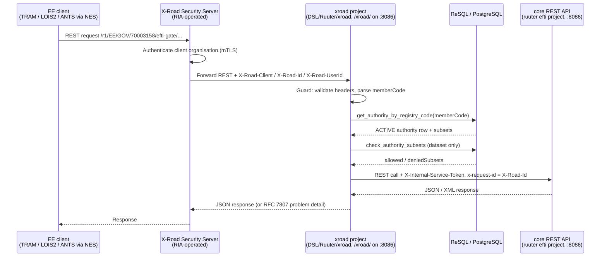

# Architecture: X-Road Integration (EE extension)

## Changes

- **v1.2** — The X-Road surface is now a project of the **main gate Ruuter** (`DSL/Ruuter/xroad/`,
  served under `/xroad/` on port 8086); the separate `ruuter-xroad` container / port 8087 /
  `constants-xroad.ini` / `ruuter-xroad.yaml` are gone. The network-isolation requirement is
  unchanged but is now an explicit **ingress constraint** (`/xroad/**` must not be publicly
  routable) rather than a property of a dedicated port. See
  [ADR-006](../decisions/006-xroad-identity-and-subsets.md).
- **v1.1** — Reconciled with the implementation. The surface is **REST, not SOAP**; there is no
  WSDL and no `protocolVersion` check. The adapter is a Ruuter project, not a Java `ee-adapter`
  Gradle module — no such module exists (`code/settings.gradle.kts` includes only `core`,
  `edelivery`, `xml-mapper`, `multiplexer`). Identity is the calling *organisation*, and the
  authorisation source is `authorities.subsets`.
- _Initial state. Change tracking begins at v1.0.0._

> Sub-architecture for the X-Road Integration (EE extension) surface. For overarching rules see [theme README](README.md). AC are in [`../../cfr/integrations/x_road_integration.md`](../../cfr/integrations/x_road_integration.md).

## X-Road integration at a glance



The `xroad` project calls `core` only over the published REST API — the `efti` Ruuter project
carries zero X-Road references.

**How the adapter authenticates to core.** `core`'s `efti/POST/api/v1/authority/.guard.yml` accepts
two credentials: a TIM-issued JWT resolving to an ADMIN/AUTHORITY `users` row, **or** a matching
`X-Internal-Service-Token`. The second is a *generic internal-service* credential — `core` learns
nothing about X-Road, and the same token is earmarked for G2G inbound. Deny (the JWT path) is the
fall-through; a missing or empty header can never match, even if the constant were unset.

This works because `core`'s authority handlers are **identity-blind**: `authority/dataset.yml` reads
only `body.uil` and `body.subsets`, `authority/follow-up.yml:12` writes `requestingUserId: ""`,
`authority/consignments-search.yml` proxies the body to ReSql, and `authority/search.yml` never
touches the caller. Identity matters only in the guard, and only as "is this an admin?" (the JWT
path now resolves gate operators only — a competent authority proper authenticates over X-Road) —
so the adapter does not impersonate a user. It performs the real authorisation itself: organisation
from `X-Road-Client`, subsets from `authorities.subsets`, both before forwarding.

> The service token grants full Authority-API access to whoever holds it, and it is baked into the
> image at build time. The same network-isolation requirement therefore applies to port
> 8086's `/efti/api/v1/authority/*` surface. See ADR-006's open questions for production delivery.

**Header mapping.** `X-Road-Id` becomes `x-request-id`. All four core authority handlers read it, and
`authority/search.yml` uses it as the multiplexer polling key — so a caller re-issuing a search with
the same `X-Road-Id` and `{"poll": true}` collects the remaining gates' results.

> **`X-Road-Id` must be a UUID, and the gate enforces it.** Core hands `x-request-id` to *typed*
> `UUID` parameters — multiplexer's `@PathParam searchId: UUID` (`MultiplexerRoutes.kt:21,43`) and
> edelivery's `e.requestId.uuid` (`InternalRoutes.kt:20`) — both of which throw on anything else. The
> X-Road REST protocol does **not** guarantee a UUID: the Security Server generates one only when the
> consumer omits the header, and a consumer information system may set an arbitrary unique string
> that the SS forwards verbatim. Unchecked, a legal message id breaks every cross-gate path, and
> silently in the worst case — core's `search.yml` never checks the multiplexer's status and
> `respond_first` sets no `status:`, so the gate would answer 200 with a wrong body. The guard
> therefore validates the shape and returns 400 `INVALID_REQUEST_ID`. Shape only: hex-digit
> validation would need a regex, and no DSL file here uses `.match`/`.test`/`RegExp`.
>
> **Known limitation — the polling key is shared.** Core's `poll_remaining` does
> `GET multiplexer/api/v1/rest/${requestId}` with no ownership check, and the multiplexer drains the
> queue for whatever id it is handed. Since `X-Road-Id` is caller-controlled, one authority that
> guesses or observes another's in-flight id can drain that search's results (bounded by the 90 s
> cache TTL). The same hole exists on the JWT path, so it is pre-existing in core — but this surface
> newly exposes it to X-Road callers and documents id reuse as the intended polling mechanism. It
> closes when the resolved authority id starts flowing to core with the audit story. Impact is
> limited to identifier-level metadata between authorities that each have unrestricted identifier
> search under Reg 2024/1942.

## Topology — the gate is the provider, not a consumer

```
TRAM / LOIS2 / ANTS (via NES)
      │  consumer request /r1/EE/GOV/70003158/efti-gate/{service}/v1
      ▼
 consumer's Security Server
      │  X-Road network — Security-Server-to-Security-Server mTLS + message signing
      ▼
 OUR Security Server (turvaserver, RIA-operated network)
      │  plain HTTP inside our own network, injecting the X-Road-* headers
      ▼
 ruuter :8086  /xroad/**  ← what this gate implements (xroad project)
```

The `xroad` project is a **provider-side adapter, called by our own Security Server**. The
consumer (client) side is not implemented — the gate never calls out to other X-Road services.
Registering the service, and granting each client subsystem access rights to it, is Security Server
configuration, not gate code.

> ### ⚠ Deployment requirement: `/xroad/**` must be reachable only from our own Security Server
>
> `X-Road-Client` is an ordinary HTTP header that the gate trusts unconditionally, because
> authentication already happened at the Security Server. **The entire authentication model therefore
> rests on network isolation.** Anyone who can reach `/xroad/**` directly can send
> `X-Road-Client: EE/GOV/<any-registry-code>/x` and impersonate **any registered authority** —
> immediately disclosing that authority's subset entitlement, and once core forwarding is wired,
> its data. Now that `/xroad/**` shares port 8086 with the public gate API, this is an **ingress
> concern**, not a matter of not publishing a port.
>
> Mandatory at deploy time:
> - the public ingress / reverse proxy must **not** route `/xroad/**` — return 404 for it;
> - a NetworkPolicy / security group must permit `/xroad/**` traffic **only** from the Security
>   Server (e.g. a separate internal listener, or a proxy that only the Security Server can reach).
>
> `compose.override.yml` publishes 8086 on localhost, but that is **local development only**. No
> Security Server container exists in compose, so the E2E suite simulates it by setting the headers
> by hand — the upstream mTLS step is not exercised locally.
>
> Removing this dependency would mean requiring mTLS between the Security Server and the adapter
> too; the X-Road deployment model does not assume it and RIA does not require it.

## Identity and access control

The Security Server authenticates the **calling organisation** by mTLS and forwards it as
`X-Road-Client`. The gate trusts that header — the authentication has already happened upstream,
subject to the network-isolation requirement above.

| Header | Required | Role |
|---|---|---|
| `X-Road-Client` | yes | **The credential.** `instance/memberClass/memberCode[/subsystemCode]`. Both the 3-part (member-level) and 4-part (subsystem-level) forms are valid X-Road client ids; `memberCode` at index 2 drives access control and maps to `authorities.registry_code`. |
| `X-Road-Id` | yes | Message id; logged for correlation. |
| `X-Road-Service` | no | Set by the Security Server; informational. |
| `X-Road-UserId` | no | End user's personal identification code. **Never grants access**, because X-Road does not authenticate it. Intended for GDPR Art. 30 audit, but nothing writes `audit_log` yet — see ADR-006's open questions. |
| `X-Road-Represented-Party`, `X-Road-Issue` | no | Informational. |

There is **no `protocolVersion`**: in the X-Road REST message protocol the version is the `/r1/`
prefix on the consumer's URL, consumed by the consumer's own Security Server and never forwarded to
the provider. The gate's own contract version is the `/v1` in `/xroad/v1/...`.

Authentication lives in **one project-level guard**, `DSL/Ruuter/xroad/.guard.yml` (Ruuter
≥ 0.9.7-rc), covering every method under `/xroad/**`. `xroad/GET/health/.guard.yml` sets
`declaration.override_ancestors: true` to replace it for that subtree, keeping the container health
probe public. The guard **authenticates only**. Denials:

| Condition | Status | `code` |
|---|---|---|
| `X-Road-Client` absent or malformed | 401 | `UNAUTHORIZED` |
| `X-Road-Id` absent | 400 | `MISSING_REQUIRED_HEADER` |
| `X-Road-Id` present but not UUID-shaped | 400 | `INVALID_REQUEST_ID` |
| `memberCode` resolves to no `ACTIVE` authority | 403 | `FORBIDDEN` |
| `memberCode` resolves to **more than one** `ACTIVE` authority (registry misconfiguration) | 403 | `FORBIDDEN` |

Per-route denials on `POST /xroad/v1/dataset`, which is the only operation taking a subset parameter:

| Condition | Status | `code` |
|---|---|---|
| `subsets` empty or absent | 400 | `MISSING_SUBSET` |
| A requested subset is not in `authorities.subsets` | 403 | `FORBIDDEN_SUBSET` |
| `core` answered with status ≥ 400 | 502 | `GATEWAY_UNAVAILABLE` (core's status and body in `coreStatus` / `coreResponse`) |

Deny is the fall-through branch and every accept path is an explicit positive condition. That
ordering is load-bearing: if ReSql returns a non-array body (a 500 error object, a param-validation
failure) then `body.length` is `undefined` and every comparison against it is false, so the request
must land on the denial. Expressing the check as a single negative condition with success as the
fall-through fails **open** on exactly that input.

**`FORBIDDEN_SUBSET` is enforced by the route, not the guard.** The guard authenticates the
organisation; only `POST /xroad/v1/dataset` accepts a subset parameter, so that route applies the
check itself via `DSL/Resql/efti/POST/check_authority_subsets.sql`. Any future route taking subsets
must do the same — the guard will not do it for them.

The check lives in SQL (`:requested_subsets <@ a.subsets`) rather than the DSL because no Ruuter DSL
file in the repo uses `.every` / `.includes` / arrow functions, so the engine's JS array support is
unproven, while ReSql already handles `{type: array}` params and `::text[]` casts.

Two traps, both commented in the code:

- **`'{}' <@ anything` is TRUE**, so an empty subset list would pass the containment test. The route
  rejects an empty or absent list *before* calling SQL — 400 `MISSING_SUBSET`, matching
  `openapi.yaml`'s `minItems: 1` on `subsetId`.
- **A partially permitted request is denied whole.** `["EU01","EU06"]` where only EU01 is permitted
  returns 403, not a silent narrowing to EU01 — narrowing would answer a question the caller did not
  ask and would hide the entitlement error.

The denial carries `deniedSubsets`, `permittedSubsets` and `authorityId` as RFC 7807 extension
members rather than interpolated into the `detail` prose, so a machine caller can branch on the
arrays directly.

Because `authorities` is append-only, the authority lookup
(`DSL/Resql/efti/POST/get_authority_by_registry_code.sql`) resolves the latest row per logical id
**before** filtering on `registry_code` and `status`. Filtering inside the `DISTINCT ON` would let a
soft-deleted authority with an older `ACTIVE` row keep authenticating.

## Vehicle lookup

`POST /xroad/v1/vehicle` — a registration number in, the identifier-level data this gate holds out:

```json
{ "vehicleId": "123ABC", "found": 1, "consignments": [
  { "uil": {"gateId": "EU-EE", "platformId": "mock", "datasetId": "550e..."},
    "mainTransportId": "123ABC", "transportRegCountry": "EE", "transportMode": "3", "...": "..." } ] }
```

**No dataset content**, and none to leak: dataset content never enters Postgres. It is fetched from
the platform by `authority/dataset.yml` with `?subsetId=...`, which is where subset entitlement is
enforced. `consignments.xml` is the *identifier* XML as received from the platform
(`006-consignments.sql:54`), not a dataset.

The dedicated `get_consignments_by_vehicle.sql` exists for two other reasons: it pins an explicit
field contract for an external consumer, rather than exposing a blob whose schema belongs to the
platform; and it drops that blob, which is redundant here because it carries the same fields already
denormalised into the columns returned. Content is still fetched afterwards via
`POST /xroad/v1/dataset` with the returned `uil`.

> An earlier draft justified this file by claiming reuse would "bypass `authorities.subsets`". That
> was wrong and has been retracted here and in ADR-006 — there is no bypass to defeat.

Requires **`EU02`** in `authorities.subsets` (Delegated Reg 2024/2024 defines EU02 as "means of
transport (vehicle plate, container number)" — exactly this data), else 403 `FORBIDDEN_SUBSET`.
Local registry only, no broadcast. An unknown plate is a **200 with `found: 0`**, not a 404, which
also gives ANTS-style existence semantics.

The column is `main_transport_id`; `consignments.vehicle_plate` named in older docs has never
existed. Matching is case-sensitive and untrimmed — see ADR-006.

## Subset-permission lookup## Subset-permission lookup

`GET /xroad/v1/subsets` returns the calling organisation's own permitted subsets:

```json
{ "registryCode": "70000097", "authorityId": "auth-mta", "subsets": ["EU01", "EU05"] }
```

A **list**, not a yes/no answer: it is the superset of yes/no (the client answers its own question
locally), a dataset request may name up to seven subsets so yes/no would cost seven round-trips, and
it is cacheable. The registry code is taken only from `X-Road-Client`, never from the request, so a
caller can never ask about another organisation's entitlement.

## Rationale

X-Road is the Estonian national-level secure data-exchange layer; integrating via X-Road is a
prerequisite for Estonian-side regulatory clients (TRAM, LOIS2, ANTS via NES). Isolating X-Road in
its own Ruuter project (`xroad/`, with its own project-level guard) keeps the
`efti`/`admin`/`platforms` surface portable to non-X-Road jurisdictions and avoids polluting
cross-border eDelivery flows with EE-specific concerns. ANTS
gets its own bypass endpoint because the cross-gate broadcast that the regular Authority route
performs is wrong for the ANTS use case (border-operations existence check, high volume,
local-registry-only).

Organisation-level identity rather than a per-user token is what makes the machine-to-machine
callers work at all — ANTS via NES has no human in the loop, so there is no TARA token to carry.
`authorities.subsets` is also the only subset register that exists: `users` has neither a `subsets`
column nor a link to an authority.
