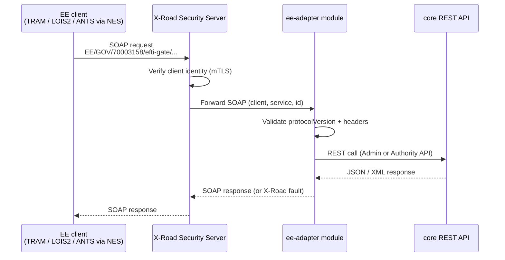

# Architecture: X-Road Integration (EE extension)

## Changes

- _Initial state. Change tracking begins at v1.0.0._

> Sub-architecture for the X-Road Integration (EE extension) surface. For overarching rules see [theme README](README.md). AC are in [`../../cfr/integrations/x_road_integration.md`](../../cfr/integrations/x_road_integration.md).

## X-Road integration at a glance

The `ee-adapter` module calls `core` only via the published REST API — no internal `core` dependency.

## Rationale

X-Road is the Estonian national-level secure data-exchange layer; integrating via X-Road is a prerequisite for Estonian-side regulatory clients (TRAM, LOIS2, ANTS via NES). Isolating X-Road in `ee-adapter` keeps the `core` gate process portable to non-X-Road jurisdictions and avoids polluting cross-border eDelivery flows with EE-specific concerns. ANTS gets its own bypass endpoint because the cross-gate broadcast that the regular Authority route performs is wrong for the ANTS use case (border-operations existence check, high volume, local-registry-only).

