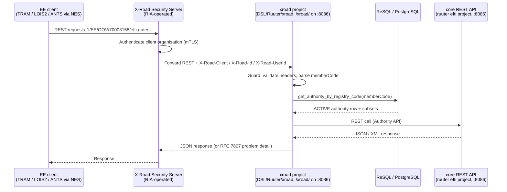

# Architecture: X-Road Integration (EE extension)

## Changes

- **v1.2** — The X-Road surface is now a project of the **main gate Ruuter** (`DSL/Ruuter/xroad/`,
  served under `/xroad/` on port 8086); the separate `ruuter-xroad` container / port 8087 /
  `constants-xroad.ini` / `ruuter-xroad.yaml` are gone. The network-isolation requirement is
  unchanged but is now an explicit **ingress constraint** (`/xroad/**` must not be publicly
  routable) rather than a property of a dedicated port. See
  [ADR-006](../decisions/006-xroad-identity-and-subsets.md).
- **v1.1** — Reconciled with the implementation. The surface is **REST, not SOAP**; there is no
  WSDL and no `protocolVersion` check. The adapter is a Ruuter project, not a Java `ee-adapter`
  Gradle module — no such module exists (`code/settings.gradle.kts` includes only `core`,
  `edelivery`, `xml-mapper`, `multiplexer`). Identity is the calling *organisation*, and the
  authorisation source is `authorities.subsets`.
- _Initial state. Change tracking begins at v1.0.0._

> Sub-architecture for the X-Road Integration (EE extension) surface. For overarching rules see [theme README](README.md). AC are in [`../../cfr/integrations/x_road_integration.md`](../../cfr/integrations/x_road_integration.md).

## X-Road integration at a glance



The `xroad` project calls `core` only over the published REST API — the `efti` Ruuter project
carries zero X-Road references, and even though both projects now run in the same engine, the
`template:` bypass does not cross project boundaries. Note that this edge is **not yet wired**:
`core`'s `efti/POST/api/v1/authority/.guard.yml` requires a TIM-issued JWT that the `xroad` project
has no way to obtain. It needs an internal service token, the same one `AGENTS.md` flags as pending
for G2G inbound.

## Topology — the gate is the provider, not a consumer

```
TRAM / LOIS2 / ANTS (via NES)
      │  consumer request /r1/EE/GOV/70003158/efti-gate/{service}/v1
      ▼
 consumer's Security Server
      │  X-Road network — Security-Server-to-Security-Server mTLS + message signing
      ▼
 OUR Security Server (turvaserver, RIA-operated network)
      │  plain HTTP inside our own network, injecting the X-Road-* headers
      ▼
 ruuter :8086  /xroad/**  ← what this gate implements (xroad project)
```

The `xroad` project is a **provider-side adapter, called by our own Security Server**. The
consumer (client) side is not implemented — the gate never calls out to other X-Road services.
Registering the service, and granting each client subsystem access rights to it, is Security Server
configuration, not gate code.

> ### ⚠ Deployment requirement: `/xroad/**` must be reachable only from our own Security Server
>
> `X-Road-Client` is an ordinary HTTP header that the gate trusts unconditionally, because
> authentication already happened at the Security Server. **The entire authentication model therefore
> rests on network isolation.** Anyone who can reach `/xroad/**` directly can send
> `X-Road-Client: EE/GOV/<any-registry-code>/x` and impersonate **any registered authority** —
> immediately disclosing that authority's subset entitlement, and once core forwarding is wired,
> its data. Now that `/xroad/**` shares port 8086 with the public gate API, this is an **ingress
> concern**, not a matter of not publishing a port.
>
> Mandatory at deploy time:
> - the public ingress / reverse proxy must **not** route `/xroad/**` — return 404 for it;
> - a NetworkPolicy / security group must permit `/xroad/**` traffic **only** from the Security
>   Server (e.g. a separate internal listener, or a proxy that only the Security Server can reach).
>
> `compose.override.yml` publishes 8086 on localhost, but that is **local development only**. No
> Security Server container exists in compose, so the E2E suite simulates it by setting the headers
> by hand — the upstream mTLS step is not exercised locally.
>
> Removing this dependency would mean requiring mTLS between the Security Server and the adapter
> too; the X-Road deployment model does not assume it and RIA does not require it.

## Identity and access control

The Security Server authenticates the **calling organisation** by mTLS and forwards it as
`X-Road-Client`. The gate trusts that header — the authentication has already happened upstream,
subject to the network-isolation requirement above.

| Header | Required | Role |
|---|---|---|
| `X-Road-Client` | yes | **The credential.** `instance/memberClass/memberCode[/subsystemCode]`. Both the 3-part (member-level) and 4-part (subsystem-level) forms are valid X-Road client ids; `memberCode` at index 2 drives access control and maps to `authorities.registry_code`. |
| `X-Road-Id` | yes | Message id; logged for correlation. |
| `X-Road-Service` | no | Set by the Security Server; informational. |
| `X-Road-UserId` | no | End user's personal identification code. **Never grants access**, because X-Road does not authenticate it. Intended for GDPR Art. 30 audit, but nothing writes `audit_log` yet — see ADR-006's open questions. |
| `X-Road-Represented-Party`, `X-Road-Issue` | no | Informational. |

There is **no `protocolVersion`**: in the X-Road REST message protocol the version is the `/r1/`
prefix on the consumer's URL, consumed by the consumer's own Security Server and never forwarded to
the provider. The gate's own contract version is the `/v1` in `/xroad/v1/...`.

Authentication is one project-level guard, `DSL/Ruuter/xroad/.guard.yml` (Ruuter #39), covering every
method under `/xroad/**`. `DSL/Ruuter/xroad/GET/health/.guard.yml` uses `override_ancestors` to keep
the health probe public. The guard **authenticates only**. Denials:

| Condition | Status | `code` |
|---|---|---|
| `X-Road-Client` absent or malformed | 401 | `UNAUTHORIZED` |
| `X-Road-Id` absent | 400 | `MISSING_REQUIRED_HEADER` |
| `memberCode` resolves to no `ACTIVE` authority | 403 | `FORBIDDEN` |
| `memberCode` resolves to **more than one** `ACTIVE` authority (registry misconfiguration) | 403 | `FORBIDDEN` |

Deny is the fall-through branch and every accept path is an explicit positive condition. That
ordering is load-bearing: if ReSql returns a non-array body (a 500 error object, a param-validation
failure) then `body.length` is `undefined` and every comparison against it is false, so the request
must land on the denial. Expressing the check as a single negative condition with success as the
fall-through fails **open** on exactly that input.

**`FORBIDDEN_SUBSET` is not yet emitted anywhere.** `authorities.subsets` is established as the
authorisation source and the code exists in the catalog, but no guard and no X-Road route performs a
subset check — the surface currently exposes only `echo` and `subsets`, neither of which takes a
subset parameter. A route that does must apply the check itself; the guard will not do it. The check
belongs in SQL (`requested <@ authorities.subsets`) rather than the DSL, because no Ruuter DSL file
in the repo uses `.every` / `.includes` / arrow functions, so the engine's JS array support is
unproven.

Because `authorities` is append-only, the authority lookup
(`DSL/Resql/efti/POST/get_authority_by_registry_code.sql`) resolves the latest row per logical id
**before** filtering on `registry_code` and `status`. Filtering inside the `DISTINCT ON` would let a
soft-deleted authority with an older `ACTIVE` row keep authenticating.

## Subset-permission lookup

`GET /xroad/v1/subsets` returns the calling organisation's own permitted subsets:

```json
{ "registryCode": "70000097", "authorityId": "auth-mta", "subsets": ["EU01", "EU05"] }
```

A **list**, not a yes/no answer: it is the superset of yes/no (the client answers its own question
locally), a dataset request may name up to seven subsets so yes/no would cost seven round-trips, and
it is cacheable. The registry code is taken only from `X-Road-Client`, never from the request, so a
caller can never ask about another organisation's entitlement.

## Rationale

X-Road is the Estonian national-level secure data-exchange layer; integrating via X-Road is a
prerequisite for Estonian-side regulatory clients (TRAM, LOIS2, ANTS via NES). Isolating X-Road in
its own Ruuter project (`xroad/`, with its own project-level guard) keeps the
`efti`/`admin`/`platforms` surface portable to non-X-Road jurisdictions and avoids polluting
cross-border eDelivery flows with EE-specific concerns. ANTS
gets its own bypass endpoint because the cross-gate broadcast that the regular Authority route
performs is wrong for the ANTS use case (border-operations existence check, high volume,
local-registry-only).

Organisation-level identity rather than a per-user token is what makes the machine-to-machine
callers work at all — ANTS via NES has no human in the loop, so there is no TARA token to carry.
`authorities.subsets` is also the only subset register that exists: `users` has neither a `subsets`
column nor a link to an authority.
