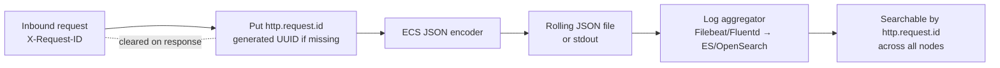

# Architecture: Logging and Observability

## Changes

- _Initial state. Change tracking begins at v1.0.0._

> Sub-architecture for the Logging and Observability surface. For overarching rules see [theme README](README.md). AC are in [`../../cfr/observability/logging_and_observability.md`](../../cfr/observability/logging_and_observability.md).

## Log pipeline at a glance

## Rationale

ECS-shaped JSON gives the operator one consistent schema to index, search, and alert against (regardless of which log-aggregator stack they run). The `efti.*` namespace keeps custom fields from colliding with ECS evolution. Mandatory `http.request.id` plus per-call outbound logging lets an on-call engineer reconstruct an end-to-end trace across the local gate, eDelivery hop, and peer-gate without distributed tracing infrastructure.

