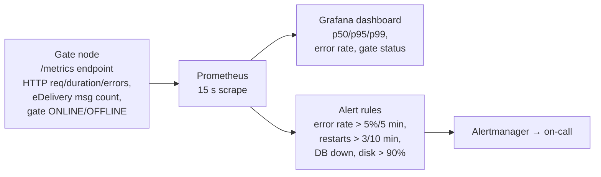

# Architecture: Monitoring and Alerting

## Changes

- _Initial state. Change tracking begins at v1.0.0._

> Sub-architecture for the Monitoring and Alerting surface. For overarching rules see [theme README](README.md). AC are in [`../../cfr/observability/monitoring_and_alerting.md`](../../cfr/observability/monitoring_and_alerting.md).

## Monitoring pipeline at a glance

## Rationale

The gate is regulator-facing; an outage during an inspection window has legal as well as operational consequences. Alerts are deliberately coarse (error rate, restart loop, DB failure, peer-gate stall, disk) — the long tail of issue-specific alerts emerges from operating the system, not from spec-writing. SLOs and the HPA contract live in one place (`non-functional.md`); this epic just wires them up to dashboards + alertmanager.

