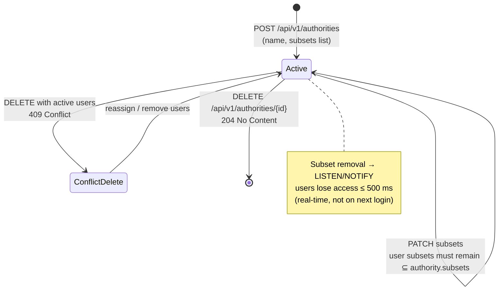

# Architecture: Authority Registry Management (Admin API)

## Changes

- _Initial state. Change tracking begins at v1.0.0._

> Sub-architecture for the Authority Registry Management (Admin API) surface. For overarching rules see [theme README](README.md). AC are in [`../../cfr/registry-management/authority_registry.md`](../../cfr/registry-management/authority_registry.md).

## Authority lifecycle at a glance

## Rationale

Authorities are the **subset-permission roots**: a user's permitted subsets must always be a subset of their authority's. Real-time propagation matters — when an admin removes a subset from an authority (e.g. legal change), every user under it must lose that access immediately, not on their next session. The append-only + `LISTEN/NOTIFY` pattern delivers that without server-side session state.

