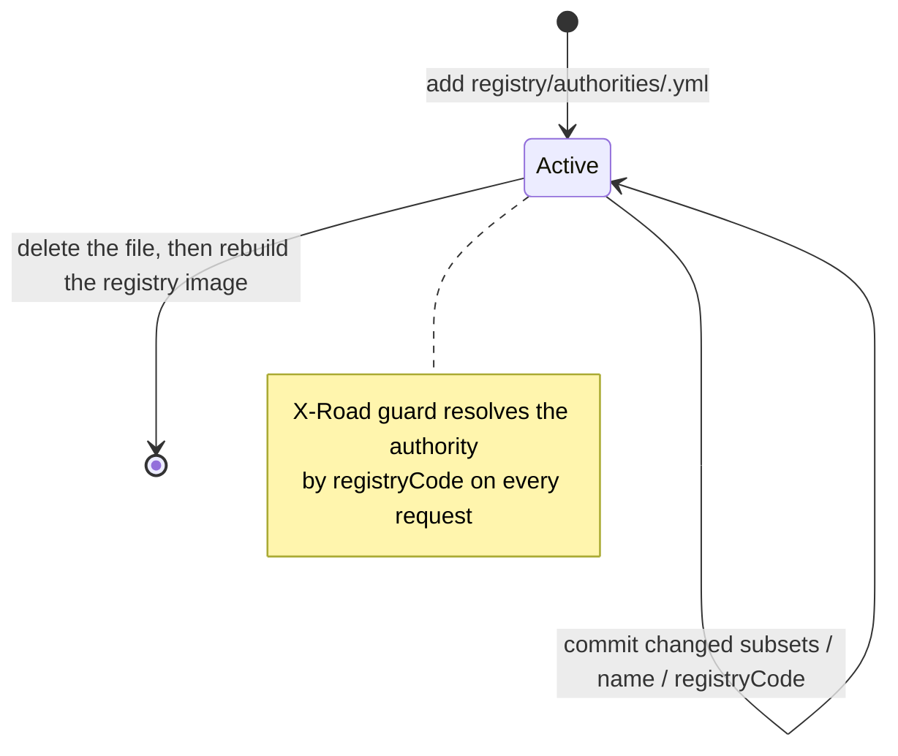

# Architecture: Authority Registry Management (Configuration-Driven, no database)

## Changes

- _Initial state. Change tracking begins at v1.0.0._
- **2026-10-08 — [ADR-011](../../architecture/decisions/011-registries-as-signed-config.md) §3/§4/§7:** the registry left the Admin API and the database. It is declared in the git folder `registry/authorities/<id>.yml` and converted, with validation, into the JSON the `registry` image serves statically at **image build time** (§3; an edit is applied by rebuilding that image, and `subsets: []` is preserved through the conversion). The `authorities` table, its read model and the `authority_status` type are **dropped**, and so is the `status` field itself (§4, §7).

> Sub-architecture for the Authority Registry Management surface. For overarching rules see [theme README](README.md). AC are in [`../../cfr/registry-management/authority_registry.md`](../../cfr/registry-management/authority_registry.md).

## Authority lifecycle at a glance

```mermaid
stateDiagram-v2
    [*] --> Active: add registry/authorities/<id>.yml
    Active --> Active: commit changed subsets / name / registryCode
    Active --> [*]: delete the file, then rebuild the registry image
    note right of Active
        X-Road guard resolves the authority
        by registryCode on every request
    end note
```

There is no `DELETED` state and no tombstone. An authority exists because its file exists, and
revoking one means deleting the file — so the id and the `registryCode` become free again. The only
record that an authority was ever registered is git history.

## How a change reaches the consumers

1. A PR adds, edits or deletes a file under `registry/authorities/`.
2. The `registry` image is rebuilt (`docker compose up --build registry`, or the CI build of the
   deployment): the YAML is validated and converted to JSON at build time, and only then served
   statically. A restart alone changes nothing.
3. The X-Road guard and `xroad/GET/v1/subsets` read `GET /authorities.json` and match `registryCode`
   in the DSL; `admin/GET/v1/consignment-summary` reads `GET /authorities/<id>.json` for the
   `subsets` that dimension the authority's summary.

`subsets` is a plain array in the file, so its order is whatever the file says — there is no
normalisation step left anywhere.

## Rationale

Authorities are the **subset-permission roots**: a caller's permitted subsets must always be a subset
of their authority's. The X-Road guard resolves that entitlement on every request straight from the
served registry, so there is no cache and no propagation delay — a change takes effect with the
registry image rebuild that carries it.

That is also why the registry must be a reviewed artefact: a row wrong in the permissive direction
(an extra subset, an empty `subsets` where entitlement was expected, a `registryCode` typo that
collides with another authority) hands one organisation another's data. The guard fails closed on an
ambiguous code — more than one match is denied, never guessed — which is what turns a duplicate into
a detectable configuration bug rather than a silent impersonation. With the registry in git that
duplicate is visible in review, and two files sharing a code are denied by construction rather than
depending on how the rows happened to be written.
