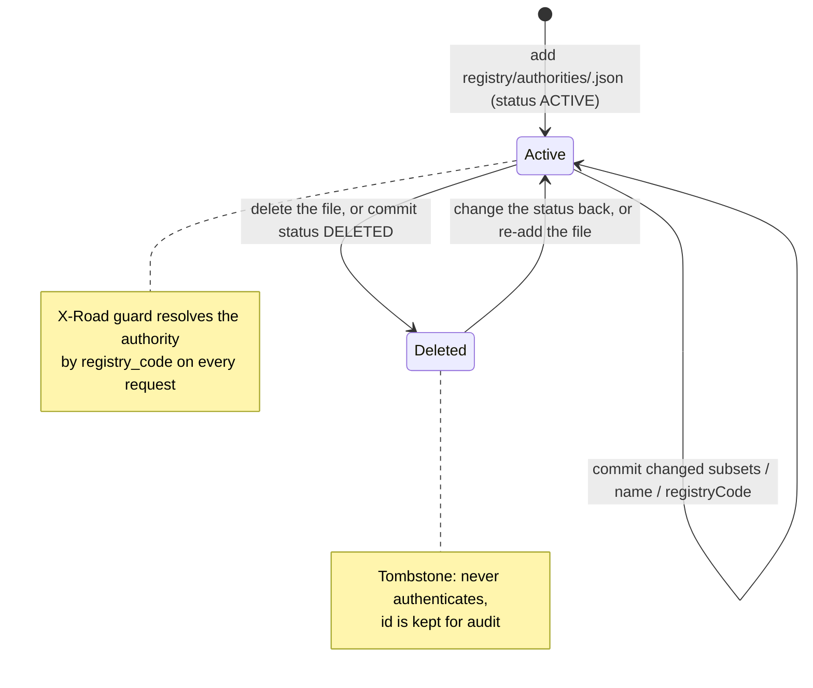

# Architecture: Authority Registry Management (Configuration-Driven)

## Changes

- _Initial state. Change tracking begins at v1.0.0._
- **2026-10-08 — rewritten for [ADR-014](../../architecture/decisions/014-registry-as-git-folder.md).** The authority registry is no longer mutated through the Admin API: it is declared in `registry/authorities/<id>.json` and applied by the one-shot `registry-sync` container at startup. The admin `POST`/`PUT`/`DELETE` routes are deleted.

> Sub-architecture for the Authority Registry Management surface. For overarching rules see [theme README](README.md). AC are in [`../../cfr/registry-management/authority_registry.md`](../../cfr/registry-management/authority_registry.md).

## Authority lifecycle at a glance

```mermaid
stateDiagram-v2
    [*] --> Active: add registry/authorities/<id>.json (status ACTIVE)
    Active --> Active: commit changed subsets / name / registryCode
    Active --> Deleted: delete the file, or commit status DELETED
    Deleted --> Active: change the status back, or re-add the file
    note right of Active
        X-Road guard resolves the authority
        by registry_code on every request
    end note
    note right of Deleted
        Tombstone: never authenticates,
        id is kept for audit
    end note
```

Two ways to revoke an authority, and they are not equivalent in intent:

- **delete the file** — the id is gone from the registry and a `DELETED` tombstone is appended. Re-adding the file revives it.
- **commit `status: DELETED`** — an explicit, permanent tombstone. The file documents that the authority exists but must never authenticate; it is stable (declared `DELETED` equals stored `DELETED`, so nothing is rewritten on restarts).

Either way the runtime effect is identical: the X-Road guard resolves authorities with `WHERE status = 'ACTIVE'`, so a `DELETED` row can never authenticate.

## How a change reaches the database

1. A PR adds, edits or deletes a file under `registry/authorities/`.
2. The `registry-sync` container validates it, posts the registry to `POST /efti/sync_authorities`, refreshes the admin read models and verifies the result.
3. `ruuter` and `edelivery` start only after that container exits successfully.

`subsets` are normalised (de-duplicated, sorted ascending) on the way in, so re-ordering the same set is not a change and does not append a revision.

## Rationale

Authorities are the **subset-permission roots**: a caller's permitted subsets must always be a subset of their authority's, and the X-Road guard reads that entitlement from the database on every request — there is no cache to invalidate and no propagation delay, so a change takes effect with the revision that carries it, i.e. at startup.

That is why the registry must be a reviewed artefact rather than a live REST resource. An authority row that is wrong in the permissive direction (an extra subset, an empty `subsets` array where entitlement was expected, a registry code typo that collides with another authority) hands one organisation another's data. The guard already fails closed on an ambiguous `registry_code` (more than one `ACTIVE` match is denied, not guessed), which is what makes a duplicate a detectable configuration bug rather than a silent impersonation — and with the registry in git, a duplicate is visible in review instead of appearing as a race between two API calls.
