# Architecture: Consignment Management (Admin API)

## Changes

- _Initial state. Change tracking begins at v1.0.0._

> Sub-architecture for the Consignment Management (Admin API) surface. For overarching rules see [theme README](README.md). AC are in [`../../cfr/registry-management/consignment_management.md`](../../cfr/registry-management/consignment_management.md).

## Consignment lifecycle at a glance

```mermaid
stateDiagram-v2
    [*] --> active: POST /v1/identifiers/{datasetId}<br/>(INSERT consignments row, status='active')
    active --> active: re-register same datasetId<br/>(append-only INSERT; latest row wins)
    active --> inactive: CronManager → /api/v1/admin/expire-identifiers<br/>(road, transport_date+14d <NOW())<br/>or immediate inactive INSERT for other modes
    inactive --> active: re-registered by platform
    active --> deleted: Platform DELETE /v1/identifiers/{datasetId}<br/>or Admin DELETE /api/v1/consignments/{datasetId}<br/>(append-only INSERT, status='deleted')
    inactive --> deleted: Platform / Admin DELETE
    note right of inactive
        Returned by /v1/identifiers only with
        dateFrom/dateTo (cabotage control,
        Reg 2024/1942 Art 11(4)).
    end note
    note right of deleted
        Append-only — nothing is physically removed.
        Old (non-latest) rows are archived nightly by
        CronManager (Epic 26) to cold storage. The
        runtime app role has no DELETE grant.
    end note
```

## Rationale

The gate's data model is **append-only everywhere**: state transitions (active → inactive, inactive → deleted, re-registration) are all INSERTs of new rows sharing the logical `dataset_id`. This preserves a complete audit trail without UPDATEs or change-tracking tables, satisfying Reg 2024/1942 Art 30's processing-record requirement without extra machinery. CronManager handles all scheduled state transitions (expiry, archival) so the gate process itself stays stateless.

