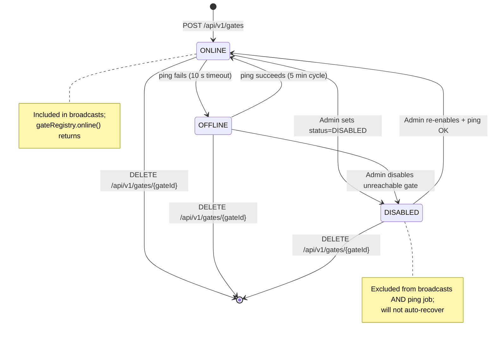

# Architecture: Gate Registry Management (Admin API)

## Changes

- _Initial state. Change tracking begins at v1.0.0._

> Sub-architecture for the Gate Registry Management (Admin API) surface. For overarching rules see [theme README](README.md). AC are in [`../../cfr/registry-management/gate_registry.md`](../../cfr/registry-management/gate_registry.md).

## Gate lifecycle at a glance

## Rationale

The gate registry is **shared state across the cluster**: every node caches the latest row per gate and refreshes on `NOTIFY`. Pings are append-only state transitions, so the history is auditable without an UPDATE-trigger pattern. Recurring jobs live in CronManager (not the gate) so a scheduled job runs exactly once regardless of how many gate replicas are deployed — combined with the advisory-lock mutex, multi-node deployments are safe.

