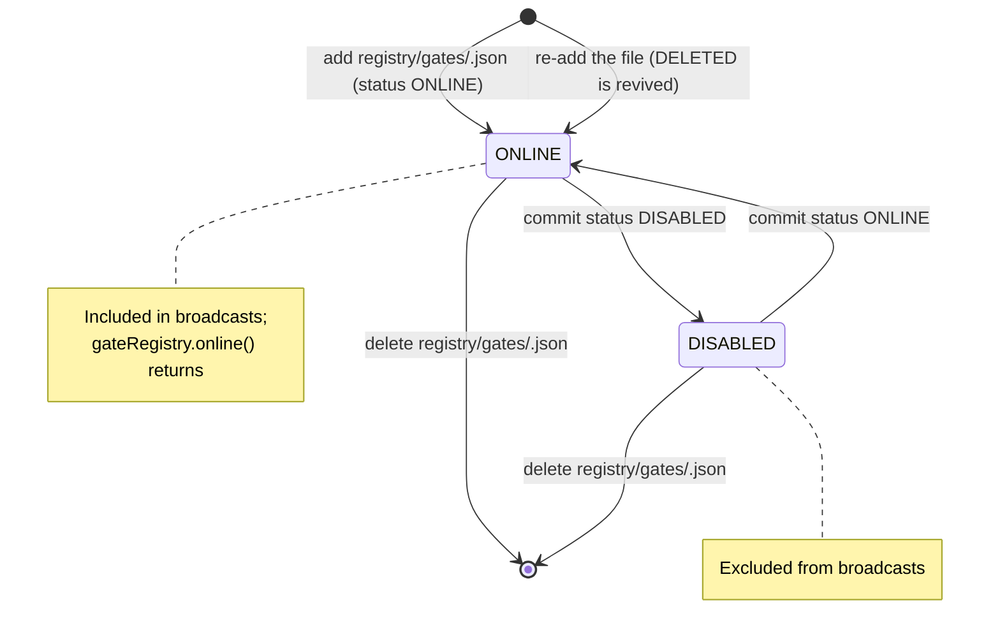

# Architecture: Gate Registry Management (Configuration-Driven)

## Changes

- _Initial state. Change tracking begins at v1.0.0._
- **2026-10-08 — rewritten for [ADR-014](../../architecture/decisions/014-registry-as-git-folder.md).** The gate registry is no longer mutated through the Admin API: it is declared in `registry/gates/<id>.json` and applied by the one-shot `registry-sync` container at startup. The admin `POST`/`PUT`/`DELETE` and `ping` routes are deleted, so the lifecycle below is driven by git rather than by HTTP.

> Sub-architecture for the Gate Registry Management surface. For overarching rules see [theme README](README.md). AC are in [`../../cfr/registry-management/gate_registry.md`](../../cfr/registry-management/gate_registry.md).

## Gate lifecycle at a glance

```mermaid
stateDiagram-v2
    [*] --> ONLINE: add registry/gates/<id>.json (status ONLINE)
    ONLINE --> DISABLED: commit status DISABLED
    DISABLED --> ONLINE: commit status ONLINE
    ONLINE --> [*]: delete registry/gates/<id>.json
    DISABLED --> [*]: delete registry/gates/<id>.json
    [*] --> ONLINE: re-add the file (DELETED is revived)
    note right of ONLINE
        Included in broadcasts;
        gateRegistry.online() returns
    end note
    note right of DISABLED
        Excluded from broadcasts
    end note
```

There is no `OFFLINE` transition. `status` is a **commit**, not a health observation: the ping job that used to flip `ONLINE`/`OFFLINE` every five minutes no longer exists, and `gates.last_ping_at` is vestigial and stays `NULL`.

## How a change reaches the database

1. A PR adds, edits or deletes a file under `registry/gates/`.
2. On the next startup the `registry-sync` container validates the file, posts the whole registry to `POST /efti/sync_gates`, refreshes the admin read models and reads the registry back to verify it.
3. `ruuter` and `edelivery` start only after that container exits successfully, so a malformed gate entry stops the deployment instead of reaching `edelivery`.

`sync_gates` is append-only and only writes when something actually changed, so restarting a node does not grow the table. Deleting a file appends a `DELETED` tombstone; re-adding it appends a new `ONLINE` row (ADR-014 relaxed the reactivation guard for this).

## Rationale

The gate registry is **contractual state**: a gate's AS4 URL and certificate decide where signed messages go, so changing them is a signing act, not a runtime mutation. Making the folder the only writer means every change is reviewed, versioned and released, and there is no REST path — authenticated or otherwise — that can repoint a peer. The tables stay append-only, so the full history of URLs, certificates and status flips is still auditable.

Every node still caches the latest row per gate, and the per-id advisory transaction lock in `protect_registry_append()` keeps concurrent appends serialised, so multi-node deployments and the reader-side caches behave exactly as before.
