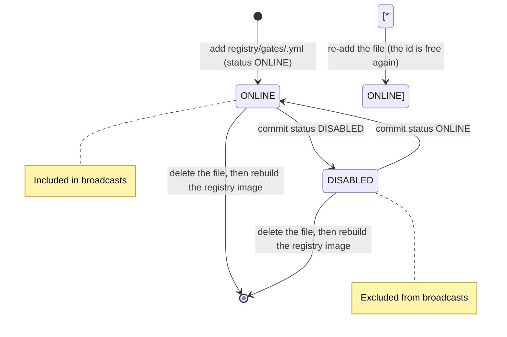

# Architecture: Gate Registry Management (Configuration-Driven, no database)

## Changes

- _Initial state. Change tracking begins at v1.0.0._
- **2026-10-08 — [ADR-014](../../architecture/decisions/014-registry-as-git-folder.md):** the registry moved out of the Admin API into the git folder `registry/gates/`.
- **2026-10-08 — [ADR-015](../../architecture/decisions/015-registry-as-file-server.md):** the database step is gone. The `gates` table, its read model and the `gate_status` type are **dropped**; the folder is served over HTTP by the `registry` service and read by Ruuter and `edelivery`.
- **2026-10-08 — [ADR-016](../../architecture/decisions/016-registry-yaml-build-time-json.md):** the sources are YAML (`registry/gates/<id>.yml`), converted to JSON at image build time and served statically by nginx — so nothing is re-read at runtime and an edit is applied by rebuilding the `registry` image.

> Sub-architecture for the Gate Registry Management surface. For overarching rules see [theme README](README.md). AC are in [`../../cfr/registry-management/gate_registry.md`](../../cfr/registry-management/gate_registry.md).

## Gate lifecycle at a glance

```mermaid
stateDiagram-v2
    [*] --> ONLINE: add registry/gates/<id>.yml (status ONLINE)
    ONLINE --> DISABLED: commit status DISABLED
    DISABLED --> ONLINE: commit status ONLINE
    ONLINE --> [*]: delete the file, then rebuild the registry image
    DISABLED --> [*]: delete the file, then rebuild the registry image
    [* --> ONLINE]: re-add the file (the id is free again)
    note right of ONLINE
        Included in broadcasts
    end note
    note right of DISABLED
        Excluded from broadcasts
    end note
```

There is no `OFFLINE` transition and no tombstone: `status` is a **commit**, and an unregistered gate
is simply absent. Nothing pings a peer any more.

## How a change reaches the consumers

1. A PR adds, edits or deletes a file under `registry/gates/`.
2. The `registry` image is rebuilt (`docker compose up --build registry`, or the CI build of the
   deployment). `scripts/registry-to-json.py` **validates** every source file and converts it to the
   JSON the image then serves statically; there is no runtime re-read and no mount to sync.
3. Ruuter reads `GET /gates.json` (for the admin list and the peer fan-out) or
   `GET /gates/<id>.json` (for get-by-id and `gates/own`) and filters in the DSL;
   `edelivery` reads `/gates.json` into its AS4 party map.

A file that fails validation fails the build, so a broken gate entry cannot reach `edelivery` — the
fail-closed gate moved from container start to build time.

## Rationale

The gate registry is **contractual state**: a gate's AS4 URL and certificate decide where signed
messages go, so changing them is a signing act. Keeping the folder as the only store — rather than
projecting it into a table — removes the second copy entirely: there is no read model to refresh, no
append-only revision history to archive, no tombstone semantics, and no way for the database to
disagree with the repository.

The cost is explicit: the registry is now on the request path (every peer fan-out and every admin
read calls the service), and the append-only audit trail of gate changes is git rather than
`created_at`-ordered rows. See ADR-015 "Tagajärjed ja hinnad".
