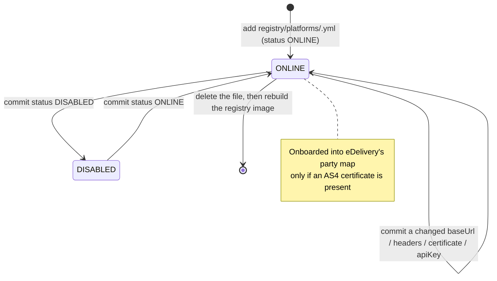

# Architecture: Platform Registry Management (Configuration-Driven, no database)

## Changes

- _Initial state. Change tracking begins at v1.0.0._
- **2026-10-08 — [ADR-011](../../architecture/decisions/011-registries-as-signed-config.md) §3/§4/§5:** the registry left the Admin API and the database. It is declared in the git folder `registry/platforms/<id>.yml` and converted, with validation, into the JSON the `registry` image serves statically at **image build time** (§3; an edit is applied by rebuilding that image). The `platforms` table, its read model and the `api_key_hash`/`api_key_hint`/`api_key_generated_at` columns are **dropped** (§4), and the platform credential is a **plaintext `apiKey` in the file** (§5) — ADR-004's hash-only rule is dropped because Ruuter's expression engine has no hash function.

> Sub-architecture for the Platform Registry Management surface. For overarching rules see [theme README](README.md). AC are in [`../../cfr/registry-management/platform_registry.md`](../../cfr/registry-management/platform_registry.md).

## Platform lifecycle at a glance

There is no `DELETED` state and no tombstone: absence is deletion.

## How a change reaches the consumers

1. A PR adds, edits or deletes a file under `registry/platforms/`.
2. The `registry` image is rebuilt (`docker compose up --build registry`, or the CI build of the
   deployment): the YAML is validated and converted to JSON at build time and then served statically.
   Nothing is re-read at runtime, so a restart alone changes nothing.
3. Ruuter reads `GET /platforms.json` (guards, list) or `GET /platforms/<id>.json` (details, dataset
   and follow-up forwarding) and filters in the DSL; `edelivery` reads `/platforms.json` into its AS4
   party map and refreshes it every `REGISTRY_REFRESH_SECONDS`.

A platform with no `eDeliveryCert` never reaches `edelivery`'s party map, which is why the REST-only
`mock` platform can authenticate without being a valid AS4 peer.

## Authentication credential

`apiKey` in the registry file is the platform's inbound `X-Api-Key`. `platforms/.guard.yml` reads
`/platforms.json`, keeps platforms where `apiKey` equals the header **and** `status === 'ONLINE'`,
and denies everything else — a null `apiKey` can never match, so an uncredentialed platform is
unreachable by construction.

Because this is a live secret baked into the registry image:

- the `registry` image must never be exposed beyond the internal network (no published port in
  `compose.yml`, no ingress rule, not proxied by the UI). With no runtime mount there is also no
  external Secret to hold the keys: they travel in the image layers and therefore into image storage,
  the SBOM and the trivy scans — the deliberate price of ADR-011 §3/§5, and the reason a production
  deployment must build its own registry image rather than reuse the one built from this repository;
- the admin read routes strip `apiKey` from every response and expose a derived `hasApiKey` boolean;
- the guard strips `apiKey` from the platform object it passes on to handlers through `${platform}`.

Rotation is a commit plus a rebuild of the `registry` image; the new secret is handed to the platform
operator out of band. There is no runtime endpoint that mints or rotates keys any more.

## Rationale

Platform metadata (base URL, headers, certificates, credential) drives Platform-API authentication
and the forwarding target for dataset and follow-up requests. All of it is contractual: a wrong base
URL or a poisoned certificate is a routing or trust failure. Keeping it declarative removes the
second copy in the database and makes the credential visible in review — at the cost of the
credential being plaintext in the repository, in the served documents and, since ADR-011 §3, in the
registry image itself, which is the deliberate trade recorded in ADR-011 §5.
