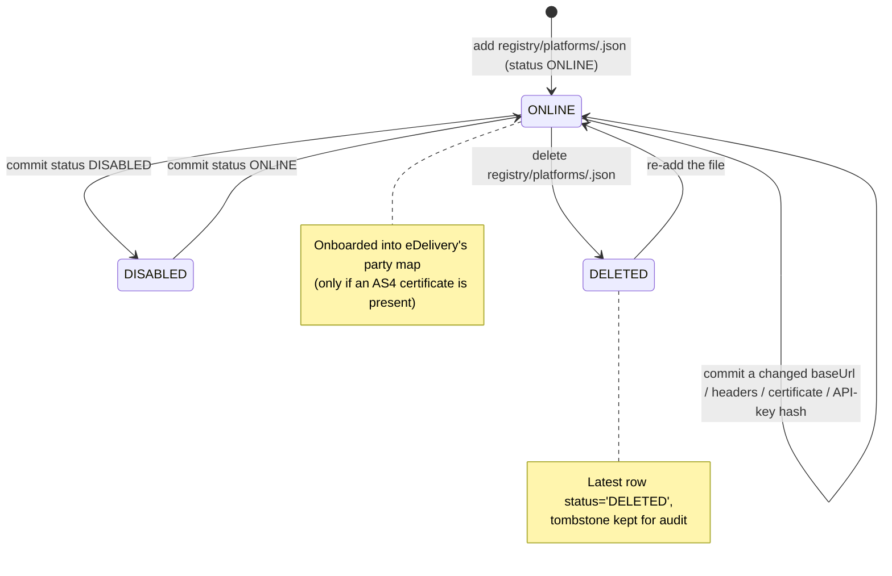

# Architecture: Platform Registry Management (Configuration-Driven)

## Changes

- _Initial state. Change tracking begins at v1.0.0._
- **2026-10-08 — rewritten for [ADR-014](../../architecture/decisions/014-registry-as-git-folder.md).** The platform registry is no longer mutated through the Admin API: it is declared in `registry/platforms/<id>.json` and applied by the one-shot `registry-sync` container at startup. The admin `POST`/`PUT`/`DELETE`, `ping` and `api-key` routes are deleted.

> Sub-architecture for the Platform Registry Management surface. For overarching rules see [theme README](README.md). AC are in [`../../cfr/registry-management/platform_registry.md`](../../cfr/registry-management/platform_registry.md).

## Platform lifecycle at a glance

## How a change reaches the database

1. A PR adds, edits or deletes a file under `registry/platforms/`.
2. The `registry-sync` container validates it, posts the registry to `POST /efti/sync_platforms`, refreshes the admin read models and verifies the result.
3. `edelivery` starts only afterwards and loads the resulting parties into its registry, refreshing every `REGISTRY_REFRESH_SECONDS`.

A platform row that is unchanged is not rewritten, so restarts do not append revisions. A platform with no `eDeliveryCert` never reaches `edelivery`'s party map, which is why the REST-only `mock` platform can authenticate without being a valid AS4 peer.

## Authentication credential

`platforms.api_key_hash` is the SHA-256 of the platform's inbound `X-Api-Key`, and it comes from `apiKeyHash` in the registry file — the plaintext key is never stored anywhere. There is no longer an endpoint that mints a key: rotating one means choosing a new secret, committing `sha256sum` of it, and handing the secret to the platform operator out of band.

The sync treats a changed hash as a rotation (stamping `api_key_generated_at` with the current time) and a file that omits `apiKeyHash` as "leave the existing credential alone" — it neither clears the key nor reports the platform as changed, so a deployment that manages keys out of band is not churned by every restart.

## Rationale

Platform metadata (base URL, headers, certificates, credential hash) drives Platform-API authentication and the forwarding target for dataset and follow-up requests. All of it is contractual: a wrong base URL or a poisoned certificate is a routing or trust failure, exactly the class of change that should require review rather than a live REST call. Append-only INSERTs still preserve every change as auditable history, and the reader-side caches (`edelivery`'s party registry, the admin read models) keep working against the same tables.
