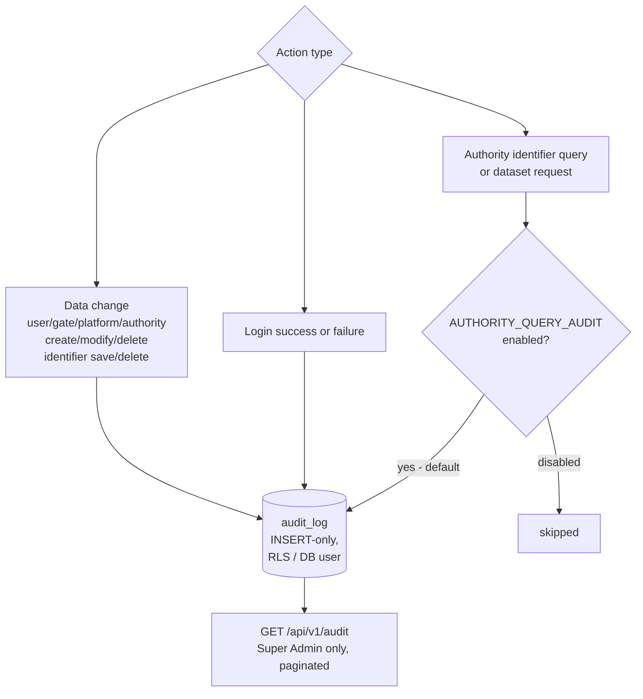

# Architecture: Audit and GDPR Compliance

## Changes

- _Initial state. Change tracking begins at v1.0.0._

> Sub-architecture for the Audit and GDPR Compliance surface. For overarching rules see [theme README](README.md). AC are in [`../../cfr/security-and-compliance/audit_and_gdpr.md`](../../cfr/security-and-compliance/audit_and_gdpr.md).

## Audit write paths at a glance

## Rationale

GDPR Art. 30 requires a record of processing for personal-data flows. The `audit_log` is the durable record: append-only, GRANT-enforced, never archived, queryable by Super Admin. Authority-query audit is configurable because not every EU member state requires it at the gate level — those that do flip the flag on; those that satisfy it via their own AAP-side logging can flip it off. The default-enabled setting is the safer choice when the operator hasn't decided.

