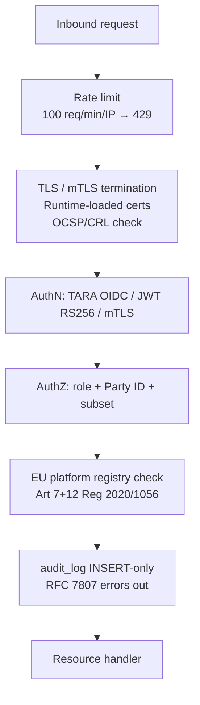

# Architecture: Security

## Changes

- _Initial state. Change tracking begins at v1.0.0._

> Sub-architecture for the Security surface. For overarching rules see [theme README](README.md). AC are in [`../../cfr/security-and-compliance/security.md`](../../cfr/security-and-compliance/security.md).

## Security layer stack at a glance

## Rationale

Security here is layered: rate-limit / TLS / authN / authZ / EU-registry / audit / handler. Each layer either accepts or rejects; rejections produce RFC 7807 responses without leaking internals. Runtime-loaded secrets + fail-closed OCSP are the two non-negotiables that lift the bar from "demo gate" to "regulator-auditable production gate".

