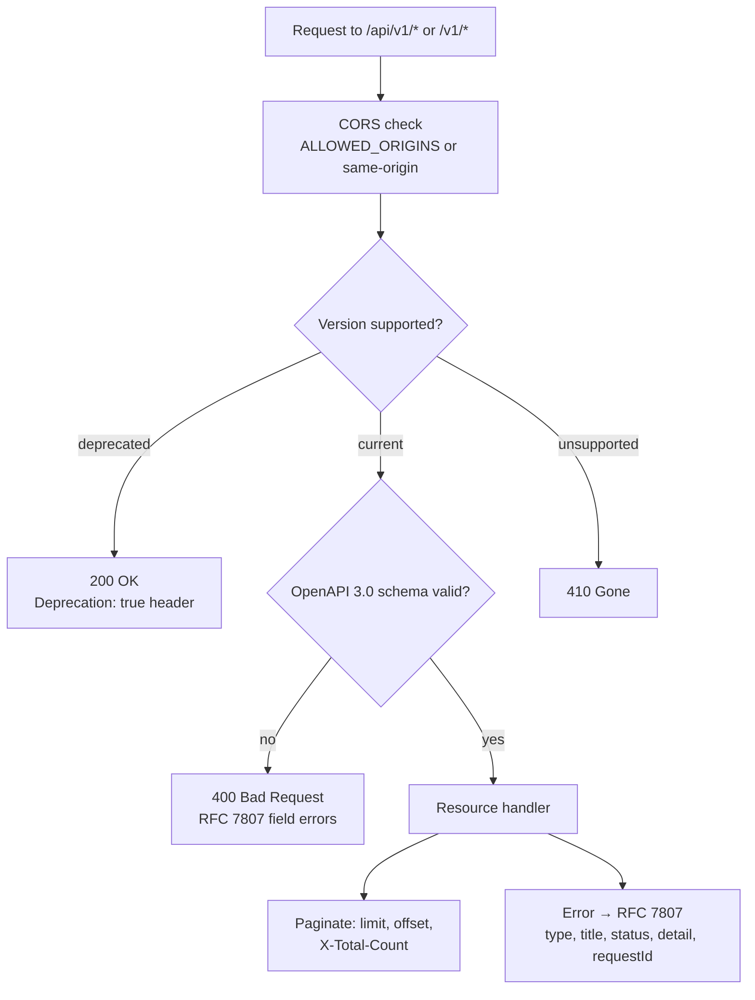

# Architecture: API Standardisation

## Changes

- _Initial state. Change tracking begins at v1.0.0._

> Sub-architecture for the API Standardisation surface. For overarching rules see [theme README](README.md). AC are in [`../../cfr/software-quality/api_standardisation.md`](../../cfr/software-quality/api_standardisation.md).

## Request handling at a glance

## Rationale

A single OpenAPI document is the contract every integration partner reads first. The gate's API surface is wide (Platform / Authority / Admin / eDelivery / health); RFC 7807 + `requestId` give every error a uniform shape and a correlation hook. Versioning by URL prefix is the simplest path-prefix choice that matches the access-check rules in `permissions-matrix.md`; 6-month deprecation windows give integration partners predictable migration time.

