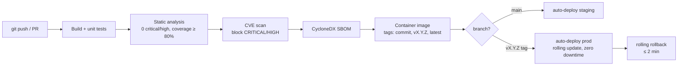

# Architecture: CI/CD and Supply Chain Security

## Changes

- _Initial state. Change tracking begins at v1.0.0._

> Sub-architecture for the CI/CD and Supply Chain Security surface. For overarching rules see [theme README](README.md). AC are in [`../../cfr/software-quality/ci_cd_and_supply_chain.md`](../../cfr/software-quality/ci_cd_and_supply_chain.md).

## Pipeline at a glance

## Rationale

Supply-chain security and reproducible deploys are non-optional for a regulator-facing service. CycloneDX SBOM + CVE scan + signed-image release process give the EU Trust Service auditors what they need without inventing a custom process. SemVer + a published `CHANGELOG.md` give integration partners the predictability they need to plan migrations against deprecation windows from Epic 19.

