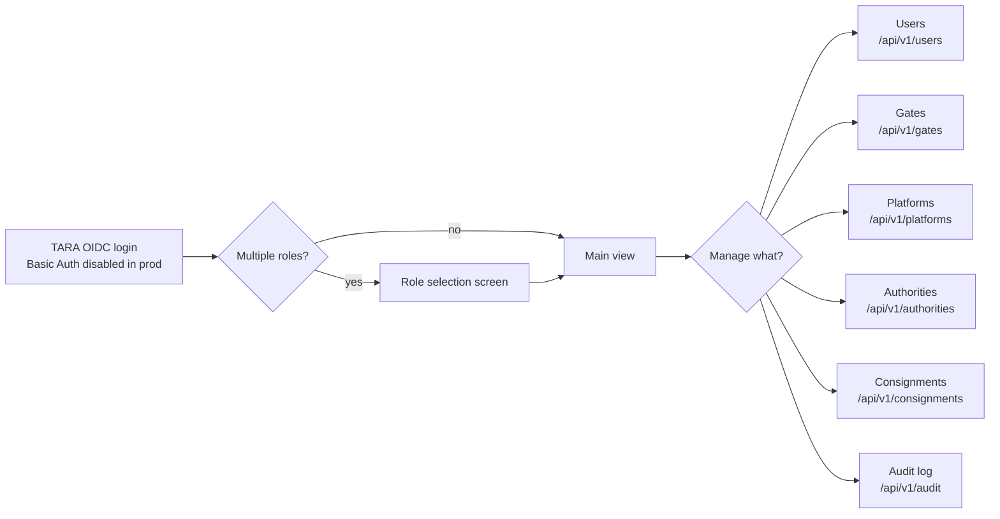

# Architecture: Admin UI

## Changes

- _Initial state. Change tracking begins at v1.0.0._

> Sub-architecture for the Admin UI surface. For overarching rules see [theme README](README.md). AC are in [`../../cfr/user-interfaces/admin_ui.md`](../../cfr/user-interfaces/admin_ui.md).

## Admin journey at a glance

UI uses TEDI (Tehik) design system; WCAG 2.2 AA verified in CI; draft auto-save every 30 s.

## Rationale

The Admin UI is the operational control surface — every registry mutation, user creation, and audit-log review goes through it. TARA OIDC reuses the same identity primitive as the Authority UI (Epic 21). Disabling Basic Auth in production removes the only non-federated entry point. TEDI + WCAG 2.2 AA are Estonian e-government baselines; the spec inherits them rather than re-litigating.

---

