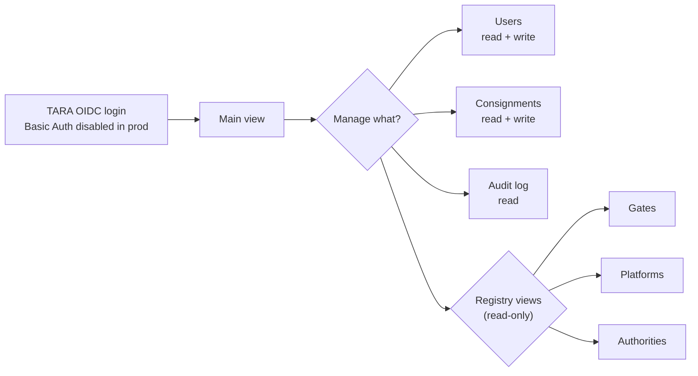

# Architecture: Admin UI

## Changes

- **v1.3** — [ADR-011](../decisions/011-registries-as-signed-config.md) §3/§5: the read-only registry
  screens now read the `registry` service (the `registry/**` git folder served over HTTP), not database
  tables — those were dropped. The served documents are JSON generated from the `registry/**` YAML at
  image build time and served statically by nginx; the screens are unchanged by that, they just read a
  static file server. Platform responses expose a derived `hasApiKey` boolean and never the `apiKey`
  itself, which is a plaintext secret in the registry folder.
- **v1.2** — Gates, platforms and authorities are **read-only** in the Admin UI. The backend
  registry write routes were deleted with [ADR-011](../decisions/011-registries-as-signed-config.md):
  those registries are declared in the git folder `registry/**` and delivered as an artefact rather
  than through the API, so the UI keeps only list + details views for them. `users` and `consignments`
  remain editable.
- **v1.1** — No role-selection step. Every authenticated user has full access;
  the former `roles TEXT[]` is gone. A caller is authenticated or is not — nothing to select or switch.
- _Initial state. Change tracking begins at v1.0.0._

> Sub-architecture for the Admin UI surface. For overarching rules see [theme README](README.md). AC are in [`../../cfr/user-interfaces/admin_ui.md`](../../cfr/user-interfaces/admin_ui.md).

## Admin journey at a glance

```mermaid
flowchart LR
    Login[TARA OIDC login<br/>Basic Auth disabled in prod] --> Home[Main view]
    Home --> Manage{Manage what?}
    Manage --> Users[Users<br/>read + write]
    Manage --> Cons[Consignments<br/>read + write]
    Manage --> Audit[Audit log<br/>read]
    Manage --> Read{"Registry views<br/>(read-only)"}
    Read --> Gates[Gates]
    Read --> Platforms[Platforms]
    Read --> Authorities[Authorities]
```

UI uses TEDI (Tehik) design system; WCAG 2.2 AA verified in CI; draft auto-save every 30 s.

## Rationale

The Admin UI is the operational control surface for **runtime** state: users are created and revoked
here, consignments are inspected and deleted, and the audit log is reviewed. TARA OIDC reuses the
same identity primitive as the Authority UI (Epic 21). Disabling Basic Auth in production removes the
only non-federated entry point. TEDI + WCAG 2.2 AA are Estonian e-government baselines; the spec
inherits them rather than re-litigating.

The gates, platforms and authorities screens are deliberately outside that write surface. Those
registries are contractual — a wrong AS4 URL or certificate, or an extra subset on an authority,
redirects signed messages or leaks another organisation's data — so they are changed by committing to
`registry/**`, not by clicking. The UI reads the same generated registry documents the runtime reads —
the JSON the `registry` image's static nginx serves — so it shows exactly what the gate is using
(certificates included), which keeps the screens useful for verification without giving them the power
to change anything. The one field deliberately withheld from the UI is a platform's `apiKey`: the UI
sees only whether one is configured.

---

