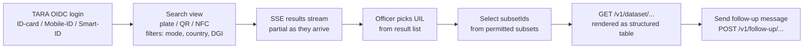

# Architecture: Authority UI (AAP — H2M Interface)

## Changes

- _Initial state. Change tracking begins at v1.0.0._

> Sub-architecture for the Authority UI (AAP — H2M Interface) surface. For overarching rules see [theme README](README.md). AC are in [`../../cfr/user-interfaces/authority_ui.md`](../../cfr/user-interfaces/authority_ui.md).

## Officer journey at a glance

UI uses the TEDI (Tehik) design system. WCAG 2.2 AA compliance verified in CI.

## Rationale

The AAP is the regulator-facing surface at roadside inspections. Streaming-first SSE matches the reality of cross-EU broadcast (partial results are useful before all peers respond). TARA OIDC + DB-backed subset enforcement makes the auth path identical to M2M (Epic 2) — there is no second permission model for "the browser". TEDI alignment and WCAG 2.2 AA are Estonian e-government baselines.

