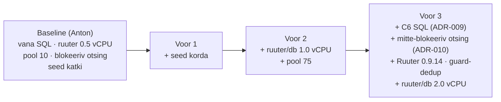
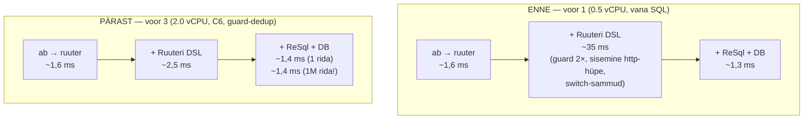
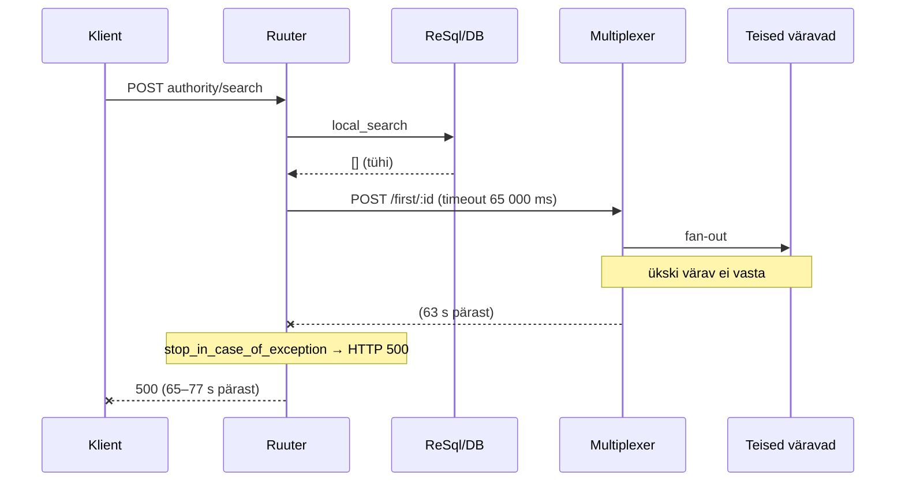
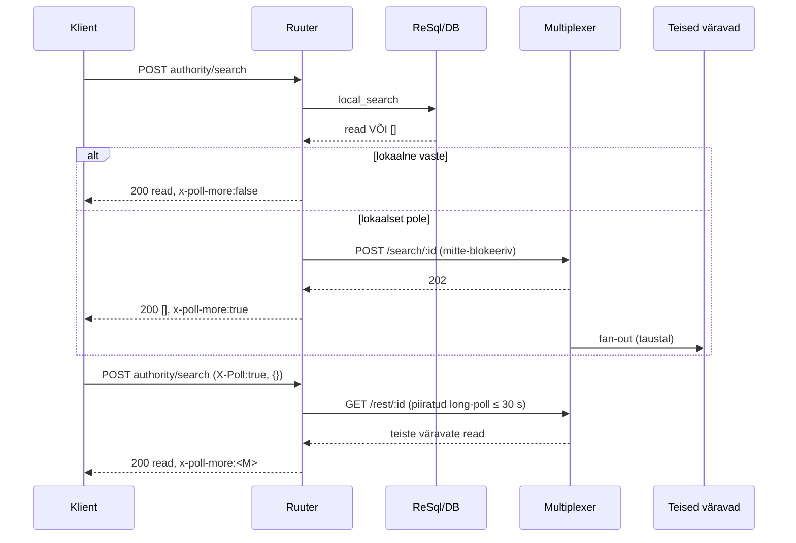
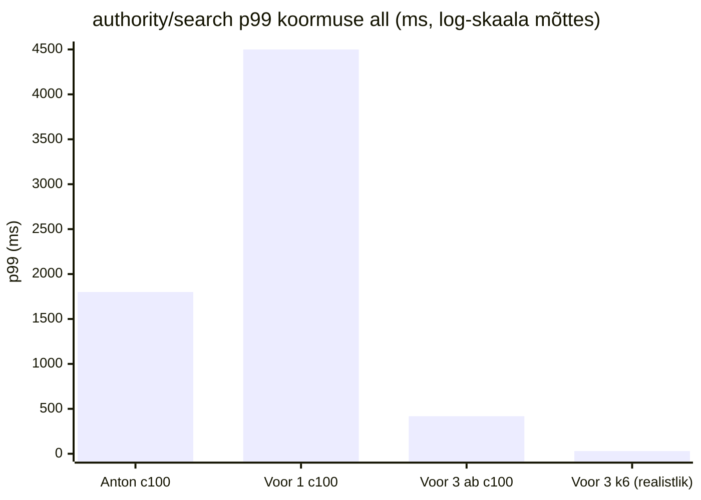

# Askend: consignments search — testimine ja häälestamine

Antoni koormustesti (`docs/performance/performance-report.md`) järelkontroll: mis üle
mõõdeti, mida muudeti, kuidas ajad iga muudatuse järel muutusid. Täisdetailid, `EXPLAIN`-plaanid
ja kordustootmise skriptid: [`analysis.md`](analysis.md).

---

## 1. Testkeskkond

| | Anton (baseline) | Askendi kordusmõõtmine |
|---|---|---|
| Riistvara | Intel Core Ultra 9 386H, 16 tuuma | Docker Desktop (aarch64), jagatud masin |
| Tööriist | ApacheBench (`ab`) | `ab` + `pgbench` + `k6` |
| Endpoint | `POST /efti/api/v1/authority/search`, keha `{"mainTransportId":{"operator":"EQ","id":"VESSEL-001"}}` | sama |
| Andmed | seed, seejärel 1 000 000 rida | sama (parandatud seed — vt allpool) |

> **Absoluutnumbrid ei ole otse võrreldavad** (16 tuuma vs jagatud arendaja­masin). Oluline
> on **kuju, kihtide vahe ja suhteline paranemine iga muudatuse järel.**

---

## 2. Mõõtmisvoorud



---

## 3. Muudatused ja mõõdetud efekt

| # | Muudatus | Miks | Mõõdetud efekt |
|---|---|---|---|
| 1 | **Seed korda** — `gate_id 'EE' → 'EU-EE'`, otsitav `VESSEL-001` andmehulka | Vana seed: `authority/search` filtreerib `gate_id = 'EU-EE'`, bulk-read olid `'EE'` → **ükski rida ei kvalifitseerunud**. 1M-test mõõtis "skaneeri miljon rida → ära leia → kuku multiplexerisse". | Test hakkas mõõtma õiget asja. Paljastas #2. |
| 2 | **`get_consignments.sql` → C6** (ADR-009). Kogu-tabeli `SELECT DISTINCT ON (...)` sort → filtreeri esmalt + korreleeritud `NOT EXISTS`. | Sisemine alampäring ilma `WHERE`-ta materialiseeris viimased-per-dataset read **kogu tabeli** ulatuses enne kriteeriumite rakendamist. | **1M real: 23 337 ms → 0,22 ms.** ReSql otse 1M: 0,14 → ~5 900 req/s. |
| 3 | **`authority/search` mitte-blokeeriv** (ADR-010). Lokaalne vaste kohe; kui pole, kohe `[]` + broadcast taustal. Multiplexeri `/first` (blokeeriv 63 s) → `/search` (kohene) + piiratud long-poll. | Tühja lokaalse otsingu järel ootas Ruuter 65 s teisi väravaid ja andis siis HTTP 500. Üks `ab` number sisaldas 4 teenust + timeout'i. | Tühja otsingu latents **65–77 s → HTTP 500** → kohe `[]`. |
| 4 | **Ruuter 0.9.12 → 0.9.14**, kattuvate authority-guard'ide dedup (`override_ancestors`). | `check_service_token` jooksis 2× iga `authority/*` päringu kohta. Ruuter #79 (guard→template rekursioon) parandamata. | Väiksem per-request DSL-kulu. |
| 5 | **Konfiguratsioon** — `ruuter` + `database` `cpus: 0.5 → 1.0 → 2.0`; ReSql pool `10 → 75`. | Ruuter 0,5 tuuma + pool 10 = testi­konfi lae, mitte koodi lae. `-c 250` juures oli p99 valdavalt järjekord. | Vt vooride tabel §7. |

---

## 4. Kihtide kaupa — kus aeg kaob (`ab`, c=1)



**Kokku otsast otsani `authority/search` (`ab`, c=1):** ~38 ms → **~4 ms**.
**DB päring ise (`pgbench`, socket):** 0,28 ms (1 rida), C6-ga sama 1M real (vt §5).

---

## 5. `get_consignments` päring — `EXPLAIN (ANALYZE)` enne / pärast

### ENNE — `DISTINCT ON`, 1 000 001 rida

```
Limit (actual time=18610..21922 rows=1)
 └─ Subquery Scan on latest       Rows Removed by Filter: 1 000 000
     └─ Unique (rows=1 000 001)
         └─ Gather Merge (Workers: 2)
             └─ Sort   Sort Method: external merge  Disk: 84 040 kB ×3 ≈ 245 MB
                 └─ Parallel Seq Scan on consignments   (1M rida, ~4,1 s)
Execution Time: 23 337 ms
```

### PÄRAST — filter-first + `NOT EXISTS` (C6, ADR-009), 1 000 001 rida

```
Limit (actual time=..0,22 rows=1)
 └─ Sort (quicksort, 25 kB)
     └─ Nested Loop Anti Join
         ├─ Index Scan  idx_consignments_main_transport_id   (Index Cond: main_transport_id = 'BULK-500000')
         └─ Index Only Scan  idx_consignments_dataset_latest  (Heap Fetches: 0)
Buffers: shared hit=16
Execution Time: 0,22 ms
```

| | ENNE | PÄRAST |
|---|---|---|
| plaan | Seq Scan + external-merge Sort + Unique(1M) + Filter | Nested Loop Anti Join, 2 indeks-otsingut |
| **täitmisaeg @ 1M** | **23 337 ms** | **0,22 ms** |
| I/O @ 1M | ~55 000 lehte + 245 MB temp | 16 buffer hit |
| skaleeruvus | O(tabeli suurus) | O(tabamuste arv) |

Artefaktid: [`explain-1m-current.txt`](explain-1m-current.txt) (enne),
[`explain-c6-1m.txt`](explain-c6-1m.txt) (pärast). Semantiline samaväärsus tõestatud:
[`semantic-test.sql`](semantic-test.sql).

---

## 6. `authority/search` voog — enne / pärast

### ENNE — blokeeriv



### PÄRAST — local-first, mitte-blokeeriv



---

## 7. `ab` sweep — läbilaskevõime ja p99

### `authority/search` (VESSEL-001 lokaalne tabamus)

| `-c` | Baseline (Anton) | Voor 1 (0.5 vCPU, vana SQL) | Voor 3 (2.0 vCPU, C6, 1 rida) | Voor 3 (2.0 vCPU, C6, **1M rida**) |
|---:|---:|---:|---:|---:|
| 1 | — | ~37 rps · p99 60 ms | **242 rps** · p99 10 ms | 234 rps · p99 14 ms |
| 10 | 70 rps · p99 240 ms | 37 rps · p99 400 ms | **508 rps** · p99 45 ms | 495 rps · p99 50 ms |
| 50 | — | 37 rps · p99 2 500 ms | **552 rps** · p99 204 ms | 494 rps · p99 250 ms |
| 100 | 93 rps · p99 1 800 ms | 37 rps · p99 4 500 ms | **557 rps** · p99 418 ms | 576 rps · p99 326 ms |
| 250 | 93 rps · p99 4 300 ms | 25 rps · p99 22 000 ms (non-2xx) | — | — |

Voor 1: **läbilaskevõime lapik ~37 rps** sõltumata konkurentsusest (`-c` kasv kasvatas ainult
järjekorda). Voor 3: **skaleerub ~550 rps-ni**; 1 rea ja 1M rea numbrid identsed.

### ReSql otse `get_consignments`

| | Voor 1 (vana SQL, 1 rida) | Voor 3 (C6, 1 rida) | Voor 3 (C6, **1M rida**) |
|---|---:|---:|---:|
| c=10 | 1 247 rps | ~5 000 rps | — |
| c=20 | — | — | **5 930 rps** · p99 45 ms |
| c=50 | 1 965 rps | ~1 960 rps | — |
| **1M vana SQL-ga** | **0,14 rps** (9/10 aegus, ReSql `request_timeout_seconds: 30`) | | |

### DB otse (`pgbench`, unix-socket, C6)

| c=1 | c=10 | c=20 | c=50 |
|---:|---:|---:|---:|
| 3 614 tps / 0,28 ms | 2 433 / 4,1 ms | 2 327 / 8,6 ms | 1 415 / 35 ms |

---

## 8. `k6` — realistlik profiil (ramp + think-time)

`ab -c 250` mõõdab küllastust. Realistlik: `k6` ([`k6-authority-search.js`](k6-authority-search.js)),
VU-d 0 → 20 → 50 → 100 (3 m 20 s), mõtlemispaus 0,5–1,5 s, tipp 100 samaaegset kasutajat.

| stsenaarium | päringuid | fail | p50 | p90 | p95 | **p99** | max |
|---|---:|---:|---:|---:|---:|---:|---:|
| `authority/search`, 1 rida | 10 109 | 0 | 6,1 ms | 11,8 ms | 15,8 ms | **29,5 ms** | 381 ms |
| `authority/search`, **1M rida** | 10 064 | 0 | 6,8 ms | 14,6 ms | 21,2 ms | **56,6 ms** | 383 ms |
| ReSql otse `get_consignments`, 1 rida | 10 117 | 0 | 2,4 ms | 4,3 ms | 5,5 ms | **40,3 ms** | 715 ms |

**Realistliku koormuse all p99 kümneid millisekundeid, mitte sekundeid.** Andmemahu kasv
1 → 1M kirjet tõstab p99 ~30 → ~57 ms — DB ei ole kitsaskoht üheski mahus.

---

## 9. Kokkuvõte



| Näitaja | Baseline (Anton) | Voor 1 (algne seadistus) | **Voor 3 (kõik parandused)** |
|---|---|---|---|
| `authority/search` läbilaskevõime | 70–93 rps | ~37 rps (lapik) | **~550 rps** (skaleerub) |
| `authority/search` p99 koormuse all | 1 800–4 300 ms | 2 500–22 000 ms | **~330–420 ms** (`ab`) / **~30–57 ms** (`k6`) |
| `get_consignments` 1M real | 0,6 rps (p99 15 000 ms) | 0,14 rps (timeout'id) | **~6 000 rps** (0,2 ms/päring) |
| tühja lokaalse otsingu latents | — | 65–77 s → HTTP 500 | kohe `[]` + `x-poll-more` |

**Allesjääv piirang:** Ruuteri DSL-mootor lisab ~2,5 ms päringu kohta (~2×, mitte enam ~50×
kuni ~30×). See on Ruuteri avaldise-mootor / HTTP-klient, mitte efti kood, ja skaleerub
konkurentsiga. Päris serveril (rohkem tuumi, väiksem kontentsioon) väiksem.

---

## 10. Mida testides veel muuta

1. **Seed peab päringu tingimustele vastama** — `gate_id = 'EU-EE'`, otsitav identifikaator
   andmehulgas. Vt [`../performance/bulk-insert-consignments-fixed.sql`](../performance/bulk-insert-consignments-fixed.sql)
   ja [`seed-consignments.sql`](seed-consignments.sql).
2. **Mõõda kihte eraldi:** `ab` ReSql-i pihta (DB + päringukiht); `ab` `authority/search`
   pihta (terve marsruut); `pgbench` custom-skriptiga (DB üksi). Skript:
   [`hop-latency.sh`](hop-latency.sh).
3. **Realistlik profiil `k6` / `wrk`-ga:** ramp + think-time, latentsi jaotus (p50/p90/p95/p99),
   mitte ainult keskmine ega burst-küllastus.
4. **1M-laadimiseks** kasuta ühte `INSERT ... SELECT generate_series`-it (`bulk-insert-1m.sql`),
   mitte DO-loopi — kordades kiirem.
5. **Kirja täpne keskkond:** Ruuteri versioon, konteinerite `cpus`/`mem`, ReSql pool,
   PostgreSQL `work_mem` / `shared_buffers`, compose-fail (`compose.yml` vs `+override`).
