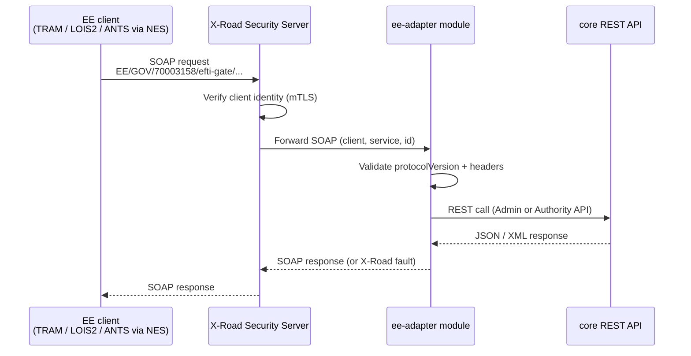

# EPIC 11 — X-Road Integration (EE extension)

> Part of [Theme 4](theme_4_en.md)

**AS AN** Estonian government system or transport platform  
**I WANT** to communicate with the eFTI gate via X-Road  
**SO THAT** the integration uses the standard Estonian national data exchange layer

## Spec anchors

| Contract surface | Reference |
|---|---|
| **X-Road service** | `EE/GOV/70003158/efti-gate/{operation}/v1` (one service per gate REST operation exposed via X-Road) |
| **Module boundary** | `ee-adapter` (X-Road) → `core` (REST) via published REST API only. `core` carries no X-Road dependency. |
| **WSDL** | `efti-xroad.wsdl` |
| **Underlying REST contract** | [`openapi.yaml`](../specs/openapi.yaml) — the same Admin / Authority / Platform routes the adapter forwards to |
| **Error codes** | `FORBIDDEN_SUBSET` (X-Road client → subset not permitted) |
| | All other gate-side errors wrapped as X-Road SOAP faults; underlying RFC 7807 carried in fault detail |
| | Full catalog: [`errors.json`](../specs/errors.json) |
| **Architecture** | [RA §9.1 Platform API](../architecture/eFTI-Gate-Reference-Architecture.md#91-platform-api) |
| | [RA §1 System Actors](../architecture/eFTI-Gate-Reference-Architecture.md#1-system-actors--components) (X-Road, ANTS, NES) |
| **Diagrams** | [`seq-10-platform-registration.mmd`](../specs/diagrams/seq-10-platform-registration.mmd) (X-Road variant of the platform-registration flow) |

## X-Road integration at a glance

The `ee-adapter` module calls `core` only via the published REST API — no internal `core` dependency.

## Acceptance Criteria

### X-Road adapter

**Business rules:**
- [ ] The X-Road service surface lives **entirely in the `ee-adapter` module**; the `core` module carries **zero** X-Road references.
- [ ] The adapter validates the X-Road headers (`client`, `service`, `id`, `protocolVersion`) before forwarding.
- [ ] Client identity is established by the X-Road Security Server (mTLS); the gate trusts the adapter-forwarded identity.
- [ ] The adapter calls `core` only via the public REST API. Modifying `core` to add X-Road awareness is **not permitted**.

**Denial scenarios:**
- [ ] Unknown `protocolVersion` → SOAP fault `faultCode="Client.unknownVersion"`.
- [ ] Client identity not authorised → SOAP fault carrying a 403-class error.
- [ ] Core REST returns 4xx/5xx → wrapped as X-Road SOAP fault; the underlying RFC 7807 payload is carried in the fault detail.

### Estonian competent authorities

**Business rules:**
- [ ] Each authority picks its preferred channel — eDelivery AS4 **or** X-Road. Both are supported.
- [ ] Subset access enforcement is per-authority (per `users.subsets`): an authority that is not entitled to a given subset is denied even if the route would otherwise permit it.

**Denial scenarios:**
- [ ] X-Road client (e.g. TRAM) querying a subset not in their `users.subsets` → 403-class SOAP fault.

### ANTS integration (high-throughput existence check)

**Business rules:**
- [ ] The gate exposes a dedicated **read-only** existence-check endpoint for ANTS — returns `{"registered": true|false}`, no dataset content.
- [ ] Channel: X-Road, via the NES intermediary (MTA internal system).
- [ ] SLO: p95 < 1 s (ANTS may send > 10 000 queries/hour during border operations).
- [ ] **No broadcast.** A miss is `{"registered": false}` — the existence check does **not** trigger the cross-gate broadcast that the regular Authority `/v1/identifiers/{identifier}` route would.
- [ ] Read path: index-only scan on `consignments.vehicle_plate` (no extra column reads).

### ADR 1000-point rule (subset `EU05`)

**Business rules:**
- [ ] The gate calculates the ADR 1.1.3.6 dangerous-goods point total per vehicle (UN number × hazard class × net mass) and appends it to the `EU05` subset response.
- [ ] Calculation result: `≥ 1000` → full ADR; `< 1000` → partial (1.1.3.6 exemptions apply); `= 0` → full exemption.
- [ ] If the platform advertises `supportsAdrCalculation=true`, the gate **skips its own calculation** and passes the platform's value through unchanged.
- [ ] If `supportsAdrCalculation=false`, the gate calculates and appends.

## Rationale

X-Road is the Estonian national-level secure data-exchange layer; integrating via X-Road is a prerequisite for Estonian-side regulatory clients (TRAM, LOIS2, ANTS via NES). Isolating X-Road in `ee-adapter` keeps the `core` gate process portable to non-X-Road jurisdictions and avoids polluting cross-border eDelivery flows with EE-specific concerns. ANTS gets its own bypass endpoint because the cross-gate broadcast that the regular Authority route performs is wrong for the ANTS use case (border-operations existence check, high volume, local-registry-only).
