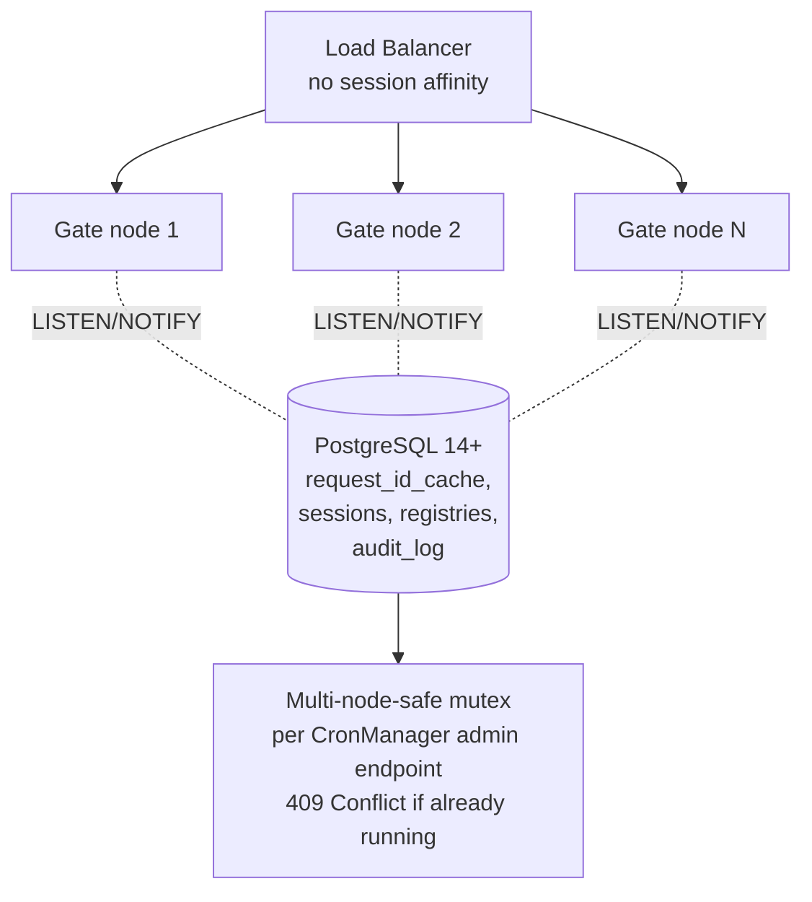

# EPIC 12 — Scalability and Statelessness

> Part of [Theme 5](theme_5_en.md)

**AS A** DevOps engineer  
**I WANT** the gate to run on multiple nodes without shared memory  
**SO THAT** the system is horizontally scalable and tolerates a single node failure

## Spec anchors

| Contract surface | Reference |
|---|---|
| **Topology / scaling contract** | Two-replica minimum, HPA mandatory (min=2, max=10 default, CPU 70 % / mem 75 %, aggressive scale-up, gradual scale-down): [`non-functional.md`](../specs/non-functional.md) §3, §3.1 |
| **Cluster-sync mechanism** | PostgreSQL `LISTEN/NOTIFY` on per-table channels (`registry_change_gates`, `_platforms`, `_authorities`); `async_responses` for peer-gate response routing: [`non-functional.md`](../specs/non-functional.md) §3 |
| **Admin-endpoint concurrency** | PostgreSQL advisory locks (one distinct lock id per CronManager endpoint): [`non-functional.md`](../specs/non-functional.md) §3 |
| **Schema** | `request_id_cache` (`X-Request-ID` dedup, 10 min TTL) |
| | `audit_log` (action-level audit trail; preserved indefinitely on live DB; never archived) |
| | Append-only design + no FK constraints between operational tables; latest-row index `(logical_id, created_at DESC)` per table |
| | Full schema: [`db/schema.sql`](../specs/db/schema.sql); design rules: [`db/README.md`](../specs/db/README.md) |
| **Error codes** | `DUPLICATE_REQUEST_ID` |
| | `ARCHIVE_IN_PROGRESS` (the canonical 409 for any admin-endpoint mutex collision) |
| | Full catalog: [`errors.json`](../specs/errors.json) |
| **Architecture** | [RA §7.1 Logical Component Layers](../architecture/eFTI-Gate-Reference-Architecture.md#71-logical-component-layers) |
| **Diagrams** | [`arch-01-multi-node-deployment.mmd`](../specs/diagrams/arch-01-multi-node-deployment.mmd) |
| | [`seq-15-gate-registry-sync.mmd`](../specs/diagrams/seq-15-gate-registry-sync.mmd) |
| **Related epic** | [Epic 26](epic_26_en.md) — CronManager-driven archival |

## Multi-node topology at a glance

## Acceptance Criteria

### Statelessness

**Business rules:**
- [ ] The gate runtime holds **no** in-memory request state, no sticky sessions, no node-local files, no in-process scheduling. Every request is independent.
- [ ] Admin auth is JWT-only (validated as OAuth 2.0 Resource Server). No DB-stored admin session, no cookie, no session affinity at the load balancer.
- [ ] Revocation is multi-node-consistent because `sessions` (the JWT denylist) is a shared DB table — every node sees the same view on the next request without coordination.
- [ ] After a node restart, registries (gates / platforms / authorities) are re-loaded from PostgreSQL at startup. No data loss.

### Registry synchronisation

**Business rules:**
- [ ] Every registry write commits + emits a `NOTIFY` on the table's channel from the **same transaction**. Subscribers receive on commit; no DB-side trigger.
- [ ] All gate nodes hold an open `LISTEN` on each registry channel; cache refresh happens within ≤ 500 ms of the writer's commit.
- [ ] A node that receives a NOTIFY for an id it doesn't have cached → loads the latest row from the DB.

### Request-id deduplication (across nodes)

**Business rules:**
- [ ] `X-Request-ID` uniqueness is enforced via the shared `request_id_cache` table — visible to all nodes. Window: 10 minutes (per `request_id_cache.expires_at` default).
- [ ] Same id arriving at two nodes within 1 ms → the DB unique constraint guarantees only one succeeds; the other returns `DUPLICATE_REQUEST_ID`.

### Scheduled-job concurrency

**Business rules:**
- [ ] All scheduled work — archive, expire-identifiers, ping-gates — runs **only** via CronManager calling the gate's admin endpoints. The gate process never schedules its own jobs.
- [ ] Each admin endpoint acquires a distinct numeric advisory lock at handler entry. A concurrent invocation returns `409` (the canonical code is `ARCHIVE_IN_PROGRESS` even for non-archive endpoints; see `errors.json`).
- [ ] The lock is released automatically when the handler's connection drops (advisory-lock auto-release; survives node crash).

### Health and readiness

**Business rules:**
- [ ] Database unreachable at startup → the node does not pass readiness; `/health/ready` returns 503; the LB withdraws the node.
- [ ] Health and readiness probes follow the topology defined in [`non-functional.md`](../specs/non-functional.md) §3 (5 s interval, 2 failures → unready, 1 success → ready).

### Schema migrations

**Business rules:**
- [ ] `schema.sql` is the v0 baseline, applied once against an empty database. All subsequent changes go through versioned migration tooling at `gate/db/changelog/` (declarative, idempotent on re-apply, per `non-functional.md` §4).
- [ ] Migration lock is released even on application crash (the migration tool's built-in lock semantics).

## Rationale

The gate scales horizontally because every piece of cross-request state lives in PostgreSQL (`sessions` denylist, `request_id_cache`, registries, `audit_log`). The application layer is fully stateless. `LISTEN/NOTIFY` removes the polling-vs-cache-staleness trade-off without adding Redis / Hazelcast / etc. Advisory locks give CronManager-driven jobs a cluster-wide mutex without any extra coordinator. Two-replica floor + HPA covers the SLO error budget under rolling upgrade or single-host failure.
