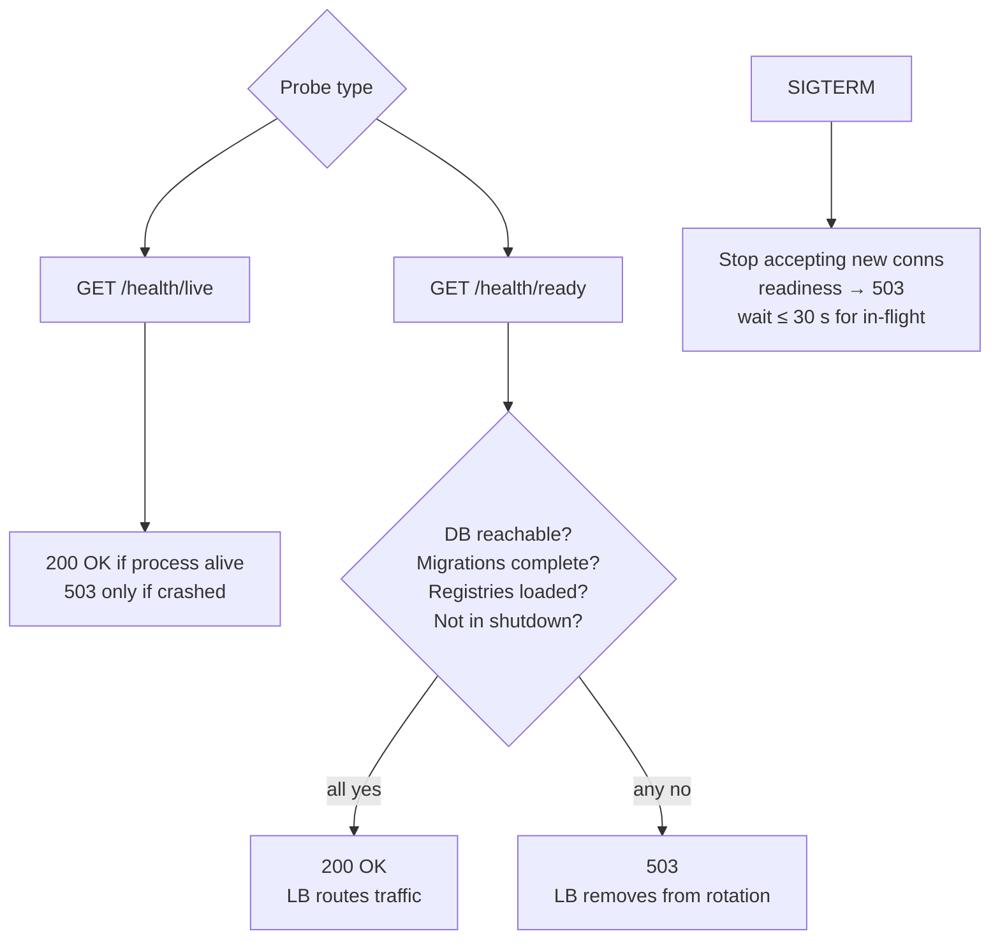

# EPIC 13 — Health Checks and Graceful Shutdown

> Part of [Theme 5](theme_5_en.md)

**AS A** orchestrated deployment environment  
**I WANT** the gate to expose health check endpoints and handle graceful shutdown  
**SO THAT** the deployment platform can manage the application lifecycle correctly

## Spec anchors

| Contract surface | Reference |
|---|---|
| **API operations** | `GET /health/live` |
| | `GET /health/ready` |
| | Full request / response shapes: [`openapi.yaml`](../specs/openapi.yaml) |
| **Probe topology** | Probe interval 5 s, 2 failures → unready, 1 success → ready: [`non-functional.md`](../specs/non-functional.md) §3 |
| **Environment** | `SHUTDOWN_TIMEOUT_SECONDS` (default 30) — see [`non-functional.md`](../specs/non-functional.md) §4.1 |
| **HPA tie-in** | Readiness drives the HPA "ready replica" count — a draining pod drops from scale-up capacity automatically: [`non-functional.md`](../specs/non-functional.md) §3.1 |
| **Architecture** | [RA §7.1 Logical Component Layers](../architecture/eFTI-Gate-Reference-Architecture.md#71-logical-component-layers) |

## Liveness vs readiness at a glance

## Acceptance Criteria

**Business rules:**
- [ ] Liveness and readiness are **separate** endpoints — not the same `/health`.
- [ ] `/health/live` returns 200 whenever the process is running; 503 only on crash.
- [ ] `/health/ready` returns 200 **only when all** of the following hold: database connection OK, schema migrations complete, in-memory registries (`gates`, `platforms`, `authorities`) loaded from their latest rows, application not in shutdown. Otherwise 503.
- [ ] On `SIGTERM`: stop accepting new connections; readiness immediately starts returning 503; wait up to `SHUTDOWN_TIMEOUT_SECONDS` (default 30 s) for in-flight requests; then exit.
- [ ] In-flight request still running after the timeout → force-shutdown; the caller receives a connection reset.

**Degraded-state behaviour:**
- [ ] Database connection lost mid-run → `/health/ready` returns 503 (LB withdraws the node), `/health/live` still returns 200 (app process is fine; orchestrator should not restart it).

## Rationale

Separating liveness from readiness lets orchestrators (Kubernetes, ECS, etc.) distinguish "process needs restarting" from "this replica shouldn't receive traffic right now". The DB-readiness signal on `/health/ready` lets the load balancer drain transient DB connectivity issues without killing the pod. Coordinated `SIGTERM` handling (readiness → 503 first, then drain in-flight) keeps the SLO error budget intact during rolling deploys and HPA scale-downs.
