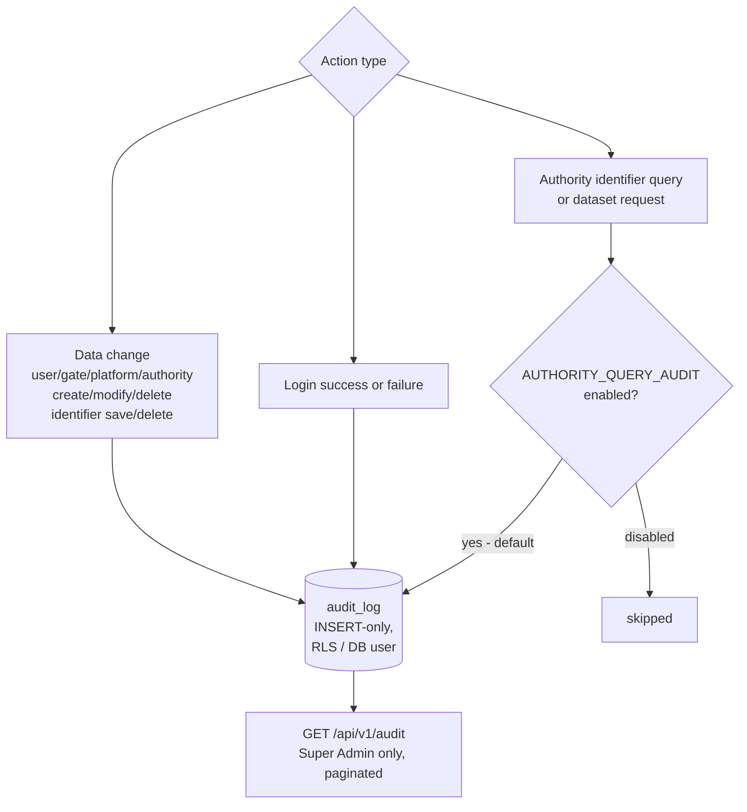

# EPIC 15 — Audit and GDPR Compliance

> Part of [Theme 6](theme_6_en.md)

**AS A** GDPR data controller  
**I WANT** data changes and admin actions to be logged, and authority query auditing to be configurable  
**SO THAT** the Gate complies with GDPR Article 30 requirements and jurisdiction-specific obligations

> **Note:** EU Regulations 2024/1942 and 2025/2243 do not explicitly require persistent audit logging of authority queries at the gate level. Member states must decide based on their own jurisdictional requirements. This epic implements a reasonable default with configurability.

## Spec anchors

| Contract surface | Reference |
|---|---|
| **API operations** | `GET /api/v1/audit` (Super Admin only, paginated) |
| | Full request / response shapes: [`openapi.yaml`](../specs/openapi.yaml) |
| **Schema** | `audit_log` (INSERT-only at GRANT level; preserved on the live DB indefinitely; never archived) |
| | Full schema: [`db/schema.sql`](../specs/db/schema.sql) |
| **Log fields** | Action-level audit fields (event.action / user.id / efti.audit), ECS 8.x JSON: [`logging-spec.md`](../specs/logging-spec.md) §3, §5 |
| **Access-check rules** | Super Admin–only audit access: [`permissions-matrix.md`](../specs/permissions-matrix.md) |
| **Environment** | `AUTHORITY_QUERY_AUDIT=enabled|disabled` (default `enabled`) — [`non-functional.md`](../specs/non-functional.md) §4.1 |

## Audit write paths at a glance

## Acceptance Criteria

### Mandatory audit-log writes

**Always-logged events (regardless of `AUTHORITY_QUERY_AUDIT`):**
- [ ] Login success and failure (user id, source IP, method).
- [ ] Admin user-management actions: create / modify / delete `users`.
- [ ] Registry mutations: create / modify / delete `gates`, `platforms`, `authorities`.
- [ ] Identifier save and delete events from platforms.

**Business rules:**
- [ ] `audit_log` is **immutable**: enforced by GRANT — the runtime app role has `INSERT` only on `audit_log`; no UPDATE, no DELETE. Same append-only design as the rest of the schema, but `audit_log` is **never archived** (preserved on the live DB ≥ 7 years; operator may extend indefinitely).
- [ ] Sensitive data (passwords, bcrypt hashes, JWT contents) is **never** persisted to `audit_log`.
- [ ] An audit-log write failure does **not** roll back the triggering operation. The failure is logged at ERROR server-side; the user-visible operation still succeeds.
- [ ] `GET /api/v1/audit` is Super Admin only; paginated with `limit` (≤ 1000 per page) / `offset`.

### Authority-query audit (configurable)

**Business rules:**
- [ ] Authority `/v1/identifiers/{identifier}` and `/v1/dataset/{...}` calls are logged to `audit_log` when `AUTHORITY_QUERY_AUDIT=enabled`.
- [ ] Fields recorded when enabled: caller user id, UIL (or `identifier` query string), requested subsets, source IP, timestamp.
- [ ] When `AUTHORITY_QUERY_AUDIT=disabled`, these specific events are **not** persisted to `audit_log` — but they are still emitted to the operational logs per [`logging-spec.md`](../specs/logging-spec.md) (`event.action: "identifier.search"` / `"dataset.deliver"`).
- [ ] If the env var is **unset**, it defaults to `enabled` (fail-safe default).

## Rationale

GDPR Art. 30 requires a record of processing for personal-data flows. The `audit_log` is the durable record: append-only, GRANT-enforced, never archived, queryable by Super Admin. Authority-query audit is configurable because not every EU member state requires it at the gate level — those that do flip the flag on; those that satisfy it via their own AAP-side logging can flip it off. The default-enabled setting is the safer choice when the operator hasn't decided.
