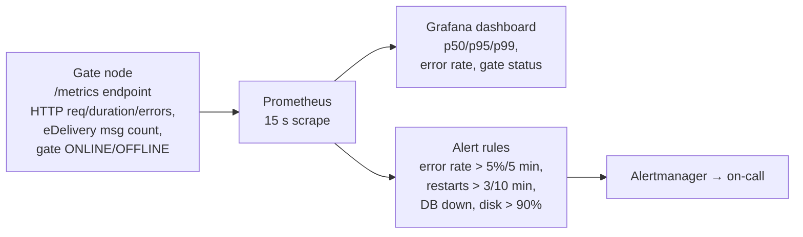

# EPIC 17 — Monitoring and Alerting

> Part of [Theme 7](theme_7_en.md)

**AS AN** operations engineer  
**I WANT** real-time metrics, dashboards, and automated alerts  
**SO THAT** I can detect and resolve incidents before users are affected

## Spec anchors

| Contract surface | Reference |
|---|---|
| **SLOs and SLIs** | Per-surface p95 latency, success-rate, error budgets: [`non-functional.md`](../specs/non-functional.md) §1 |
| **Capacity model** | Per-replica steady / peak load assumptions: [`non-functional.md`](../specs/non-functional.md) §2 |
| **Scaling contract** | HPA driven by CPU 70 % / mem 75 % / readiness: [`non-functional.md`](../specs/non-functional.md) §3.1 |
| **Health probes** | `/health/live` / `/health/ready` shared with HPA + LB: [`openapi.yaml`](../specs/openapi.yaml), Epic 13 |
| **Logging fields driving alerts** | `event.outcome`, `db.pool.warning`, `runtime.memory.warning`, `gate.ping.failed`, `efti.error.code`: [`logging-spec.md`](../specs/logging-spec.md) §5, §10 |
| **Architecture** | [RA §7.1 Logical Component Layers](../architecture/eFTI-Gate-Reference-Architecture.md#71-logical-component-layers) |

## Monitoring pipeline at a glance

## Acceptance Criteria

### Metrics surface

**Business rules:**
- [ ] A `/metrics` endpoint exposes (at minimum): HTTP request count / duration / error count per route group, eDelivery in/out message count, total identifier count, per-peer gate `ONLINE/OFFLINE` status, DB connection-pool stats, process heap usage.
- [ ] Scrape interval: 15 s (operator-tunable).
- [ ] Dashboard panels exist for p50 / p95 / p99 latency per surface, error rate per surface, peer-gate status, DB pool availability.

### Alerts (minimum set)

The operator must wire up at least the following:

- [ ] Gate error rate > 5 % in the last 5 minutes.
- [ ] Application node restarting repeatedly (> 3 restarts in 10 minutes).
- [ ] DB connection failure (no successful query in 1 minute).
- [ ] Disk usage > 90 % on the gate's persistent volumes.
- [ ] eDelivery message processing stalled > 15 minutes (no inbound or outbound success).
- [ ] Metrics endpoint unscrapeable for > 2 consecutive intervals (target DOWN).

### SLO and capacity tie-in

**Business rules:**
- [ ] The per-surface SLOs in `non-functional.md` §1 are the alert thresholds. A burn-rate alert exceeding the §1 error budget is an on-call page.
- [ ] Per-replica capacity (`non-functional.md` §2) anchors the dashboard's "current load vs. per-replica peak" panel.
- [ ] EU Reg 2024/1942 Art 8(3) baseline: service availability ≥ 99.9 % during business hours (10:00–16:00 CET minimum); end-to-end response for roadside inspections < 60 s.

### Artifacts committed alongside the gate

- [ ] Dashboard JSON in `monitoring/` of the deployment repo (committed; reviewable).
- [ ] Prometheus alert-rule YAML in `monitoring/alerts.yaml`.
- [ ] Performance tests run in CI/CD; SLO regressions fail the build.

## Rationale

The gate is regulator-facing; an outage during an inspection window has legal as well as operational consequences. Alerts are deliberately coarse (error rate, restart loop, DB failure, peer-gate stall, disk) — the long tail of issue-specific alerts emerges from operating the system, not from spec-writing. SLOs and the HPA contract live in one place (`non-functional.md`); this epic just wires them up to dashboards + alertmanager.
