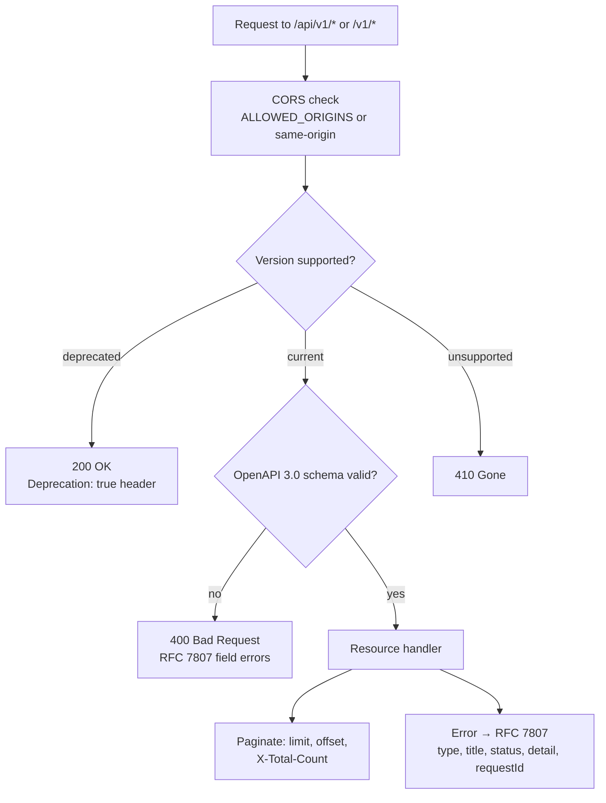

# EPIC 19 — API Standardisation

> Part of [Theme 8](theme_8_en.md)

**AS A** integration partner  
**I WANT** a well-documented, versioned API  
**SO THAT** I can integrate with the gate without direct technical support

## Spec anchors

| Contract surface | Reference |
|---|---|
| **OpenAPI** | [`openapi.yaml`](../specs/openapi.yaml) — single source of truth for all REST routes, schemas, examples |
| **Error format** | RFC 7807 Problem Details with `requestId` correlation: [`errors.json`](../specs/errors.json) |
| **Path-prefix convention** | `/api/v1/...` (Admin API), `/v1/...` (Platform + Authority API), `/services/...` (eDelivery + fast), `/health/...` (public probes): [`permissions-matrix.md`](../specs/permissions-matrix.md) §1.1 |
| **Pagination** | `limit` (default 100, max 1000 per `PageLimit`), `offset`; response carries `X-Total-Count`: [`openapi.yaml`](../specs/openapi.yaml) |
| **Environment** | `ALLOWED_ORIGINS` (CORS) — [`non-functional.md`](../specs/non-functional.md) §4.1 |
| **Architecture** | [RA §9 API Reference](../architecture/eFTI-Gate-Reference-Architecture.md#9-api-reference) |

## Request handling at a glance

## Acceptance Criteria

**Business rules:**
- [ ] `docs/specs/openapi.yaml` is the canonical contract. The deployed gate's behaviour matches it; the file is committed to the repo and reviewed alongside any API change.
- [ ] Interactive docs (Swagger UI or equivalent) are served at `/api/openapi` and `/v1/openapi`, including a way to exercise authenticated requests with a Bearer token.
- [ ] URL versioning: `/api/v1/...` (Admin) and `/v1/...` (Platform + Authority). Older versions remain reachable for **≥ 6 months** after a new major version ships.
- [ ] Calls to a deprecated-but-still-supported version → `200 OK` with response header `Deprecation: true` and a `Link: rel="successor-version"` migration hint.
- [ ] Calls to an unsupported (sunset) version → `410 Gone` with RFC 7807 detail pointing at the current version.
- [ ] **All** error responses follow RFC 7807; field-level validation errors return `400` with per-field detail; `instance` carries the request path; every response carries `requestId`.
- [ ] **CORS:** when `ALLOWED_ORIGINS` is unset, default to **same-origin only** (never `*`).
- [ ] Listings (`GET /api/v1/users`, `/platforms`, etc.) paginate via `limit`/`offset` and return `X-Total-Count`.

**Denial / edge scenarios:**
- [ ] Body does not validate against the OpenAPI schema → `400 Bad Request` RFC 7807 with field-level errors.
- [ ] Request to an unknown route under a supported version → `404 Not Found` RFC 7807.
- [ ] Method not allowed on a known route → `405` with `Allow` header listing the supported methods.

## Rationale

A single OpenAPI document is the contract every integration partner reads first. The gate's API surface is wide (Platform / Authority / Admin / eDelivery / health); RFC 7807 + `requestId` give every error a uniform shape and a correlation hook. Versioning by URL prefix is the simplest path-prefix choice that matches the access-check rules in `permissions-matrix.md`; 6-month deprecation windows give integration partners predictable migration time.
